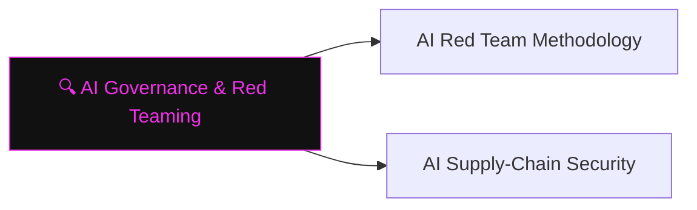

# 🔍 AI Governance & Red Teaming

> [!abstract] The Branch
> Red teaming an AI system requires probing safety constraints, bias surfaces, and supply-chain trust — different tools from traditional security red teaming, same adversarial mindset.

## Learning Path

1. [[AI Red Team Methodology]] — structured prompt probing; harm-category taxonomy; team composition and reporting
2. [[AI Supply-Chain Security]] — model provenance and poisoning; malicious fine-tunes; SBOM for ML

> [!note] Planned notes
> Content notes for this branch are coming soon.

---
> 🔼 Up: [[AI Security]]
