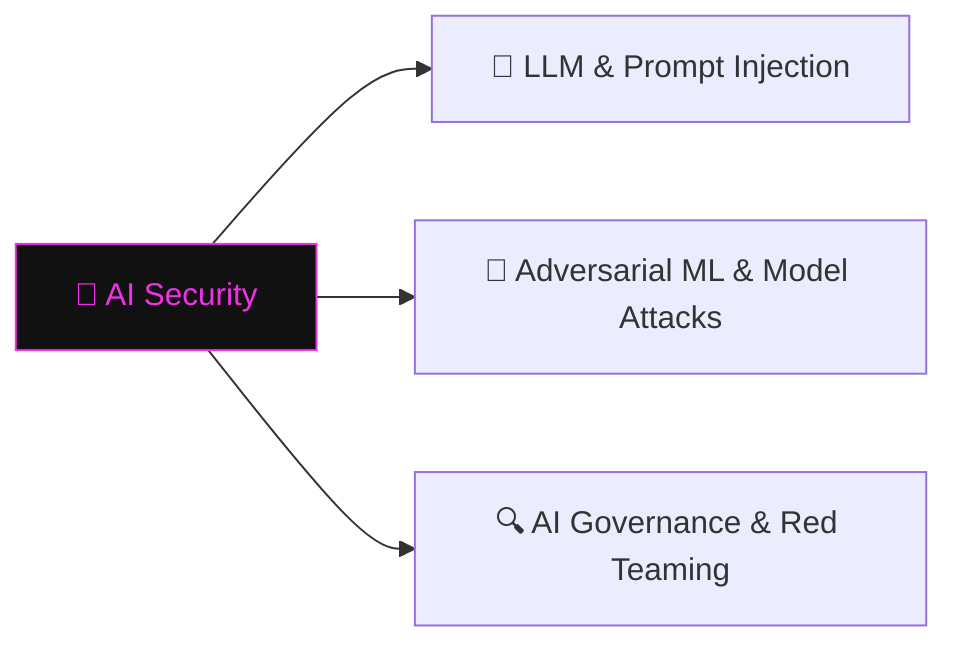

# 🧠 AI Security

> [!abstract] The Domain
> Securing and attacking ML systems — prompt injection, adversarial inputs, model theft, and AI red teaming. Part of the domain map at [[Cyber Security]].

## Learning Path

1. [[LLM & Prompt Injection]] — how LLMs process input and where injection boundaries collapse
2. [[Adversarial ML & Model Attacks]] — crafting perturbed inputs that fool classifiers; model extraction and theft
3. [[AI Governance & Red Teaming]] — structured red-team methodologies for AI systems; bias probing and safety evaluation

---
> 🌐 Back to the domain map: [[Cyber Security]]
