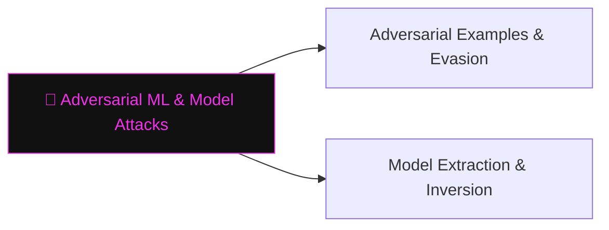

# 🎯 Adversarial ML & Model Attacks

> [!abstract] The Branch
> ML models are differentiable functions — small, deliberate input perturbations can flip predictions, extract training data, or replicate the model entirely.

## Learning Path

1. [[Adversarial Examples & Evasion]] — FGSM and PGD attack theory; physical-world adversarial patches; defences and their limits
2. [[Model Extraction & Inversion]] — query-based model stealing; training-data reconstruction; membership inference

> [!note] Planned notes
> Content notes for this branch are coming soon.

---
> 🔼 Up: [[AI Security]]
