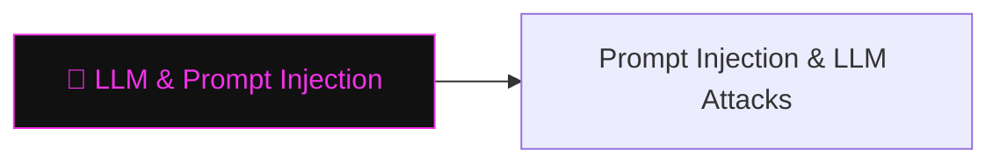

# 💬 LLM & Prompt Injection

> [!abstract] The Branch
> Large language models collapse the boundary between instruction and data — attacker-controlled text in the context window can hijack model behaviour, exfiltrate secrets, and pivot through tool calls.

## Learning Path

1. [[Prompt Injection & LLM Attacks]] — direct and indirect injection; jailbreak taxonomy; tool-call and plugin hijacking

---
> 🔼 Up: [[AI Security]]
