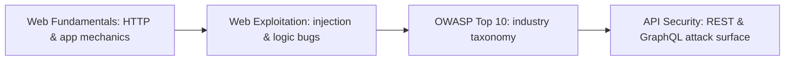

# 🕸️ Application Security

> [!abstract] The Domain
> Web and API security — from HTTP mechanics through every major injection class, the OWASP taxonomy, and the API-specific vulnerability set. Part of the domain map at [[Cyber Security]].

## 🗺️ Zero-to-Mastery Learning Path

1. [[Web Fundamentals]] — HTTP transactions, walking an app, content discovery, subdomain enumeration, JWT security
2. [[Web Exploitation]] — SQL injection, XSS, command injection, SSTI, XXE, SSRF, file inclusion, IDOR, auth bypass, race conditions, insecure deserialisation, prototype pollution
3. [[OWASP Top 10]] — A01 Broken Access Control through A10 SSRF with attacker and defender framing
4. [[API Security]] — REST/GraphQL methodology, OWASP API Top 10 (BOLA, BUA, mass assignment, improper assets)

---
> 🌐 Back to the domain map: [[Cyber Security]]
