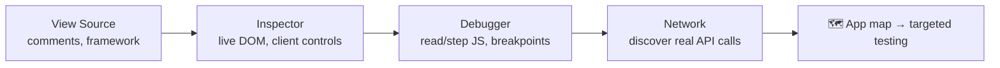
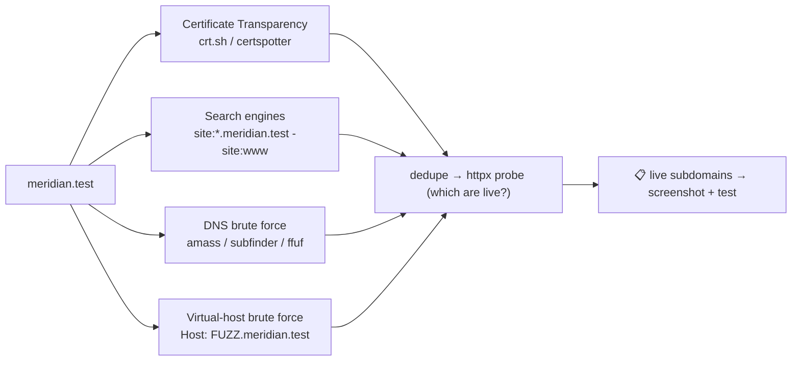
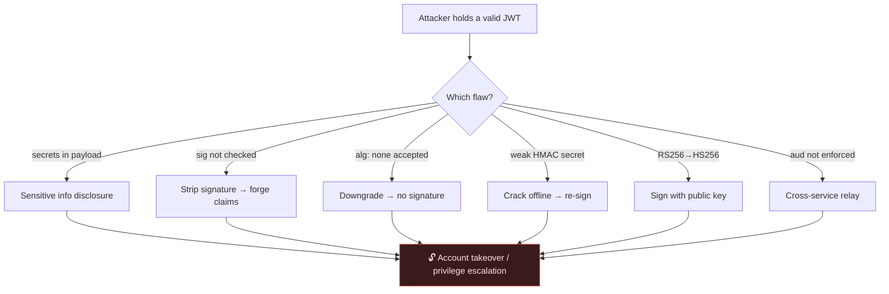

# 🕸️ Web Fundamentals

> [!abstract] Note of [[Web Security]]
> Before you can exploit a web application you have to be able to read it — its requests, its responses, the content it does not link to, and the tokens it trusts. This note is the reconnaissance half of web testing: HTTP anatomy, the browser dev-tools workflow, content and subdomain discovery, and the JWT attack surface. It is the on-ramp to [[OWASP Top 10]] and [[Web Exploitation]].

> [!warning] Authorized vulnerability-assessment context
> Every technique here is for authorized testing — a lab, a bug-bounty scope, or an engagement with written permission. Each recon method is paired with what a defender should therefore lock down.

## Parent Learning Order
Web Fundamentals -> Web Exploitation

## Anatomy of an HTTP Transaction

> *HTTP is stateless — the server forgets you the instant it answers. So how does a site still know who you are three pages later?*
>
> Hold your answer — the section below is the response.

Because you tell it, every single time. The server keeps nothing between requests; the browser re-presents a cookie or a token on each one, and the server decides afresh who you are from what you handed it. That is the whole architecture, and it is why so much of this note is about what those values are, who can read them, and what happens when a client edits one before sending it back.

A web app is a stack: **front-end** (HTML/CSS/JS in the browser) over **back-end** (web server, application code, database, WAF). Every interaction is a single HTTP request answered by a single HTTP response — and *every field in both* is something an assessor probes. The protocol foundations are in **the Networking Masterclass**; here we read it like an attacker.

### The full request/response, annotated
```http
POST /api/login HTTP/1.1              ← request line: METHOD  path  version
Host: track.meridian.test                      ← which vhost (one IP can host many)
User-Agent: Mozilla/5.0               ← client fingerprint (spoofable)
Content-Type: application/json        ← how to parse the body
Cookie: session=eyJ...                ← state carried across stateless requests
Content-Length: 44

{"username":"admin","password":"hunter2"}   ← body (POST/PUT/PATCH only)
```
```http
HTTP/1.1 200 OK
Server: nginx/1.18.0                  ← version disclosure → known-CVE shortlist
Content-Type: application/json; charset=utf-8
Set-Cookie: session=…; HttpOnly; Secure; SameSite=Strict   ← the cookie's defenses
Cache-Control: no-store               ← keep sensitive responses out of caches
X-Frame-Options: DENY                 ← clickjacking defense
{"token":"eyJ..."}
```

### Methods — intent, and the abuse of each
The **request line** is `METHOD /path HTTP/version`. The method declares intent, and each carries a distinct security concern a tester checks for:

| Method | CRUD-ish | Attacker's angle | Defender's job |
| --- | --- | --- | --- |
| **GET** | Read | Params in the URL leak to logs, history, `Referer`; try tampering IDs → **IDOR** | Never put secrets/tokens in a URL |
| **POST** | Create | The main injection surface (body params) | Validate & sanitise every field |
| **PUT** | Replace | Overwrite a resource you shouldn't | Authorize *before* the write |
| **PATCH** | Partial update | Inject extra fields → **mass assignment** | Allow-list writable fields |
| **DELETE** | Delete | Destroy others' resources | Authorize the destructive action |
| **OPTIONS** | Discover | Enumerate the method/verb surface + CORS policy | Don't reveal more than needed |
| **TRACE** | Debug echo | Cross-Site Tracing (XST) to steal headers | Disable it |

```bash
curl -v https://track.meridian.test            # full request + response headers
curl -sI https://track.meridian.test           # headers only — fingerprint the stack fast
curl -X OPTIONS -i https://track.meridian.test  # which methods are allowed here?
```

### Body formats and response headers
POST/PUT bodies come as `application/x-www-form-urlencoded` (`k1=v1&k2=v2`), `multipart/form-data` (file uploads — feeds **upload attacks**), `application/json`, or `application/xml` (the XML parser is the door to **XXE**). On the response side, the security-relevant headers a tester always inspects:

| Header | Why it matters |
| --- | --- |
| `Server` / `X-Powered-By` | Fingerprint → CVE lookup (**A06**) |
| `Set-Cookie` flags | `HttpOnly`+`Secure`+`SameSite` decide cookie-theft feasibility |
| `Location` | If user-controllable → **open redirect** |
| `Content-Security-Policy` | The main **XSS** mitigation |
| `Access-Control-Allow-Origin` | `*` with credentials = CORS misconfig |

> **Defensive architecture note:** strip/obscure `Server`, set all three cookie flags, validate any user-influenced `Location`, ship a strict CSP + HSTS, and HTML-escape all user data in the **response body**.

## Walking an Application

"Walking" an app means manually exploring it through the browser's own tools *before* firing any scanner — the highest-signal, lowest-noise recon there is. You build a mental map of the app: its pages, its JavaScript, its background API calls, and its assumptions.



### View source & the hidden clues
`Ctrl-U` shows the raw HTML/CSS/JS the browser received. Hunt for:
- **HTML comments** — dev notes, hidden endpoints, half-removed features, sometimes credentials.
- **Framework/version fingerprints** — meta tags, JS bundle names, `/static/` paths. A known framework + version = a shortlist of public CVEs.

### Inspector — the DOM is attacker-controlled
The Inspector shows the *live* DOM (after CSS/JS run), and you can edit it locally. The classic lesson: a client-side "paywall" that only *hides* premium content with CSS.

Right-click the blocking element, choose **Inspect**, and find the overlay sitting on top of the content:

```html
<div class="premium-customer-blocker" style="display: block">
  <p>This content is for premium customers.</p>
</div>
<div class="premium-content">
  <!-- the article is already here, in the page the server sent you -->
</div>
```

Change `display: block` to `display: none` and the content underneath appears — because it was never withheld. The server sent it, and the browser was asked to cover it up. This generalises to a rule you'll rely on constantly: *the client is fully attacker-controlled; never enforce authorization, price, or role in the browser.* Hidden form fields, disabled buttons, and `type=hidden` price inputs are all editable here.

### Debugger — reading and pausing JavaScript
The **Debugger** (Chrome: *Sources*) inspects and controls JS execution. Minified/**obfuscated** JS (variables renamed to gibberish, dummy code inserted, everything on one line) can be *Pretty-Print*'d (`{ }`) to restore formatting, then stepped through with **breakpoints** — pausing execution to freeze a page and read its logic. Here a call wipes a popup before it can be read; a breakpoint on that line freezes execution with the popup still on screen:

```javascript
// after Pretty-Print, the obfuscated one-liner becomes readable
function showMessage(m) {
  flash.textContent = m;
  flash['remove']();        // ← breakpoint here: the page pauses with the message visible
}
```

> **On obfuscation & "web hacking" JS:** obfuscation *raises the effort* to read JS but is **not** a security control — a breakpoint, a deobfuscator site, or a JS beautifier recovers the logic. Never put secrets, API keys, or auth logic in client-side JS; it all ships to the attacker. Source maps (`.js.map`) often leak the original readable source entirely.

### Network — finding the real API
The **Network** tab logs every request the page makes, including background **AJAX/fetch** calls. For a single-page app (React/Vue/Angular) this is the fastest way to discover the *real* API endpoints — the front-end is just a client to the same API you'll test directly in **API Security**. Filter by `XHR`, watch the request/response, and note auth headers.

## Content Discovery

**Content** = everything *not* linked from the front page: staff portals, old versions, backups, config files, admin panels, `.git` directories. Three avenues: **manual**, **OSINT**, **automated**.

### Manual — the free, low-noise wins
| Source | What it leaks |
| --- | --- |
| `robots.txt` | Paths the owner *doesn't* want indexed — i.e. a curated map of what's sensitive |
| `favicon.ico` | Default framework favicons fingerprint the stack (hash → [OWASP favicon DB](https://wiki.owasp.org/index.php/OWASP_favicon_database)) |
| `sitemap.xml` | Every page the owner *does* list — including forgotten/legacy ones |
| `.git/`, `.env`, `*.bak` | Source code, credentials (see **OSINT**) |
| HTTP headers | `Server`, `X-Powered-By` → software + version |

```bash
curl https://track.meridian.test/robots.txt
curl -s https://track.meridian.test/images/favicon.ico | md5sum     # → look up the hash
curl -v http://track.meridian.test                                    # read Server / X-Powered-By
```

### OSINT
- **Google Dorking** — `site:`, `inurl:`, `filetype:`, `intitle:` (full reference in **OSINT**).
- **Wappalyzer** — fingerprint frameworks/CMS/versions from the browser.
- **Wayback Machine** — resurrect old pages/endpoints still live behind the scenes.
- **GitHub** — search the target's org for leaked source, keys, `.env` files.
- **S3 buckets** — `{name}-assets.s3.amazonaws.com`; misconfigured ACLs expose files.

### Automated (fuzzing) — with real workflow
Brute-force paths/files against a **wordlist** (SecLists is the standard). Wordlist choice matters more than the tool: `common.txt` for a quick pass, `raft-large-directories.txt` for depth, tech-specific lists once you've fingerprinted the stack.
```bash
# Baseline directory fuzz
ffuf -w /usr/share/seclists/Discovery/Web-Content/common.txt -u https://track.meridian.test/FUZZ
# Filter noise: hide 404s by size, and auto-calibrate against a bogus path
ffuf -w common.txt -u https://track.meridian.test/FUZZ -mc 200,301,302,403 -fs 1234 -ac
# Recurse into discovered dirs, and fuzz an extension list
ffuf -w common.txt -u https://track.meridian.test/FUZZ -recursion -e .php,.bak,.txt
```
Typical output — `admin [Status: 302]`, `backup [Status: 200]`, `.git [Status: 301]` — each a lead. See **Gobuster** for the alternative tool. *Defenders:* remove backups/config from web roots, return uniform 404s, and rate-limit so blind fuzzing is expensive and noisy in your logs.

## Subdomain Enumeration

Finding valid subdomains **expands the attack surface** — `dev.`, `staging.`, `vpn.`, `legacy.`, `api.` hosts are frequently weaker, unpatched, or forgotten. Four methods, best run as a pipeline:



- **Certificate Transparency (CT) logs** — every CA-issued TLS cert is publicly logged; passive and instant:
  ```bash
  curl -s "https://crt.sh/?q=%25.meridian.test&output=json" | jq -r '.[].name_value' | sort -u
  ```
- **Search-engine dorking** — `site:*.meridian.test -site:www.meridian.test`.
- **DNS brute force** — try thousands of candidate names against a wordlist:
  ```bash
  subfinder -d meridian.test -silent | tee subs.txt        # passive aggregation
  ffuf -w subdomains.txt -u https://meridian.test -H "Host: FUZZ.meridian.test" -fs 0
  ```
- **Virtual-host brute force** — fuzz the `Host:` header to find vhosts that share one IP but aren't in public DNS (internal apps).

Chain it: `subfinder`/`amass` → dedupe → `httpx` (which resolve and serve HTTP) → `gowitness`/`aquatone` (screenshot at scale). This feeds **Reconnaissance** and **OSINT**. *Defenders:* inventory every subdomain, retire dangling DNS records (they enable **subdomain takeover**), and keep non-prod hosts off the public internet.

## JWT Security

**JSON Web Tokens** are the dominant stateless-auth mechanism (concept in **Sessions: Cookies vs Tokens**). A JWT is `header.payload.signature`, each part Base64URL-encoded. Because it is **encoded, not encrypted**, and self-verifying, its entire security rests on the **signature** — which is exactly where implementations fail. Every item below is a finding you'd report in a **vulnerability assessment**, with its fix. `jwt_tool` and jwt.io are the standard analysis aids.



**1 — Sensitive information disclosure.** Claims are readable by anyone with the token. Developers who treat the payload like a server-side session leak password hashes, internal IPs, and hostnames:
```bash
curl -H 'Content-Type: application/json' -d '{"username":"user","password":"password1"}' https://api.meridian.test/v1/login
echo "eyJ...<payload-segment>" | base64 -d      # read the claims — never store secrets here
```

**2 — Signature not verified.** If an endpoint skips verification entirely, strip the third segment (leave the trailing dot) and forge any claim (`"admin":true`). Uncommon globally, but frequently missing on a *single* endpoint — test each one.
```
eyJ...header.eyJ...payload.        ← empty signature; if accepted = critical bug
```

**3 — `alg: none` downgrade.** The spec's `none` algorithm means "no signature." If the server doesn't pin the algorithm, set `"alg":"none"`, drop the signature, and the verifier returns true for any claims. **Fix:** allow-list the exact expected algorithm; explicitly reject `none`.

**4 — Weak symmetric secret.** HS256 security equals the secret's entropy. A weak secret cracks offline; then you re-sign arbitrary forged claims:
```bash
# save the token to jwt.txt, then:
hashcat -m 16500 -a 0 jwt.txt jwt.secrets.list     # wallarm/jwt-secrets wordlist
# jwt_tool automates crack + tamper:
python3 jwt_tool.py <JWT> -C -d jwt.secrets.list
```

**5 — Algorithm confusion (RS256 → HS256).** Downgrade an asymmetric algorithm to symmetric; vulnerable libraries then use the **public key** (which you can obtain) as the HMAC secret, letting you forge a valid signature:
```python
import jwt
public_key = open("server_public.pem").read()     # the server's known RSA public key
token = jwt.encode({"username":"user","admin":1}, public_key, algorithm="HS256")
```

**6 — Token lifetime.** No/oversized `exp` = a stolen token valid forever; JWTs can't be revoked server-side without a denylist. Choose `exp` per sensitivity (minutes for banking, not days), and pair short access tokens with rotating refresh tokens.

**7 — Cross-service relay (audience confusion).** One SSO issuer, many apps. If an app does not enforce the `aud` claim, a token minted for one service is accepted by another:

```json
{
  "sub": "k.adeyemi",
  "aud": "track.meridian.test",     ← minted for the tracking app
  "role": "admin",                  ← where admin means "admin of the tracking app"
  "exp": 1788400000
}
```

Replay that at `api.meridian.test` and, if it never checks `aud`, the signature verifies, the claims are trusted, and a role that meant something modest on one service becomes administrative on another. The signature was never the problem — the token is genuine. It was issued for somewhere else.

> **Secure JWT checklist:** pin the algorithm · reject `none` · strong random secret (or asymmetric keys, verify with the *public* key only) · verify `exp`, `aud`, `iss` server-side · never authorize on an unverified claim · keep lifetimes short. This is **OWASP A07** and API **API2**.

**The deliberate break:** the attack surface reads as the application you were pointed at — the site named in the scope document.

It is **every name that resolves into the organisation's space**, and the productive one is rarely the main site. A forgotten subdomain, a staging host left reachable, an old marketing site on a shared platform: each is in scope by ownership and none is in the brief. This is why subdomain enumeration sits in a fundamentals note rather than an advanced one — it is not a specialist technique, it is how you find out what you are actually assessing.

**How you'd spot it:** enumerate first and pay particular attention to cookie scope, because that is what turns a peripheral host into a critical finding: a cookie set on `.example.com` is readable from every subdomain, so a scripting flaw on a forgotten marketing site reaches the main application's session directly. Certificate transparency logs are the highest-yield source, since they name hosts that were issued certificates and never intended to be found.

## Security Implications

**Reconnaissance decides what the assessment was.** Every finding in a report is a finding about something that was tested, and the boundary of what was tested is set here, before any tool runs. An assessment that never enumerated subdomains did not find the vulnerable staging host, and its clean report will say so in language indistinguishable from a genuinely clean estate. This is the one phase where a mistake is invisible in the output.

**The client is not a place where security happens.** The paywall in the Inspector, the disabled button, the hidden price field, the obfuscated script — every one of them is a control that ships to the person it is meant to constrain. Obfuscation raises effort and buys time; it is not a boundary. The rule the whole note serves is that anything the browser can decide, an attacker can decide differently.

**Passive discovery is not something a target can decline.** Certificate transparency is a public, append-only log of every certificate a CA issues, which means a host acquires a public record the moment it is given TLS — no scanning, no traffic, no opt-out. Defenders who reason about their exposure in terms of what they have exposed to scanners are reasoning about the wrong set.

**A JWT's security lives in one segment, and every failure is the verifier declining to check it.** None of the attacks here break a signature. They persuade the server that the algorithm is `none`, or that the public key is the secret, or that a token for another service will do. The lesson generalises past JWTs: when verification is configurable by the thing being verified, the configuration is the vulnerability.

## Summary

You should now be able to:

- Read and construct an HTTP transaction, and systematically walk an unfamiliar application's structure.
- Discover hidden content and subdomains with calibrated fuzzing and enumeration, and feed the results into testing.
- Decode and attack a JWT, and explain what each of its three segments controls and how tampering is detected.
- Explain why reconnaissance is the one phase whose mistakes never appear in the report, and why a control that ships to the browser is not a control.

---
> 🔼 Up: [[Web Security]]
