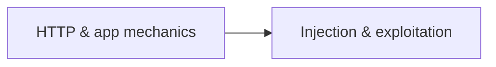

# 🕸️ Web Security

> [!abstract] Branch of [[Application Security]]
> From the anatomy of an HTTP transaction through every major server-side injection class, file-handling flaw, and logic bug. This branch builds the attacker's mental model of a web application — the prerequisite for both testing and defence.

## 📄 Notes in this branch

1. [[Web Fundamentals]] — HTTP transactions, walking an app, content discovery, subdomain enumeration, and JWT security
2. [[Web Exploitation]] — SQL injection, XSS, command injection, SSTI, XXE, SSRF, file inclusion, IDOR, auth bypass, race conditions, insecure deserialisation, and prototype pollution

---
> 🔼 Up: [[Application Security]]
