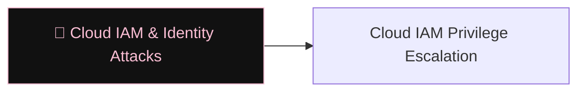

# 🔑 Cloud IAM & Identity Attacks

> [!abstract] The Branch
> Cloud identity planes are the blast radius multiplier — a single over-privileged service principal or a misconfigured role assignment can yield Global Admin or account-owner control without touching a host.

## Learning Path

1. [[Cloud IAM Privilege Escalation]] — PassRole/CreatePolicy (AWS), Entra app-role escalation, AADC sync abuse; hybrid AD-to-cloud paths

---
> 🔼 Up: [[Cloud Security]]
