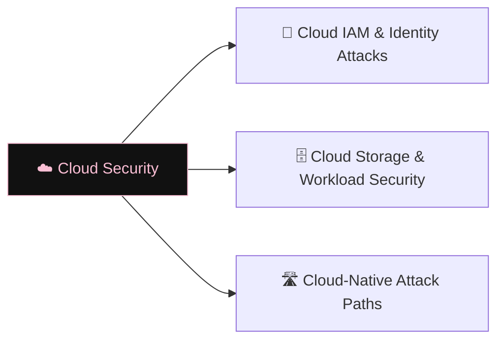

# ☁️ Cloud Security

> [!abstract] The Domain
> Securing cloud platforms — IAM privilege escalation, storage misconfigurations, container escapes, and cloud-native attack paths. Part of the domain map at [[Cyber Security]].

## Learning Path

1. [[Cloud IAM & Identity Attacks]] — principals, roles and privilege escalation across Azure, AWS, and GCP
2. [[Cloud Storage & Workload Security]] — S3/Blob misconfigurations, container escapes, serverless risks
3. [[Cloud-Native Attack Paths]] — SSRF to metadata; credential exfiltration; lateral movement through cloud APIs

---
> 🌐 Back to the domain map: [[Cyber Security]]
