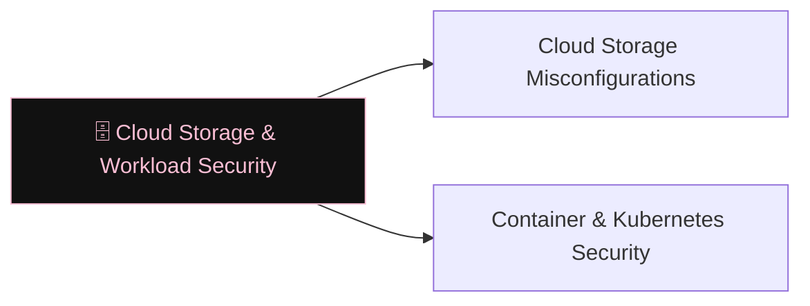

# 🗄️ Cloud Storage & Workload Security

> [!abstract] The Branch
> Object storage buckets, container registries, and serverless runtimes share a common failure mode: they are internet-reachable and frequently misconfigured during rapid deployment.

## Learning Path

1. [[Cloud Storage Misconfigurations]] — public S3/Blob buckets; pre-signed URL abuse; bucket policy confusion
2. [[Container & Kubernetes Security]] — privileged pods; host path mounts; RBAC escalation; etcd exposure

> [!note] Planned notes
> Content notes for this branch are coming soon.

---
> 🔼 Up: [[Cloud Security]]
