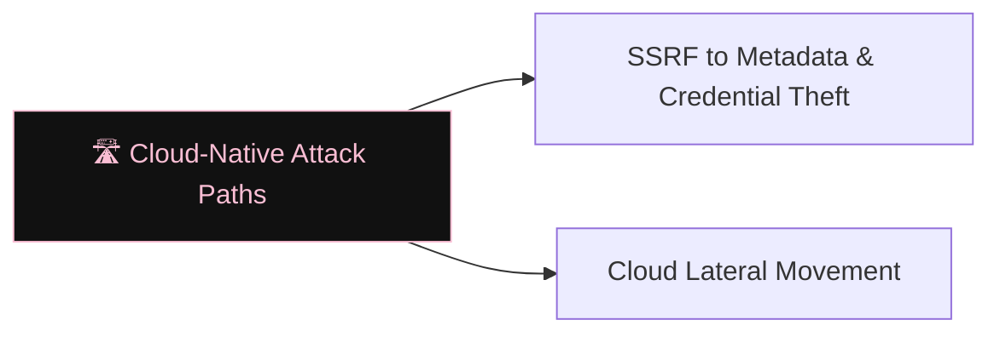

# 🛣️ Cloud-Native Attack Paths

> [!abstract] The Branch
> Cloud-native services expose metadata APIs, assume-role endpoints, and secrets managers — each an attacker pivot point reachable from a compromised workload.

## Learning Path

1. [[SSRF to Metadata & Credential Theft]] — IMDSv1 vs IMDSv2; Azure IMDS; GCP metadata server; token exfiltration via SSRF
2. [[Cloud Lateral Movement]] — cross-account role chaining; resource-based policy abuse; VPC peering pivots

> [!note] Planned notes
> Content notes for this branch are coming soon.

---
> 🔼 Up: [[Cloud Security]]
