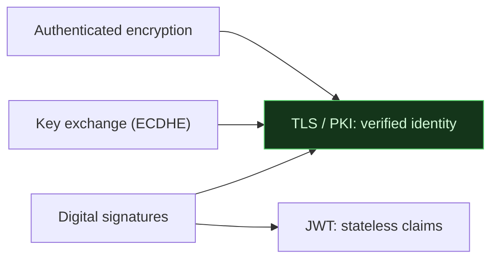

# 🔏 Applied Trust & Tooling

> [!abstract] Branch of [[Cryptography]]
> The earlier branches built the primitives; this one shows them assembled into the systems the world actually runs on. TLS and PKI compose signatures, key exchange and symmetric encryption into the padlock in the browser bar. JWTs use signatures for stateless authentication — and fail in instructive ways. And the branch closes with the project's own command-line crypto multi-tool that ties encoding, hashing and cracking into one interface.

Everything here is *composition* and *use*. The security failures in this branch are almost never broken math — they are trust misplaced (a rogue CA), verification skipped (`alg:none`), or a primitive used without the authentication it needs. This is where a cryptographer's "the algorithm is fine, the system is broken" becomes concrete.

## The leaves in this branch

Read them in order:

1. **TLS & PKI** — how certificates, a chain of trust, and the handshake compose every primitive into HTTPS; and where the trust system fails.
2. **JWT Security** — signed stateless tokens, why the payload is readable by anyone, and the `alg:none` and algorithm-confusion forgeries.
3. **CyberChef & the Crypto Toolkit** — the real tools for the branch's work: CyberChef for visual, chained transformations, and the CLI (`openssl`, `base64`, `xxd`, crackers) for scale.

## 📄 Notes in this branch
- [[TLS and PKI]]
- [[JWT Security]]
- [[CyberChef and the Crypto Toolkit]]

---
> 🔼 Up: [[Cryptography]]
