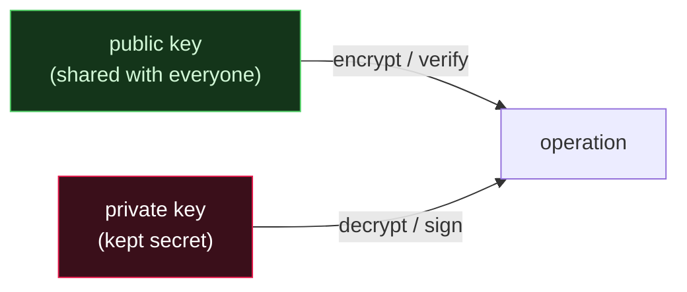

# 🔑 Asymmetric Encryption

> [!abstract] Branch of [[Cryptography]]
> Asymmetric (public-key) cryptography uses a **pair** of keys — a public key anyone may hold and a private key only the owner keeps — solving the problem symmetric encryption cannot: how two parties who have never met agree on secrets, and how anyone can verify who produced a message. This branch covers RSA, Diffie-Hellman key exchange, and digital signatures, and shows how each is broken by bad parameters or missing authentication rather than bad math.

The defining property is the keypair: what one key does, only the other undoes. Encrypt with the public key, decrypt with the private (confidentiality to the owner); sign with the private key, verify with the public (authenticity from the owner). Asymmetric operations are slow, so in practice they establish or authenticate a *symmetric* key that does the bulk work — the hybrid pattern every real protocol uses.

## The leaves in this branch

Read them in order:

1. **RSA** — the classic public-key algorithm; factoring as its trapdoor; and how weak parameters (shared primes) factor "real" keys instantly.
2. **Diffie-Hellman & ECC** — agreeing a shared secret over an open channel, why it needs authentication, and how elliptic curves shrink the keys.
3. **Digital Signatures** — inverting the keys to prove authenticity and integrity, hash-then-sign, and where signatures anchor internet trust.

## 📄 Notes in this branch
- [[RSA]]
- [[Diffie Hellman and ECC]]
- [[Digital Signatures]]

---
> 🔼 Up: [[Cryptography]]
