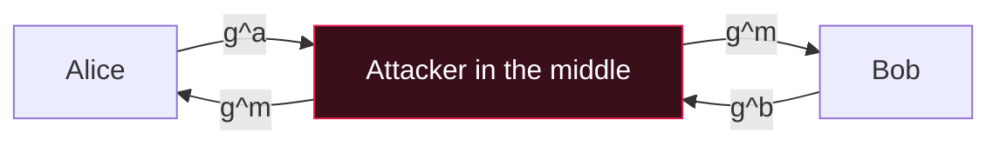

# 🤝 Diffie-Hellman & ECC

> [!abstract] Note of [[Asymmetric Encryption]]
> Diffie-Hellman lets two parties who have never met agree on a shared secret over a channel everyone can read — the breakthrough that makes symmetric encryption usable on the open internet. This note performs a key exchange where both sides independently derive the same secret, explains the hard problem it rests on, shows why unauthenticated Diffie-Hellman falls to a machine-in-the-middle, and why elliptic curves do the same job with far smaller keys.

## Parent Learning Order
RSA -> Diffie Hellman and ECC -> Digital Signatures

## The Problem: A Shared Key Without a Shared Meeting

> *Two machines that have never communicated need to end up holding the same secret key, and everything they send each other is public. Is that possible?*
>
> Hold your answer — the section below is the response.

Symmetric encryption is fast and does the real work, but both sides need the same key first. On the internet, two parties who have never communicated cannot simply *send* a key — anyone watching the channel would capture it. **Diffie-Hellman (DH)** solves exactly this: it lets them construct a shared secret through a public exchange, such that an eavesdropper who sees every message still cannot compute the secret. It does not encrypt anything itself; it *agrees a key*, which a symmetric cipher then uses.

## Worked Example: Agreeing a Secret in the Open

Both parties share public parameters — a large prime `p` and a base `g`. Each picks a private random number, sends a public value derived from it, and combines the other's public value with their own private number. The arithmetic makes both arrive at the same secret:

```shell-session
analyst@lab:~$ python3 -c "
p=0xFFFFFFFF...FFFF   # a standard 1024-bit safe prime (truncated here)
g=2
import secrets
a=secrets.randbelow(p); b=secrets.randbelow(p)   # private keys (never sent)
A=pow(g,a,p); B=pow(g,b,p)                        # public keys (exchanged openly)
s_alice=pow(B,a,p); s_bob=pow(A,b,p)              # each combines the other's public with own private
print('Alice secret == Bob secret ?', s_alice==s_bob)
print('shared secret (first 16 hex):', format(s_alice,'x')[:16])"
Alice secret == Bob secret ? True
shared secret (first 16 hex): 9065ae1124e89107
```

The symmetry is the magic. Alice computes `Bᵃ = (gᵇ)ᵃ = g^(ab)`; Bob computes `Aᵇ = (gᵃ)ᵇ = g^(ab)`; both land on `g^(ab) mod p`, the same value, without either revealing their private number. An eavesdropper saw `g`, `p`, `A = gᵃ` and `B = gᵇ` — everything except `a` and `b` — and to compute the secret would need to recover `a` from `A`, which is the hard problem of the next task.

## Why the Eavesdropper Is Stuck: Discrete Logarithms

The security rests on the **discrete logarithm problem**. Computing `A = gᵃ mod p` forward is fast. Reversing it — finding `a` given `g`, `p` and `A` — is infeasible for a large prime, because modular exponentiation scrambles the value with no usable structure to work backwards through. This is the multiplicative cousin of RSA's factoring problem: easy one way, ruinous the other. Break the discrete log and you break DH; and as with RSA, a sufficiently large quantum computer would (via Shor's algorithm), which is why post-quantum key exchange is being standardised.

One practical refinement matters enormously: because the private values `a` and `b` can be generated fresh for every session and thrown away afterwards, DH provides **forward secrecy**. Even if an attacker later steals the long-term keys, they cannot decrypt past sessions, because the per-session secrets no longer exist anywhere. This is why modern TLS insists on *ephemeral* DH (ECDHE).

**The deliberate break:** Diffie-Hellman is a key exchange, so completing one reads as having established a secure channel with the other party.

It establishes a shared secret **with someone**, and says nothing whatever about who. An attacker in the path runs two separate exchanges — one with each side — and relays between them; both exchanges are cryptographically perfect, both parties compute a genuine shared secret, and both secrets are known to the attacker. Nothing failed and no key size would have helped, because secrecy and identity are different properties and DH provides only the first. Every real deployment supplies the second from somewhere else, and the exchange is only as trustworthy as whatever that is.

**How you'd spot it:** ask what authenticated the exchange, and expect a specific answer. In TLS it is the server's signature over the handshake, chaining to a certificate you already trust; elsewhere it may be a pre-shared identity or a pinned key. A protocol description that discusses key sizes and curve choices at length while never mentioning a certificate, a signature or a pre-shared value is describing an unauthenticated exchange, however modern the primitives are.

## Unauthenticated DH Falls to the Middle

DH guarantees that you share a secret with *someone*. It says nothing about *who*. An attacker positioned between Alice and Bob can run DH with each of them separately — agreeing one secret with Alice and a different secret with Bob — and sit in the middle, decrypting and re-encrypting everything. Neither party can tell, because every message they see is validly encrypted under a secret they correctly derived.



This is why raw DH is never used alone. The public values must be **authenticated** — tied to a proven identity — so each side knows the `g^a` they received really came from the other party and not an impostor. That authentication comes from **digital signatures** (the next note) and the certificate system (**TLS and PKI**). In TLS, the server *signs* its DH parameters with the private key behind its certificate, which is the join between key exchange and identity that makes the whole handshake trustworthy.

## ECC: The Same Idea, Much Smaller Keys

Classic DH and RSA need large numbers — 2048-bit and up — to stay secure, which is slow and bandwidth-heavy. **Elliptic Curve Cryptography (ECC)** replaces modular exponentiation with point operations on an elliptic curve, where the equivalent hard problem (the elliptic-curve discrete log) is much harder per bit. The result is dramatic: a **256-bit** elliptic-curve key gives roughly the security of a **3072-bit** RSA/DH key.

That efficiency is why ECC dominates modern deployments. **ECDH** (elliptic-curve Diffie-Hellman) is the key exchange in current TLS; **X25519**, a specific fast and misuse-resistant curve, is the common default; and **ECDSA** and **Ed25519** are the signature counterparts (next note). The concepts are identical to everything above — public/private keypair, a hard reverse problem, key agreement, the need for authentication — only the underlying math is smaller and faster.

## Summary

You should now be able to:

- Explain the problem DH solves — agreeing a symmetric key over a public channel — and that it agrees a key rather than encrypting.
- Perform a DH exchange in which both sides independently derive `g^(ab) mod p`, and explain why the eavesdropper cannot.
- State the discrete-logarithm problem as DH's security basis, and explain forward secrecy from ephemeral keys.
- Explain why unauthenticated DH falls to a machine-in-the-middle and must be paired with signatures/PKI, and why ECC achieves the same security with far smaller keys.

---
> 🔼 Up: [[Asymmetric Encryption]]
