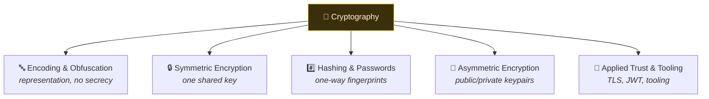

# 🔐 Cryptography

> [!abstract] The Domain
> How data is represented, kept secret, proven unchanged, and proven authentic — and how each of those is attacked. This domain runs from raw bytes to the TLS handshake in five branches, with a recurring lesson: the algorithms are rarely the weak point; how they are used is where systems break.

## 🚦 Start Here — the branch order

The branches build on each other; read them in order if you are new:

1. **[[Encoding & Obfuscation]]** — bits, hex, Base64 and XOR. The notation everything else is written in, and the crucial first lesson that encoding is not encryption.
2. **[[Symmetric Encryption]]** — AES, block cipher modes and stream ciphers: fast encryption with one shared key, and the usage mistakes (ECB, nonce reuse) that break it.
3. **[[Hashing & Passwords]]** — one-way hashes, salting, key-derivation functions, and cracking. Integrity, and how to store a password without keeping it.
4. **[[Asymmetric Encryption]]** — RSA, Diffie-Hellman and digital signatures: agreeing secrets and proving identity between parties who never met.
5. **[[Applied Trust & Tooling]]** — TLS/PKI and JWT, where every primitive above composes into the systems the internet actually runs on.

---
> 🌐 Back to the domain map: [[Cyber Security]]
