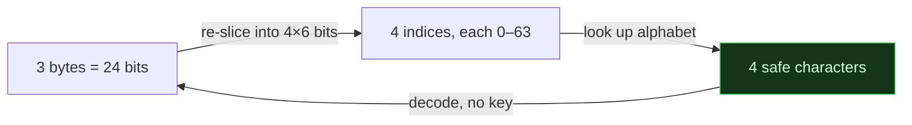

# 🔤 Base64 & the Base Family

> [!abstract] Note of [[Encoding & Obfuscation]]
> Base64 re-expresses arbitrary bytes in a 64-character alphabet safe for text-only channels. It is reversible by anyone, uses no key, and provides no secrecy — and mistaking it for encryption is one of the most common and most damaging beginner errors in security. This note shows how the encoding works, how to recognise it and its relatives on sight, and why "it was Base64-encoded" is never a security control.

## Parent Learning Order
Hexadecimal & Binary -> Base64 and the Base Family -> XOR and Classical Ciphers

## Why Encoding Exists At All

Many channels cannot carry raw bytes. Email bodies, URLs, JSON strings, HTTP headers and cookies are text, and a raw byte like `0x00` or `0xFF` either has no textual meaning or actively breaks the format. **Base64** solves this by re-expressing any bytes using only 64 characters that every text channel accepts: `A–Z`, `a–z`, `0–9`, and `+` and `/`.

The mechanism is pure regrouping. Base64 takes the input three bytes (24 bits) at a time and re-slices those 24 bits into four groups of six bits. Six bits index a value from 0 to 63, which selects one character from the alphabet. So three input bytes always become four output characters, and the output is about 33% larger than the input — the price of using only safe characters.

Nothing here involves a key or a secret. Encoding is a **representation** change, fully reversible by anyone who knows it is Base64, which is everyone. That is the entire point, and it is exactly why it is not protection.



## The Encoding, Worked

Encoding and decoding are one shell command each:

```shell-session
analyst@lab:~$ echo -n "Attack at dawn" | base64
QXR0YWNrIGF0IGRhd24=
analyst@lab:~$ echo "QXR0YWNrIGF0IGRhd24=" | base64 -d
Attack at dawn
```

The `-n` on `echo` matters: without it a trailing newline (`0x0A`) is included in the input and changes the output, which is a common source of "why doesn't my decode match" confusion. The round-trip is exact and needs no key — the decoder reversed the encoding using only public knowledge of the alphabet.

## Padding and the Length Tell

Base64 works in blocks of three input bytes. When the input length is not a multiple of three, the encoder pads the output with `=` so the length is always a multiple of four. Watching the padding change makes the mechanism visible:

```shell-session
analyst@lab:~$ for s in A AB ABC; do printf "%-4s -> %s\n" "$s" "$(echo -n "$s" | base64)"; done
A    -> QQ==
AB   -> QUI=
ABC  -> QUJD
```

One input byte leaves two `=`; two input bytes leave one `=`; three input bytes leave none. This is why trailing `=` characters are the single most recognisable sign of Base64 — and why their *absence* does not rule it out, since an input that is a multiple of three needs no padding. The `=` is not part of the data; it is bookkeeping the decoder uses to know how many real bytes the final block held.

## The Base Family

Base64 has relatives that trade the alphabet for different properties, and telling them apart at sight is the skill:

```shell-session
analyst@lab:~$ echo -n "hello" | base64
aGVsbG8=
analyst@lab:~$ echo -n "hello" | base32
NBSWY3DP
analyst@lab:~$ echo -n "hello" | xxd -p
68656c6c6f
```

Same input, three encodings. **Base64** uses mixed case plus `+/` and usually ends in `=`. **Base32** uses only uppercase `A–Z` and `2–7` — no lowercase, no digits below 2 — which makes it look "shouty" and is used where case is unreliable (some DNS and TOTP contexts). **Hex** (base 16) uses only `0–9a–f`, so it is the most restricted alphabet and the longest output. **Base58**, common in cryptocurrency addresses, is Base64 with the visually ambiguous characters (`0`, `O`, `I`, `l`, `+`, `/`) removed so an address can be read aloud or copied by hand without error.

The recognition heuristic: only `0-9a-f` is hex; uppercase-and-digits-2-7 is base32; mixed case with `+/=` is base64; mixed case without the ambiguous characters is base58.

## Why "It's Encoded" Is Not Security

Because decoding needs no key, Base64 provides zero confidentiality. A credential stored Base64-encoded is stored in plaintext for anyone who recognises the format — which is a reportable **cryptographic failure**, not a protection. Two consequences follow for security work:

**As a defender**, never treat encoding as a control. A "protected" config value that is merely Base64 is exposed; an HTTP Basic Authorization header is `base64(user:password)` and is plaintext credentials to anyone who reads the traffic, which is why Basic Auth requires TLS to be safe at all.

**As an analyst**, encoding is a wrapper to peel, not a wall. Malware and CTF challenges routinely stack encodings — Base64 of hex of gzip of the real payload — to slow a reader. You peel one layer at a time, identifying each by its alphabet, and the base64 that decodes to more base64 is a signal you are not done. That a payload is "obfuscated" this way tells you the author wanted to raise the effort, never that they succeeded in hiding anything from a patient reader.

Even binary data reveals itself through Base64 once you know the tell — the encoded first bytes of an executable still carry its recognisable structure:

```shell-session
analyst@lab:~$ head -c 6 /bin/ls | base64
f0VMRgIB
```

Decoding those bytes gives back `\x7fELF` — the magic number from the previous note — so an ELF binary smuggled through a text channel as Base64 is still identifiable as an ELF binary.

## Summary

You should now be able to:

- Explain that Base64 is a keyless, reversible representation change with no secrecy, and why it exists (text-only channels cannot carry raw bytes).
- Encode and decode with `base64` / `base64 -d`, and explain what the trailing `=` padding means and why it appears.
- Distinguish Base64, Base32, hex and Base58 by their alphabets at sight.
- Explain why storing or "protecting" data with encoding is a cryptographic failure, and peel layered encodings one alphabet at a time.

---
> 🔼 Up: [[Encoding & Obfuscation]]
