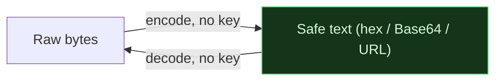

# 🔤 Encoding & Obfuscation

> [!abstract] Branch of [[Cryptography]]
> Encoding turns data into a different *representation* so it survives a text-only channel. It is reversible with no key and provides no secrecy — and treating it as protection is the classic first mistake this branch exists to correct. Obfuscation stacks encodings to slow a reader, never to stop one.

Encoding exists because channels are picky: email, URLs and JSON cannot carry raw bytes, so data is re-expressed in a safe alphabet. Anyone can reverse it — that is the point, and it is exactly why "it was encoded" is never a security control but a reportable **cryptographic failure** when used as one.

## The leaves in this branch

Read them in order — each assumes the one before:

1. **Hexadecimal & Binary** — bits, bytes and hex; reading a raw dump with `xxd`; magic bytes and endianness. The notation the rest of cryptography is written in.
2. **Base64 & the Base Family** — Base64, Base32, Base58 and hex; how the alphabet maps; recognising and peeling each on sight.
3. **XOR & Classical Ciphers** — XOR, Caesar, ROT13 and Vigenère; breaking single-byte and repeating-key XOR from ciphertext; the key-reuse flaw that separates a toy from a one-time pad.

## 📄 Notes in this branch
- [[Hexadecimal and Binary]]
- [[Base64 and the Base Family]]
- [[XOR and Classical Ciphers]]

---
> 🔼 Up: [[Cryptography]]
