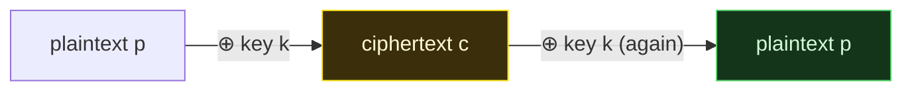

# ⊕ XOR & Classical Ciphers

> [!abstract] Note of [[Encoding & Obfuscation]]
> XOR and the classical ciphers — Caesar, ROT13, Vigenère — are the "encryption" that isn't. They are reversible transformations with tiny or reused keys, and each falls to a short script. This note shows why XOR is the atom of both real and fake cryptography, breaks single-byte and repeating-key XOR from ciphertext alone, and explains the exact property (key reuse) that separates a toy from a one-time pad.

## Parent Learning Order
Hexadecimal & Binary -> Base64 and the Base Family -> XOR and Classical Ciphers

## XOR: The Operation Underneath Everything

Exclusive-or (XOR, written `⊕` or `^`) compares two bits and returns 1 when they differ, 0 when they match. It has one property that makes it the workhorse of cryptography: **applying the same value twice returns the original**. If `c = p ⊕ k`, then `c ⊕ k = p`. Encryption and decryption are the *same operation* with the same key.



```shell-session
analyst@lab:~$ python3 -c "
p=b'SECRET'; k=0x2a
c=bytes(x^k for x in p)
print('cipher:', c.hex())
print('back  :', bytes(x^k for x in c).decode())"
cipher: 796f69786f7e
back  : SECRET
```

This reversibility is why XOR appears inside AES, inside stream ciphers, inside the one-time pad — and also inside every amateur "encryption" scheme. XOR itself is neither secure nor insecure; what matters entirely is the *key*: how long it is, whether it repeats, and whether it is ever reused. This note is about what happens when the key is weak, because that is what you will meet in CTFs, malware and audits.

## Single-Byte XOR, and How It Falls

The simplest XOR "cipher" uses one key byte for the whole message. It has 256 possible keys, so it does not survive contact with a computer. The attack does not need the key or the plaintext — only the ciphertext and the knowledge that the result should look like English:

```shell-session
analyst@lab:~$ python3 -c "
import string
# a real ciphertext: plaintext XOR one secret byte
pt=b'Meet me at midnight'; key=0x5c
ct=bytes(x^key for x in pt)
print('ciphertext (hex):', ct.hex())
# --- the attack: try all 256 keys, score by English-likeness ---
def score(b): return sum(chr(x) in string.ascii_letters+' ' for x in b)
best=max(range(256), key=lambda k: score(bytes(x^k for x in ct)))
print('recovered key      = 0x%02x' % best)
print('recovered plaintext =', bytes(x^best for x in ct).decode(errors='replace'))"
ciphertext (hex): 113939287c31397c3d287c31353832353b3428
recovered key      = 0x5c
recovered plaintext = Meet me at midnight
```

Read what the attack actually used. It did not know the key `0x5c` and it did not know the plaintext. It tried all 256 possible key bytes, and for each candidate it *scored* the result by how many characters landed in the printable-English range. The correct key produces readable text and every wrong key produces garbage, so the highest score is the answer. This scoring-by-plausibility is the engine of most classical breaks: the key space is small enough to enumerate, and English is distinctive enough to recognise.

## Repeating-Key XOR and the Keylength Attack

Repeating a short key over a long message — the "Vigenère of bytes" — feels stronger, and is the scheme most homemade encryptors actually use. It falls in two stages: first find the key *length*, then solve each key byte independently.

The key-length stage uses a striking fact. Two chunks of ciphertext that were encrypted under the *same* stretch of key differ only by the difference between two pieces of English, which is small; two chunks encrypted under *different* key positions differ more. Measuring bit-difference (**Hamming distance**) for each candidate length and taking the smallest reveals the period:

```shell-session
analyst@lab:~$ python3 keylen.py     # key was b'LEMON' (length 5)
Ranked keylen candidates (lowest normalized Hamming first):
  keylen 5: 2.556
  keylen 4: 2.567
  keylen 8: 2.667
  keylen 7: 2.724
-> top candidate: 5
```

The true length, 5, ranks first — but notice the margin over length 4 is thin (2.556 vs 2.567). That closeness is honest and important: the Hamming test *ranks* candidates, it does not certify one. On short or unusual text the true length can slip to second or third place, which is why the real workflow is to take the top few candidates and actually attempt to solve each. The confirmation is not the ranking; it is that one length yields readable plaintext and the others do not.

Once the length is known the problem collapses. Every Nth byte of the ciphertext was XORed with the *same* key byte, so grouping those bytes turns a repeating-key cipher into N independent single-byte XOR problems — each solved exactly as in **Single-Byte XOR, and How It Falls**. A short key does not multiply the difficulty; it just gives you several easy problems instead of one.

## The Classical Ciphers Are the Same Story

The pre-computer ciphers are XOR's cousins: small keys, reversible, and broken by the same enumerate-and-score approach.

```shell-session
analyst@lab:~$ echo "Attack" | tr 'A-Za-z' 'N-ZA-Mn-za-m'
Nggnpx
analyst@lab:~$ python3 -c "print(''.join(chr((ord(c)-65+3)%26+65) if c.isupper() else c for c in 'HELLO'))"
KHOOR
```

**ROT13** shifts every letter by 13; since 13+13=26, applying it twice returns the original — it is its own inverse, and it was never meant as secrecy, only to hide spoilers. **Caesar** shifts by a fixed amount (3 here: `HELLO`→`KHOOR`); with only 25 possible shifts it falls to trying all of them. **Vigenère** uses a repeating keyword to vary the shift per letter — which is exactly repeating-key XOR done with letters instead of bytes, and it breaks by exactly the **keylength attack** method above: find the keyword length by looking for repeated distances, then solve each shift by letter frequency.

Every one of these is enumerate-the-small-keyspace, score-for-language. The lesson is not the individual cipher; it is that a small or repeating key is the vulnerability, whatever alphabet it dresses in.

## The One Property That Would Make XOR Unbreakable

XOR is not inherently weak. If the key is **truly random, at least as long as the message, and never reused**, XOR *is* the one-time pad — provably unbreakable, because every possible plaintext of that length is an equally valid decryption and the ciphertext gives no way to prefer one. Every attack in this note exploited a violation of that rule: a one-byte key (far shorter than the message), or a short key repeated (reused key positions).

That is the bridge to real cryptography. The reason stream ciphers exist (the sibling **Stream Ciphers** note) is to generate a long, non-repeating, key-derived stream to XOR against the message — an attempt to approximate the one-time pad's "never reuse the keystream" property with a short key. And the reason "never reuse a nonce/keystream" is repeated so insistently in real systems is that key reuse is precisely the flaw this note breaks by hand: reuse turns an unbreakable operation into a scoring exercise.

> [!warning] Authorized use
> The breaks here run against ciphertext you generate yourself. Recovering plaintext from other parties' data without authorization is unlawful regardless of how weak the cipher is.

## Summary

You should now be able to:

- Explain XOR's self-inverse property (`c ⊕ k ⊕ k = c`) and why it makes XOR the atom of both real and fake encryption.
- Break single-byte XOR from ciphertext alone by enumerating 256 keys and scoring for English.
- Recover the key length of a repeating-key XOR cipher with the normalized Hamming-distance test, explain why it only *ranks* candidates, and reduce the cipher to independent single-byte problems.
- Recognise Caesar, ROT13 and Vigenère as the same small-key weakness, and state the three conditions (random, message-length, never reused) that would make XOR a one-time pad.

---
> 🔼 Up: [[Encoding & Obfuscation]]
