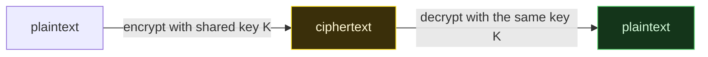

# 🔒 Symmetric Encryption

> [!abstract] Branch of [[Cryptography]]
> Symmetric encryption uses **one shared secret** to both encrypt and decrypt. It is fast and does the bulk of the world's data protection — but its security depends entirely on how the cipher is *used*: which mode, which nonce, whether the result is authenticated. This branch builds from the block cipher up to the modes and stream ciphers that make it usable, and shows the usage mistakes that break otherwise-unbreakable ciphers.

The defining property is a single shared key: whoever can encrypt can also decrypt. That makes symmetric encryption efficient but raises the question the **Asymmetric Encryption** branch exists to answer — how two parties who have never met agree on that shared key in the first place.

## The leaves in this branch

Read them in order — each builds on the one before:

1. **AES & Block Ciphers** — the block cipher as a keyed permutation; AES's structure; and why a block cipher alone can only encrypt one block.
2. **Block Cipher Modes** — ECB's pattern leak, CBC's chaining and malleability, and the authenticated modes (CTR, GCM) that make encryption correct.
3. **Stream Ciphers** — keystream encryption, ChaCha20, and the nonce-reuse flaw that recovers plaintext with no key.

## 📄 Notes in this branch
- [[AES and Block Ciphers]]
- [[Block Cipher Modes]]
- [[Stream Ciphers]]

---
> 🔼 Up: [[Cryptography]]
