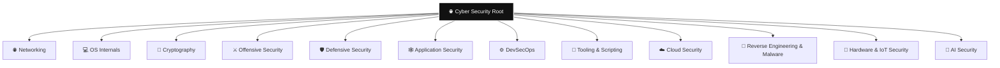

# 🌐 Cyber Security Root — The Domain Map

> [!abstract] The Center of the Universe
> The entry point to the vault — **twelve** colour-coded security domains, each a deep tree: **Root → Hub → Branch → Master Note**. Colours are configured in `.obsidian/graph.json` so the twelve trees render automatically.

## 🚦 Start Here — If You Are New

> [!tip] Never studied this before? Read and master in this order.
> Everything in this vault assumes the fluency built by the first two domains. Do not start in the middle.
>
> 1. **Network Foundations** (in [[Networking]]) — what a network is, the OSI and TCP/IP models, how a packet becomes a frame. Nothing else makes sense without this.
> 2. **Addressing & Subnetting** (in [[Networking]]) — IP addresses, masks, and why a subnet boundary is a security control.
> 3. **OS Theory and Architecture** (in [[OS Internals]]) — processes, threads, scheduling, and memory: the ideas every operating system shares.
> 4. Pick the platform you actually use — **Linux**, **Windows**, or **macOS** (all in [[OS Internals]]) — and work through its curriculum in order.
> 5. Then continue down the Networking path (Switching → Routing → Transport → Services), and only afterwards branch into [[Cryptography]], [[Offensive Security]], or [[Defensive Security]].
>
> Every leaf opens at **Crook** level with a plain-language mental model and an analogy, then climbs to **Operator** and **Root**. If a note feels too advanced, its `Parent Learning Order` line names the siblings you should read first.

## 🌳 The Twelve Domains
- 🌐 **[[Networking]]** — How data moves — OSI/TCP-IP, addressing, DNS/DHCP/NAT, routing, and the protocols both sides target.
- 🐧 **[[OS Internals]]** — The operating system a hacker lives in — the CLI arsenal, filesystem, permissions & processes, and privilege escalation.
- 🔐 **[[Cryptography]]** — Encoding vs encryption vs hashing, symmetric & asymmetric crypto, signatures, TLS/JWT, and cracking.
- ⚔️ **[[Offensive Security]]** — The attacker's craft — methodology, recon, exploitation, and total root control. Authorized simulation only.
- 🛡️ **[[Defensive Security]]** — The defender's craft — controls & hardening, logging, EDR/SIEM, and detection engineering.
- 🕸️ **[[Application Security]]** — Web & API security — HTTP fundamentals, the OWASP Top 10, web exploitation, and API defense.
- ⚙️ **[[DevSecOps]]** — Security baked into the pipeline — containers, orchestration, and secure delivery.
- 🧰 **[[Tooling & Scripting]]** — Building and wielding tools — Python & Go for security, and the core pentest toolkit.
- ☁️ **[[Cloud Security]]** — Securing cloud platforms — IAM, storage, workloads, cloud-native attack paths.
- 🦠 **[[Reverse Engineering & Malware]]** — Taking binaries apart — disassembly, debugging, and malware analysis.
- 🔌 **[[Hardware & IoT Security]]** — Attacking physical devices — firmware, embedded systems, radio, and IoT.
- 🧠 **[[AI Security]]** — Securing and attacking ML systems — prompt injection, model theft, and data poisoning.

---
> Twelve trees, one root.
