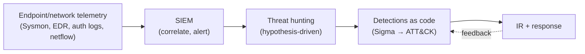

# 🛡️ Advanced Defenses

> [!abstract] Note of [[Defensive Security]]
> Every offensive technique in this corpus leaves something behind. This note turns them into detections — the telemetry that records them, the queries that surface them, and the reason the hardest attacks to catch are the ones that use no malicious software at all.

## Parent Learning Order
Defensive Groundwork -> Advanced Defenses

## The Detection Mindset

> *An attacker uses only signed Microsoft binaries that ship with the operating system. What is left for your antivirus to match on?*
>
> Hold your answer — the section below is the response.

Nothing, which is why modern defense stopped asking that question. Antivirus matches artefacts; an attacker using `certutil` and `rundll32` brings no artefact to match. Modern defense assumes the perimeter *will* be breached and focuses on **detecting the attacker inside**. Three principles:

- **Assume breach** — hunt for post-exploitation behaviour, not just perimeter blocks.
- **Behaviour over signatures** — **LOTL** uses *trusted* binaries, so you can't block by hash; you detect by **what they do** (a `certutil` that downloads an `.exe`, `rundll32` running from `C:\Users\Public`).
- **Detection engineering** — map coverage to **MITRE ATT&CK**, write detections as code, and measure them (the Pyramid of Pain: cost the attacker *TTPs*, not just IOCs).



## The Defensive Stack (EDR · SIEM · Threat Hunting)

| Layer | Role |
| --- | --- |
| **Telemetry** | The raw truth: **Sysmon** (process/network/image-load — Event IDs 1/3/7/11), Windows Security log, auth.log/auditd, **netflow/Zeek** |
| **EDR** | Endpoint Detection & Response — real-time process-tree, memory, and behavioural monitoring on every host; blocks and isolates |
| **SIEM** | Splunk/Elastic/Sentinel — centralises logs, correlates across hosts, runs detection rules, alerts |
| **NDR / NSM** | Network detection — beaconing, lateral movement, exfil patterns |
| **Threat hunting** | Proactive, hypothesis-driven search for what automated rules miss |
| **SOAR** | Automated response playbooks |

> The **non-negotiable foundation** is off-host, real-time log forwarding — it neutralises most of **anti-forensics** before it starts.

## Detecting Privilege Escalation

The escalations in [[Local Privilege Escalation]] and [[Linux Privilege Escalation]] all leave telemetry:

| Technique | Detection |
| --- | --- |
| **SUID/sudo abuse** | auditd on `execve` of shell-escape binaries via `sudo`; `sudo -l` enumeration bursts; a shell spawned as a child of a SUID binary |
| **LD_PRELOAD** | auditd on `sudo` with `LD_PRELOAD` set; unexpected `.so` writes to `/tmp` |
| **Cron/PATH hijack** | file-integrity monitoring (FIM) on cron scripts & `/etc/crontab`; writes to `PATH` dirs |
| **Kernel exploit** | a service/kernel Oops in `dmesg`; a child shell from an unexpected process; EDR memory anomalies |
| **Windows token impersonation (Potato)** | Sysmon EID 1 for `PrintSpoofer`/potato tooling; **Event ID 4673/4674** (privileged service called); a service account suddenly running `cmd`/`powershell` as SYSTEM |

```splunk
index=sysmon EventCode=1 (Image="*\\cmd.exe" OR Image="*\\powershell.exe")
ParentImage IN ("*\\w3wp.exe","*\\sqlservr.exe","*\\services.exe") User="NT AUTHORITY\\SYSTEM"
| stats count by Host, ParentImage, Image, User      // service account → SYSTEM shell
```

## Detecting Exploitation & Shellcode

Memory-corruption exploitation ([[Binary Exploitation Fundamentals]]) is noisy at the endpoint:
- **Repeated service crashes** — fuzzing/offset-finding shows up as recurring `SIGSEGV` / Windows WER crash events on the same process.
- **Anomalous child process** — a network daemon (`nginx`, `sqlservr`) spawning `cmd`/`/bin/sh` is a near-certain post-exploitation signal.
- **RWX memory / suspicious allocations** — shellcode needs executable memory; EDR flags `VirtualProtect`/`mprotect` making a region RWX, and ROP-like stack pivots.
- **Exploit-guard controls** — CFG, CET/shadow-stack, and EMET-style mitigations both *prevent* and *log* exploitation attempts.

```splunk
index=sysmon EventCode=1 ParentImage IN ("*\\nginx.exe","*\\httpd*","*\\sqlservr.exe")
Image IN ("*\\cmd.exe","*\\powershell.exe","*/sh","*/bash")
| stats count by Host, ParentImage, Image      // daemon spawning a shell = exploitation
```

## Detecting Living off the Land

Because LOLBins are trusted, detection is **behavioural** — correlate the tool with an anomalous action (the detections shipped alongside each technique in [[Local Privilege Escalation]]):

- **PowerShell** — `IEX(DownloadString)`, `-EncodedCommand`, `-Exec Bypass`; enable **Script-Block Logging (EID 4104)**, **Module Logging**, **AMSI**, and **Constrained Language Mode**.
- **certutil** — `-urlcache`/`-decode` (a certificate tool has no business downloading `.exe`s).
- **rundll32 / mshta / regsvr32** — running from `C:\Users\Public`/`Temp`, or with URLs/inline script.
- **wmic / schtasks** — remote `process call create`; new tasks with benign names (`WindowsUpdate`) running from user-writable paths.

```splunk
index=sysmon (EventCode=1 OR EventCode=4104)
(CommandLine="*DownloadString*" OR CommandLine="*-EncodedCommand*"
 OR (Image="*\\certutil.exe" AND CommandLine="* -urlcache *")
 OR (Image="*\\rundll32.exe" AND CommandLine="*\\Users\\Public\\*"))
| stats count values(User) values(ParentImage) by Host, Image, CommandLine
```
Parent-child anomalies are gold: `winword.exe → powershell.exe` is almost always malicious.

## Detecting Anti-Forensics

The paradox from [[Operational Security, Anti-Forensics & Teardown]] — *removal is itself an artifact*:

| Anti-forensic move | Alert |
| --- | --- |
| Windows Security log cleared | **Event ID 1102** — one of the highest-fidelity alerts in the SOC |
| Linux log cleared/edited | **off-host forwarded copy** already has the entries; FIM on `/var/log`; sequence-number gaps |
| `wtmp`/`utmp` wiped | inode `ctime` anomaly; `last` output ends abruptly; forwarded auth events remain |
| auditd/Sysmon stopped | **service-stop event**, then telemetry silence — alert on the *absence* of expected heartbeat logs |
| Secure file deletion | USN journal / `$MFT` deletion record; EDR captured the file **hash on write**, before shredding |
| MAC/hostname masking | NAC/802.1X, switch port, and DHCP logs record both identities |

```splunk
index=wineventlog (EventCode=1102 OR EventCode=104)         // Security/System log cleared
| stats count by Host, User, _time
| eval severity="CRITICAL — audit log cleared"
```
> **Design principle:** make logs **immutable and off-host**, alert on **log-source silence**, and treat *any* clearing event as an incident. The attacker owns the endpoint; they don't own the SIEM.

**The deliberate break:** detection reads as recognising malicious tools — know the bad software, spot it when it appears.

Living-off-the-land removes the thing being recognised. The binaries are already installed, already signed, and already used legitimately every day, so there is no malicious artefact anywhere in the sequence. Detection therefore has to be about **context and combination** — this binary, doing this, with that parent, at this hour — rather than about identity. Anti-forensics inverts the problem the same way: the signal becomes an absence, a log source that stopped, which nothing will alert on unless somebody is watching for silence.

**How you'd spot it:** the tells are pairings and gaps rather than names: a signed system binary doing something outside its purpose, and a telemetry source that went quiet without an explanation. Both are only visible against a known baseline, which makes baselining the prerequisite rather than a maturity step — without it, "unusual" has no referent and every one of these detections is unimplementable.

## Security Implications

**A detection you cannot baseline is a detection you do not have.** Every query in this note asks whether something is unusual, and unusual is meaningless without a record of usual. A SOC that deploys these rules before it can answer "does `winword.exe` ever launch PowerShell here, and how often" will drown in alerts and switch them off within a fortnight. Baselining is not a maturity milestone that comes later; it is the precondition, and the correct order is to collect first, characterise second, and alert third.

**The telemetry is more valuable than the alerts built on it.** Rules encode what was already understood to be an attack. The log that recorded a process tree nobody had thought to look at is what makes the next investigation possible, and it is why retention and off-host forwarding matter more than rule count. An organisation with six months of clean process telemetry and twenty rules is in a far better position than one with two weeks and four hundred.

**Detection engineering is adversarial, and the adversary reads your rules.** Published detections — Sigma, ATT&CK mappings, vendor blogs — are read by both sides. A rule matching `-EncodedCommand` is trivially evaded by an attacker who stops using it. This is not a reason to stop writing rules; it is the reason to cost the attacker at the level of technique rather than string, and to accept that any single detection has a shelf life.

**The controls in this note watch the endpoint, and the endpoint may already be lost.** Every one of these signals is generated on a host the attacker may control. This is the entire argument for immutable, off-host, real-time forwarding: not because it is tidier, but because it is the one place in the chain the attacker does not own.

## Summary

You should now be able to:

- Adopt the detection mindset — assume compromise and hunt for the behaviour rather than waiting for a signature.
- Build detections for privilege escalation, exploitation and shellcode, living-off-the-land, and anti-forensics.
- Explain how EDR, SIEM and threat hunting compose into a layered defensive stack, and where each layer sees what.
- Explain why baselining is a precondition rather than a maturity step, and why telemetry outlives the rules written against it.

---
> 🔼 Up: [[Defensive Security]]
