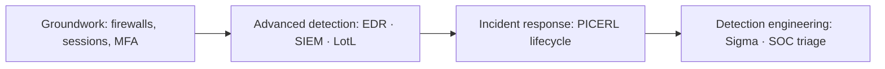

# 🛡️ Defensive Security

> [!abstract] The Domain
> The defender's craft — controls and hardening, detection and triage, incident response, and the engineering discipline of making detection rules that actually work. Part of the domain map at [[Cyber Security]].

## 🗺️ Zero-to-Mastery Learning Path

1. [[Defensive Groundwork]] — firewalls and their default policy; cookie vs. token session management; MFA and the real-world attacks that bypass it
2. [[Advanced Defenses]] — the detection mindset; EDR, SIEM, and threat hunting as a stack; detecting privilege escalation, shellcode, LotL, and anti-forensics
3. [[Incident Response Methodology]] — PICERL lifecycle; evidence volatility order; containment strategies; chain of custody
4. [[SIEM & Detection Engineering]] — SIEM architecture; Sigma rules as detection-as-code; SOC tier model; precision over coverage

---
> 🌐 Back to the domain map: [[Cyber Security]]
