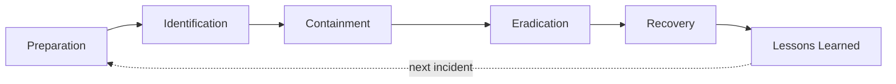

# 🚨 Incident Response Methodology

> [!danger] Authorized response environments only
> IR techniques — memory acquisition, network isolation, registry analysis — are applied only on systems you own or are authorized to respond on. Never image or isolate a system without explicit authorization and a defined scope.

## Parent Learning Order
Defensive Groundwork -> Advanced Defenses -> Incident Response Methodology -> SIEM & Detection Engineering

## When Something Is Wrong

> *A host on your network is beaconing to an unknown IP. Do you shut it down immediately?*
>
> Hold your answer — the section below is the response.

You have a confirmed or suspected security incident — malware on a workstation, ransomware starting to spread, credentials being exfiltrated. The instinct is to act fast: unplug the host, wipe it, restore from backup, declare victory. That instinct destroys evidence, announces to the attacker that they have been detected (triggering accelerated damage), and — in regulated industries — may violate legal obligations around evidence preservation. **Incident Response (IR)** is the structured alternative: a repeatable process that balances speed of containment against preservation of the evidence needed to understand what happened, attribute it, and prevent recurrence.

IR is not a linear playbook executed once. It is a **loop** — initial containment may reveal new affected systems, forcing re-identification; recovery may uncover persistence mechanisms missed in eradication, forcing re-containment. The structure exists to ensure nothing is skipped, not to pretend incidents are tidy.

> [!tip] The analogy, and where it breaks
> IR is like preserving a crime scene: the first responder's instinct is to help the victim, but disturbing the scene destroys the evidence that would identify the attacker and convict them. The analogy breaks on *time pressure* — in a cyber incident, the attacker is usually still active, the damage is still accumulating, and a real crime scene doesn't typically escalate while you document it. That tension — preserve versus act — is the central judgment call IR makes explicit.

**The deliberate break:** shut it down immediately, before it can do more damage. Pulling the power stops the harm and protects data.

Immediate power-off destroys volatile memory — the running process list, open network connections, decryption keys held in RAM, and any in-memory-only malware that leaves no disk artifact. That volatile data is often the only evidence that proves *how* the attacker got in, *what* they accessed, and *whether* they are still present. Recovery from backup restores the system; it does not answer those questions, and an undetected persistence mechanism survives it. The cost of "act immediately" is answered only by reconstructing a complete attack chain from incomplete evidence — or not at all.

**How you'd spot the wrong approach:** an IR report that starts with "We imaged the disk" but has no memory dump, no live network capture, and no pre-isolation netstat or process list. The disk image proves the disk; it says nothing about what was running.

## The PICERL Lifecycle

IR divides into six phases. Each phase gates the next — skipping a phase degrades the quality of all later ones.



**Preparation** happens before any incident. It includes: documented response plans, defined roles, out-of-band communication channels (an attacker who has email access reads your IR emails), pre-positioned forensic tooling, legal authority letters, and tabletop exercises that stress-test the plan before it is needed under pressure.

**Identification** is confirming that a real incident occurred and determining its initial scope — which systems, what data, what attack class. Sources: SIEM alerts, EDR telemetry, user reports, third-party notification. The key deliverable is an **incident declaration** that starts the clock on any regulatory notification window.

**Containment** limits further damage without destroying evidence. Short-term containment (isolate the affected host from the network) and long-term containment (patch the vulnerability, revoke the credential) are distinct steps. Network isolation is preferred over power-off because it preserves volatile state and maintains the ability to observe attacker behaviour if needed.

**Eradication** removes the attacker's presence: delete malware, close backdoors, reset compromised credentials, patch the vulnerability. Eradication is only meaningful after root-cause analysis confirms *how* the attacker got in and *what* they installed — otherwise you are removing what you found, not what they left.

**Recovery** restores normal operations: re-image or restore affected systems, re-enable services, validate functionality. Monitor closely for recurrence — successful eradication is confirmed by the absence of re-compromise, not by the act of reinstalling.

**Lessons Learned** is a structured post-mortem: timeline of events, root cause, response actions, what worked, what didn't, and specific control improvements with owners and deadlines. Without this phase, each incident produces the same lessons at the same cost.

## Evidence Priority and Volatility

Collect evidence in order of volatility — the most transient data first, because it vanishes on shutdown or network change:

| Priority | Source | What it proves | Capture method |
|---|---|---|---|
| 1 | **Running memory** | In-memory malware, decryption keys, process tree | `winpmem`, `lime`, `dumpit` |
| 2 | **Live network state** | Open connections, listening ports, ARP cache | `netstat -ano`, `ss -antp`, `arp -a` |
| 3 | **Running processes** | Parent-child chain, loaded DLLs, handles | `tasklist /v`, `ps aux`, Volatility |
| 4 | **Disk image** | Filesystem, artefacts, registry hives | FTK Imager, `dd`, `dc3dd` |
| 5 | **Log exports** | Event log, syslog, SIEM data | `wevtutil`, `journalctl`, SIEM API |

### Worked example — WS-014, meridian.test

EDR on WS-014 (10.10.10.14) flags an outbound TLS connection to a new external host. The analyst declares a P2 incident and follows the evidence-first sequence before isolating:

```shell-session
; Step 1 — capture volatile network state before isolation
analyst@LOG01:~$ ssh admin@10.10.10.14 "netstat -ano | findstr ESTABLISHED"
TCP  10.10.10.14:49731  203.0.113.99:443  ESTABLISHED  PID 4812

; Step 2 — identify the process
analyst@LOG01:~$ ssh admin@10.10.10.14 "tasklist /fi \"PID eq 4812\" /v"
rundll32.exe  4812  Console  1  12,040 K  RUNNING  MERIDIAN\svc_backup

; Step 3 — capture memory before isolation
analyst@LOG01:~$ ssh admin@10.10.10.14 "C:\tools\winpmem.exe ws014-mem.raw"
; Transfer ws014-mem.raw to evidence store BEFORE pulling the network cable

; Step 4 — network isolation (ACL on the switch port, not power-off)
; Switch config: interface gi0/14 -> shutdown
; WS-014 is now isolated but still powered; memory is intact for Volatility analysis
```

`rundll32.exe` running as `svc_backup` and making outbound TLS is the finding — a service account is not expected to spawn `rundll32.exe` for any legitimate purpose. Memory acquisition before isolation captures the in-memory PE the loader dropped, which disk forensics would miss entirely.

## Containment Strategies

| Strategy | When to use | Trade-off |
|---|---|---|
| **Network isolation** | Confirmed compromise, active exfiltration | Stops data loss; destroys volatile state if rebooted |
| **Decoy network (sinkhole)** | Want to observe attacker behaviour longer | Highest evidence quality; requires legal authority, carries risk of further access |
| **Credential reset** | Compromised account confirmed | Lowest disruption; ineffective if other persistence exists |
| **Emergency patch + monitor** | Vulnerability confirmed, no active compromise yet | Proactive; riskier if attacker is already present |

## Chain of Custody Basics

Every piece of evidence must be **documented, hashed, and stored** before analysis:

```text
sha256sum ws014-mem.raw > ws014-mem.raw.sha256
sha256sum ws014-disk.dd  > ws014-disk.dd.sha256
```

Hash before transferring. Hash again after transfer. A mismatch means the evidence was modified in transit and may be inadmissible. Record: who collected it, when, from which system, using which tool, and where it is stored. A chain of custody that breaks at any link breaks the legal case and may break the insurance claim.

## Security Implications — the Defender's View

- **Preparation is not optional.** An IR plan written during an incident is written under pressure, by people who cannot agree on who is in charge, using an email channel the attacker is reading. Run tabletops quarterly.
- **Out-of-band communication is mandatory.** A compromised mail server means the attacker sees every "confidential" IR update. Pre-establish a Signal channel, a secondary email domain, or a physical war room.
- **Regulatory notification windows are short.** GDPR requires notification within 72 hours of awareness; HIPAA within 60 days; breach-notification laws vary by state and sector. The IR plan must include a legal/compliance track running in parallel.
- **Recovery ≠ eradication.** Re-imaging a system that still has an active credential or a persistence mechanism in a domain GPO will be re-compromised within hours. Confirm root cause before recovery.
- **Attacker dwell time is the key metric.** Average dwell time (detection to containment) is measured in weeks in real incidents — the longer it runs, the more systems are affected and the higher the recovery cost.

## Summary

You should now be able to:

- Apply the PICERL lifecycle to a confirmed incident, naming what each phase produces and why phases cannot be safely skipped.
- Collect volatile evidence — memory, network state, process list — in priority order before network isolation, and explain what is lost if isolation happens first.
- Choose a containment strategy (isolation, sinkhole, credential reset, patch-and-monitor) based on what is known about the attacker's access and intent.

---
> 🔼 Up: [[Defensive Security]]
