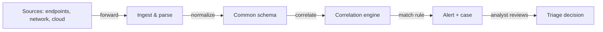

# 📊 SIEM & Detection Engineering

> [!warning] Authorized detection environments only
> Detection rules, log queries, and alert tuning are applied only within authorized environments. Never forward or export production security logs outside your authorized scope.

## Parent Learning Order
Defensive Groundwork -> Advanced Defenses -> Incident Response Methodology -> SIEM & Detection Engineering

## Twelve Thousand Alerts

> *Your SIEM generated 12,000 alerts overnight. How do you find the real attack hidden in them?*
>
> Hold your answer — the section below is the response.

You don't review 12,000 alerts. The number itself is the bug, not the workload. A SIEM that produces 12,000 alerts a night is a SIEM whose rules were written once and never tuned — it is detecting everything and therefore detecting nothing, because analysts stop reading alerts that cry wolf. **Detection engineering** is the discipline of writing, testing, and continuously tuning detection logic so that the signal-to-noise ratio is high enough that every alert is worth investigating. A mature detection programme produces fewer alerts than a naive one, and every alert it does produce leads somewhere.

The answer to 12,000 alerts is not "hire more analysts" — it is "improve the rules." Detection is a software engineering problem with an adversarial opponent who is actively trying to stay below the threshold.

> [!tip] The analogy, and where it breaks
> A SIEM is like a smoke detector in a kitchen: calibrated correctly it fires only when there is actual danger; calibrated badly it fires every time you make toast, and people start removing the batteries. The analogy breaks on *adversarial adaptation* — a smoke detector's threshold is fixed, but an attacker observes your detection boundary and deliberately operates below it. Detection engineering is therefore not a configuration task but an ongoing arms race: each attacker technique your rules cover teaches them to use the next technique your rules do not.

**The deliberate break:** write a detection rule for every known MITRE ATT&CK technique and you have full coverage.

Coverage and precision are different metrics. A rule that fires on every PowerShell execution achieves T1059.001 coverage but floods the queue with legitimate admin activity. A rule that fires only when PowerShell spawns from `winword.exe`, makes a network connection, and runs within 30 seconds of an email delivery is more precise and therefore more actionable. Writing 500 low-precision rules that fire constantly produces worse security outcomes than 50 high-precision rules that analysts trust. Coverage is a starting point; precision is the goal.

**How you'd spot the gap:** a SOC that measures detection maturity by the number of rules rather than by the percentage of true-positive alerts, or that has never run a purple-team exercise to check whether rules actually fire on real attacker techniques.

## SIEM Architecture

A SIEM has four stages, and understanding each helps diagnose why alerts fail to materialize or why false positives accumulate:



**Ingest & parse** converts raw syslog, Windows Event Log, or JSON into structured fields. A malformed parser silently drops fields — a Sysmon Event ID 1 that loses the `CommandLine` field before indexing is invisible to any rule that matches on command-line patterns.

**Normalization** maps vendor-specific field names to a common schema (Elastic Common Schema, OCSF). A rule written against ECS works against any properly normalized source — without normalization, every source requires its own rule variant.

**Correlation** applies rules across events from multiple sources and time windows. A single event rarely tells the full story; correlation connects "process spawned" + "network connection" + "registry write" into "attacker established persistence."

**Triage** is the analyst's judgment: true positive, false positive, or needs more data. Triage decisions feed back into rule tuning — a high false-positive rate on a rule is a signal that the rule needs an exclusion or a precision improvement.

## Sigma Rules — Detection as Code

**Sigma** is a vendor-neutral, YAML-based rule format. A rule written in Sigma compiles to SPL (Splunk), KQL (Microsoft Sentinel), Lucene (Elastic), and others — write once, deploy anywhere.

```yaml
# Sigma rule: PowerShell download cradle from Office process
title: PowerShell Download Cradle via Office Parent
id: a1b2c3d4-e5f6-7890-abcd-ef1234567890
status: experimental
description: >
  Detects PowerShell spawned by an Office application making an
  outbound network connection — a common macro-based initial access pattern.
logsource:
  category: process_creation
  product: windows
detection:
  selection_parent:
    ParentImage|endswith:
      - '\winword.exe'
      - '\excel.exe'
      - '\powerpnt.exe'
  selection_child:
    Image|endswith: '\powershell.exe'
  selection_network:
    EventID: 3          # Sysmon network connection
    Image|endswith: '\powershell.exe'
  condition: selection_parent and selection_child
falsepositives:
  - Legitimate macro automation (document in baseline)
level: high
tags:
  - attack.execution
  - attack.t1059.001
  - attack.initial_access
  - attack.t1566.001
```

A rule has three mandatory sections: **logsource** (where to search), **detection** (what to match), and **condition** (how to combine the selections). The `falsepositives` field documents known benign triggers — it drives the exclusion list rather than being aspirational.

### Worked example — LOG01 and WS-014, meridian.test

WS-014 (10.10.10.14) runs Sysmon with Event ID 1 (process create) and Event ID 3 (network connect) forwarded to LOG01 (10.10.20.40). An analyst queries for the macro-execution pattern:

```shell-session
# Elastic KQL (compiled from the Sigma rule above)
analyst@LOG01:~$ curl -s -X GET "http://10.10.20.40:9200/sysmon-*/_search" \
  -H "Content-Type: application/json" -d '{
  "query": {
    "bool": {
      "must": [
        {"match": {"event.code": "1"}},
        {"wildcard": {"process.parent.executable": "*\\winword.exe"}},
        {"wildcard": {"process.executable": "*\\powershell.exe"}}
      ]
    }
  }
}' | python3 -m json.tool | grep -A3 '"hits"'

# Result:
"total": {"value": 1, "relation": "eq"},
"hits": [
  {"_source": {
    "process.parent.executable": "C:\\Program Files\\Microsoft Office\\root\\Office16\\WINWORD.EXE",
    "process.executable": "C:\\Windows\\System32\\WindowsPowerShell\\v1.0\\powershell.exe",
    "process.args": "-enc SQBFAFgAIAAoAE4AZQB3AC0ATwBiAGoAZQBjAHQ..."
  }}
]
```

One hit. The `-enc` flag is Base64-encoded PowerShell — a download cradle. That one event becomes a P2 incident, and the SIEM automatically creates a case linked to the Sigma rule and the MITRE technique T1059.001.

## Alert Triage — SOC Tier Model

Alerts flow through a tiered model:

| Tier | Role | Actions |
|---|---|---|
| **T1** | First response | Acknowledge, basic enrichment (host owner, IP geo, threat-intel lookup), escalate or close |
| **T2** | Investigation | Deep log analysis, timeline reconstruction, pivot across related indicators, IR declaration if confirmed |
| **T3** | Threat hunting | Proactive hypothesis-driven searches not triggered by an alert; tune rules based on findings |

**Enrichment** is the T1 multiplier — adding context to an alert before a human reads it: IP reputation, asset owner, user role, similar recent alerts, MITRE technique. An alert with context takes three minutes to triage; an alert without context takes thirty.

## Tuning: the Feedback Loop

A detection programme that is not improving is degrading, because the threat landscape moves and your rules do not.

```
Write rule → Deploy → Measure FP rate → Add exclusions / raise precision → Validate on purple-team test → Re-measure
```

Key tuning signals: false-positive rate per rule, analyst closure time, "no action taken" closure reason (often means the alert was noise), and alert volume trend over time. A rule whose false-positive rate exceeds ~20% needs a precision improvement before it contributes to alert fatigue.

## Security Implications — the Defender's View

- **Logging is the prerequisite.** A SIEM with poor log sources produces poor alerts. Windows Event ID 4688 (process create with command line) and Sysmon Event ID 1 are non-negotiable baselines; without them, PowerShell detection is nearly impossible.
- **Detection-as-code belongs in version control.** A Sigma rule not in Git has no history, no review, and no rollback. Treat detection rules with the same rigour as application code: PR reviews, CI validation, staged rollout.
- **Purple teaming validates coverage.** Run attacker techniques against your own environment and confirm rules fire before an attacker does. MITRE ATT&CK provides the technique list; Atomic Red Team provides ready-made test cases.
- **Attacker-aware tuning.** Excluding `C:\Windows\System32\` from PowerShell detection is a common false-positive reduction that is also a common attacker bypass. Every exclusion is a gap; document why it exists.
- **Mean Time to Detect (MTTD) and Mean Time to Respond (MTTR)** are the metrics that matter. A SIEM that detects an attacker within 24 hours and an IR team that contains within 4 hours produce a 28-hour total exposure window. Reduce both independently.

## Summary

You should now be able to:

- Describe the four SIEM stages (ingest, normalize, correlate, alert) and explain how a failure at each stage produces specific blind spots.
- Read and write a Sigma rule, identifying the logsource, detection logic, and condition; explain how it compiles to a vendor-specific query language.
- Explain why detection coverage and detection precision are separate metrics, why high false-positive rates cause worse security outcomes than fewer rules, and how the T1/T2/T3 SOC tier model routes alerts to appropriate expertise.

---
> 🔼 Up: [[Defensive Security]]
