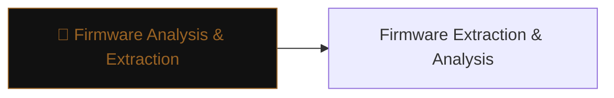

# 💾 Firmware Analysis & Extraction

> [!abstract] The Branch
> Firmware is the lowest software layer of an embedded device — extracting it reveals the OS, filesystem, credentials, and cryptographic material that all higher-layer security depends on.

## Learning Path

1. [[Firmware Extraction & Analysis]] — physical and logical extraction methods; binwalk filesystem carving; hardcoded credential hunting

---
> 🔼 Up: [[Hardware & IoT Security]]
