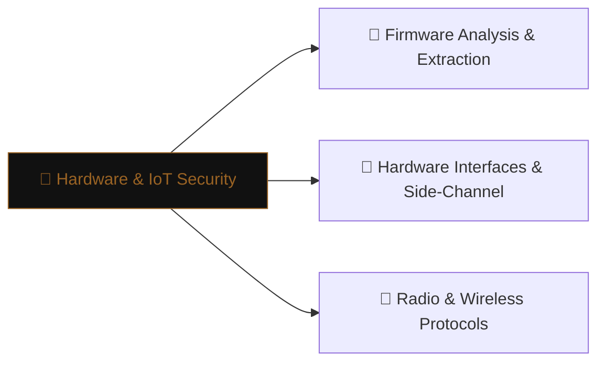

# 🔌 Hardware & IoT Security

> [!abstract] The Domain
> Attacking physical devices — firmware extraction, embedded-system exploitation, hardware debug interfaces, and radio protocol analysis. Part of the domain map at [[Cyber Security]].

## Learning Path

1. [[Firmware Analysis & Extraction]] — extracting and reversing firmware blobs; hardcoded credentials; vulnerable update mechanisms
2. [[Hardware Interfaces & Side-Channel]] — JTAG/UART/SPI debugging interfaces; fault injection; power and EM side-channel
3. [[Radio & Wireless Protocols]] — SDR-based analysis; Zigbee, Z-Wave, 433 MHz; replay and injection attacks

---
> 🌐 Back to the domain map: [[Cyber Security]]
