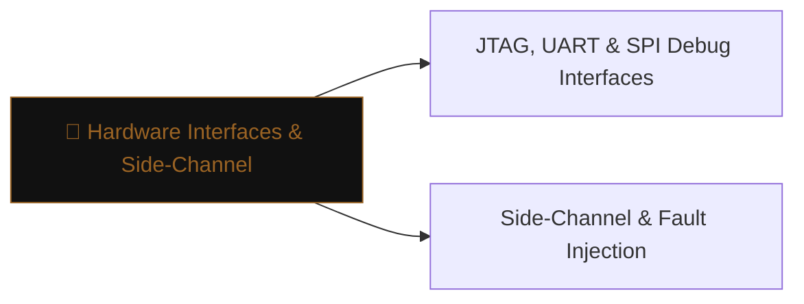

# 🔧 Hardware Interfaces & Side-Channel

> [!abstract] The Branch
> Embedded hardware exposes maintenance interfaces (JTAG, UART, SPI) and leaks information through power, timing, and electromagnetic emanations — physical access is often all an attacker needs.

## Learning Path

1. [[JTAG, UART & SPI Debug Interfaces]] — identifying and connecting to debug headers; OpenOCD; extracting memory via JTAG; UART shell access
2. [[Side-Channel & Fault Injection]] — power-trace analysis; clock glitching to bypass secure boot; voltage fault injection

> [!note] Planned notes
> Content notes for this branch are coming soon.

---
> 🔼 Up: [[Hardware & IoT Security]]
