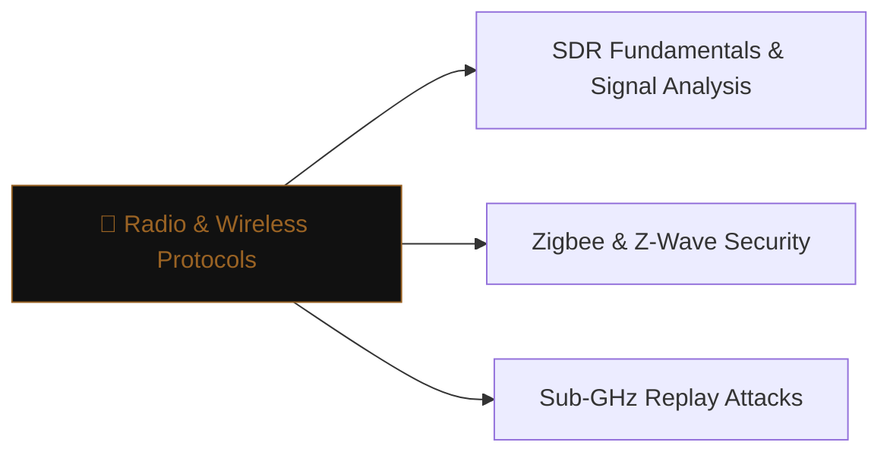

# 📡 Radio & Wireless Protocols

> [!abstract] The Branch
> IoT devices communicate over short-range radio protocols with minimal authentication — a software-defined radio and a laptop are often sufficient to capture, replay, or inject traffic.

## Learning Path

1. [[SDR Fundamentals & Signal Analysis]] — RTL-SDR and HackRF setup; GNU Radio; capturing and demodulating unknown protocols
2. [[Zigbee & Z-Wave Security]] — network key sniffing; coordinator impersonation; replay in building automation
3. [[Sub-GHz Replay Attacks]] — 433/868/915 MHz keyfob and garage-door replay; rolling-code bypass approaches

> [!note] Planned notes
> Content notes for this branch are coming soon.

---
> 🔼 Up: [[Hardware & IoT Security]]
