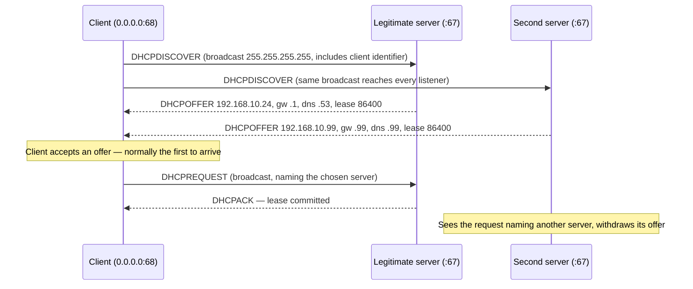

# 🎫 Address Assignment & DHCP

> [!abstract] Note of [[Addressing & Subnetting]]
> DHCP hands a booting host its address, its gateway, and its resolvers — which means whoever answers a DHCP request controls where that host sends everything. This note covers the lease exchange in detail, the state a lease creates, and why the protocol's total absence of authentication makes it both indispensable and one of the most abusable services on a segment.

## Parent Learning Order
IPv4 Addressing -> Subnetting & CIDR -> VLSM & Route Summarization -> IPv6 Addressing -> Address Assignment & DHCP -> NAT & Address Translation

## Three Ways to Get an Address

| Method | Who decides | Where used | Failure mode |
| --- | --- | --- | --- |
| **Static** | An administrator, on the host | Servers, network devices, printers | Silent conflicts; drift from documentation |
| **DHCP reservation** | The server, keyed to hardware address | Managed devices needing stable addresses | Wrong identifier means the wrong lease |
| **DHCP dynamic pool** | The server, from a range | Endpoints, guests, most clients | Pool exhaustion; no lease means no network |
| **Self-assigned** | The host itself | Nothing, deliberately | `169.254.x.x` — the symptom, not a method |

**DHCP (Dynamic Host Configuration Protocol)** exists because manually configuring an address, mask, gateway, and resolvers on every device does not scale, and because devices move. It is an application-layer protocol carried over UDP: the server listens on port 67, the client on port 68.

The critical realization for a beginner is that DHCP does not merely provide an address. A lease carries **options** — a whole configuration profile.

| Option | Name | Why it matters |
| --- | --- | --- |
| 1 | Subnet mask | Determines which hosts the client treats as neighbours |
| 3 | Router | The default gateway — where all off-segment traffic goes |
| 6 | Domain name server | Every name the host resolves goes through this |
| 15 | Domain name | Search suffix appended to short names |
| 51 | Lease time | How long before renewal |
| 42 / 121 | NTP servers / classless static routes | Time source; extra routes that override the gateway |

Look at options 3, 6, and 121 together and the security model becomes obvious: a client accepts, from an unauthenticated source, the address of the device that will carry all of its traffic and the address of the service that will answer all of its name lookups. That is the entire attack in one sentence, and it is inherent to the design rather than a bug.

> [!tip] The analogy, and where it breaks
> Arriving at a conference and being handed a badge with your room number, the map, and the help desk's extension — all from whoever is standing at the welcome table. The analogy breaks because a real conference has one official desk you can recognise, whereas a client broadcasts its request to the whole room and simply accepts the first reply. Nothing distinguishes the official desk from an impostor with a folding table.

## DORA: The Lease Exchange

The four-message exchange is remembered as **DORA** — Discover, Offer, Request, Acknowledge.



Four details in that diagram do the real teaching.

**The Discover is broadcast** because the client has no address yet and no knowledge of who might serve it. Every device on the segment receives it, including any device pretending to be a server.

**Multiple offers are legitimate.** Redundant DHCP servers are a normal design. The protocol has no notion of an authoritative server, so the client cannot distinguish redundancy from an impostor.

**The client typically takes the first offer.** There is no ranking, no signature, no trust evaluation. An attacker on the segment does not need to disable the real server — only to answer faster, which is easy when the attacker is closer or the real server is loaded.

**The Request is also broadcast**, naming the chosen server, so the losing servers know to release their reservation.

Renewal skips the broadcast: at 50% of the lease (T1) the client unicasts a Request directly to its server, and at 87.5% (T2) it broadcasts to reach any server. Only if both fail does the address expire and the interface fall back to `169.254.x.x`.

## Reading Lease State

On a client:

```bash
sudo dhclient -v eth0
```

Expected excerpt:

```text
Listening on LPF/eth0/00:0c:29:4a:9b:31
DHCPDISCOVER on eth0 to 255.255.255.255 port 67 interval 3
DHCPOFFER of 192.168.10.24 from 192.168.10.1
DHCPREQUEST for 192.168.10.24 on eth0 to 255.255.255.255 port 67
DHCPACK of 192.168.10.24 from 192.168.10.1
bound to 192.168.10.24 -- renewal in 41508 seconds.
```

The line to inspect is `DHCPOFFER ... from 192.168.10.1`. That source address is the only identification the client has of who configured it. If it ever shows an unexpected address, the client has been configured by an unknown party — and everything downstream of that, including its gateway and resolvers, is suspect.

On systemd-managed hosts:

```bash
networkctl status eth0
```

Expected excerpt:

```text
● 2: eth0
    Address: 192.168.10.24 (DHCP4 via 192.168.10.1)
    Gateway: 192.168.10.1
        DNS: 192.168.10.53
  DHCP4 Client: Lease: 86400s, T1: 43200s, T2: 75600s
```

On the server, the lease database is the authoritative record:

```bash
sudo grep -A5 "lease 192.168.10.24" /var/lib/dhcp/dhcpd.leases
```

Expected excerpt:

```text
lease 192.168.10.24 {
  starts 4 2026/07/30 08:14:22;
  ends 5 2026/07/31 08:14:22;
  hardware ethernet 00:0c:29:4a:9b:31;
  client-hostname "workstation-14";
}
```

This record is the backbone of attribution. An investigation that finds activity from `192.168.10.24` at a given time can only name the responsible host by consulting the lease that was active then. Once that lease expires and the address is reissued, the mapping is gone unless the log was retained. **Lease log retention is therefore an investigative capability decision, not a housekeeping one.**

### Failure modes and how they present

**No server reachable.** The interface ends with a `169.254.x.x` address. This is a complete diagnosis on its own: the request went unanswered, so look at the segment, the relay, or the server — not at routing.

**Pool exhaustion.** New clients fail while existing ones work fine, because they are renewing rather than requesting. Check free-address counts on the server before suspecting the network.

**Address conflict.** A statically configured host uses an address inside the dynamic pool. The server offers it to someone else, and two hosts fight over it. Symptoms are intermittent and affect both. Well-behaved clients probe before accepting, but not all do. The prevention is to exclude static ranges from the pool as a matter of design.

**Relay misconfiguration.** Because Discover is broadcast, a server on another segment never sees it. A **DHCP relay** forwards the request as unicast and records the originating subnet so the server picks the right pool. If the relay is missing or points at the wrong server, clients on that segment silently get nothing.

## Security Implications

**Rogue DHCP** is the headline risk. An attacker running a server on the segment answers Discovers faster than the legitimate one and issues leases naming their own host as gateway and resolver. The victim's traffic then flows through attacker-controlled infrastructure, and every name it resolves is attacker-answered. Nothing appears broken to the user — connectivity works perfectly, which is precisely what makes it effective. It can also occur accidentally: a consumer router plugged into a wall port serves the whole VLAN.

**DHCP starvation** is the complementary technique. Requests with fabricated client identifiers consume every address in the pool. Legitimate clients then fail to obtain leases — a denial of service on its own, and a way to increase the value of a rogue server that still has addresses to hand out.

The controls are link-layer, because the attack is link-layer:

- **DHCP snooping** designates switch ports as trusted or untrusted and discards server messages arriving on untrusted ports. This alone defeats rogue servers introduced at an access port.
- **Port security** limits the number of hardware addresses per port, which blunts starvation by capping how many identities one port can present.
- **Dynamic ARP Inspection** consumes the snooping binding table to validate address resolution, closing the follow-on attack.
- **802.1X** prevents the unauthorized device from reaching the segment in the first place.

Snooping is the highest-value control here because its binding table — port, hardware address, IP address, lease — becomes the trusted source of truth that several other protections depend on.

**Detection** does not require special tooling. Two or more servers offering on a segment where one is expected is an alarm-worthy condition, as is a client whose lease source address changes. Monitoring for `DHCPOFFER` from unexpected sources catches both the malicious and the accidental case.

Everything described here must be exercised only on an isolated laboratory segment you own. Running a DHCP server on a network you do not control affects every device on it, including devices belonging to others, and is out of scope in any engagement that has not explicitly authorized it in writing.

## Summary

You should now be able to:

- Name the four DORA messages, state which are broadcast and why, and explain why a `169.254.x.x` address is a complete diagnosis.
- Read client and server lease state, identify the offering server, and diagnose exhaustion, conflict, and relay failures from their distinct symptoms.
- Explain why DHCP has no authentication and what that implies for options 3, 6, and 121; describe how snooping's binding table underpins other link-layer controls; and argue lease-log retention as a prerequisite for post-incident attribution.

---
> 🔼 Up: [[Addressing & Subnetting]]
