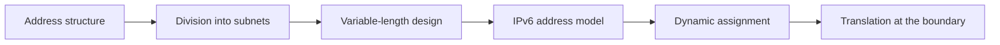

# 🔢 Addressing & Subnetting

> [!abstract] Addressing branch
> How a host is identified, how an address space is divided, how it scales, how it is assigned, and how it is rewritten in transit. Address fluency is the difference between scanning a computed block and guessing at hosts, and between segmenting a network deliberately and inheriting one enormous blast radius.

## 🗺️ Zero-to-Mastery Learning Path

1. [[IPv4 Addressing]] — decode 32-bit dotted-decimal notation, classes, and special ranges
2. [[Subnetting & CIDR]] — split address space with prefix lengths and calculate host ranges
3. [[VLSM & Route Summarization]] — allocate differently-sized subnets and aggregate routes efficiently
4. [[IPv6 Addressing]] — navigate 128-bit addresses, scopes, EUI-64, and dual-stack coexistence
5. [[Address Assignment & DHCP]] — trace how hosts obtain addresses and the attack surface that creates
6. [[NAT & Address Translation]] — understand rewriting at the boundary and the visibility it removes

---
> 🔼 Up: [[Networking]]
