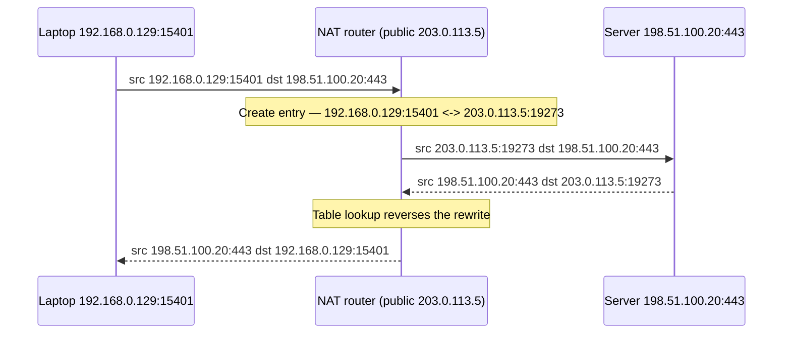

# 🔁 NAT & Address Translation

> [!abstract] Note of [[Addressing & Subnetting]]
> NAT rewrites addresses in flight and remembers the rewrite so replies can be reversed. This note explains the translation table that makes it work, distinguishes the variants that are constantly confused, and confronts the two beliefs that cause real damage: that NAT is a security control, and that a logged public address identifies a host.

## Parent Learning Order
IPv4 Addressing -> Subnetting & CIDR -> VLSM & Route Summarization -> IPv6 Addressing -> Address Assignment & DHCP -> NAT & Address Translation

## Why Rewriting Became Necessary

IPv4 provides about 4.3 billion addresses, which the Internet exhausted. **NAT (Network Address Translation)** was the pragmatic answer: let many hosts share a small number of public addresses by rewriting the address fields of packets as they cross a boundary, and keeping a table so replies can be translated back.

The device performing translation must solve one problem. If ten internal hosts all send from the same public address, how does a returning packet get to the right one? The answer is to rewrite the **source port** as well, making every outbound flow unique in the table. That is why the common form of NAT is more precisely called **PAT (Port Address Translation)**, or "NAT overload."



The server never learns the internal address. It sees only `203.0.113.5:19273`, which is why translation destroys attribution unless the translating device logs the mapping — a point returned to below.

**Prerequisites:** private address ranges, ports, and the five-tuple.

> [!tip] The analogy, and where it breaks
> A company switchboard with one public number: staff dial out and the receptionist notes which extension made each call so replies get routed back. The extension numbers mean nothing outside the building. The analogy breaks precisely where people assume it holds — the receptionist is not a security guard. Blocking unexpected inbound calls is a side effect of having no note for them, not a policy decision, which is why NAT is not a firewall.

## The Variants, Distinguished

These four terms are routinely used interchangeably and mean different things.

| Type | Direction | Mapping | Typical use |
| --- | --- | --- | --- |
| **Static NAT** | Either | One internal address ↔ one public address, permanently | A server needing a stable public identity |
| **Dynamic NAT** | Outbound | Internal addresses drawn from a public pool, first-come | Legacy; rare now |
| **PAT / NAT overload** | Outbound | Many internal ↔ one public, distinguished by port | Nearly every home and office edge |
| **Port forwarding / DNAT** | Inbound | A public address and port ↔ one internal address and port | Deliberately publishing an internal service |

**SNAT** rewrites the source and is what makes outbound sharing work. **DNAT** rewrites the destination and is what makes an internal service reachable from outside. A load balancer typically performs both at once.

The distinction that matters operationally: SNAT entries are created *by traffic*, and expire. DNAT entries are created *by configuration*, and are permanent until removed. A port-forward opened once for a temporary need persists indefinitely and is a recurring source of forgotten exposure.

## Inspecting the Translation Table

On a Linux NAT gateway:

```bash
sudo conntrack -L -j 2>/dev/null | head -5
```

Expected excerpt:

```text
tcp 6 431990 ESTABLISHED src=192.168.0.129 dst=198.51.100.20 sport=15401 dport=443
    src=198.51.100.20 dst=203.0.113.5 sport=443 dport=19273 [ASSURED] mark=0 use=1
```

Read this as two tuples describing one flow. The first is the connection as the internal host sees it. The second is the reply direction as it arrives from outside. The gateway's job is to match one to the other. `sport=15401` becoming `dport=19273` in the reply tuple is the port rewrite made visible.

Inspect the rules producing it:

```bash
sudo nft list table ip nat
```

Expected excerpt:

```text
table ip nat {
  chain postrouting {
    type nat hook postrouting priority srcnat; policy accept;
    oifname "eth0" masquerade
  }
  chain prerouting {
    type nat hook prerouting priority dstnat; policy accept;
    iifname "eth0" tcp dport 8443 dnat to 192.168.0.50:443
  }
}
```

`masquerade` is SNAT that takes its public address from the outgoing interface automatically — correct when the public address is dynamic, slightly slower than a fixed SNAT rule because the address is resolved per flow. The `prerouting` rule is a port forward: anything arriving on the public interface at port 8443 is redirected to an internal host. That one line is the entire difference between an internal service and an Internet-exposed one.

### Table exhaustion — the failure that looks like a network fault

```bash
sudo sysctl net.netfilter.nf_conntrack_count net.netfilter.nf_conntrack_max
```

Expected excerpt:

```text
net.netfilter.nf_conntrack_count = 262144
net.netfilter.nf_conntrack_max = 262144
```

When count reaches max, new connections are dropped and the kernel logs `nf_conntrack: table full, dropping packet`. Users report intermittent failures that resolve themselves, monitoring shows the link is healthy, and the router's CPU looks fine. The cause is state capacity, not bandwidth. It arises from ordinary load growth, from a host opening connections abnormally fast, or deliberately — exhausting a translation table is a denial-of-service technique precisely because it targets a resource nobody monitors.

The port space also bounds concurrency. One public address offers roughly 64,000 ports per destination tuple; that is the hard ceiling on simultaneous flows sharing it, and busy applications opening many parallel connections reach it sooner than expected.

## What NAT Breaks

Rewriting headers violates the assumption that addresses are stable end-to-end, so several things need help.

**Inbound connections are impossible by default.** No table entry exists until an internal host sends something, so unsolicited inbound traffic has no mapping and is discarded. This is often mistaken for a firewall, discussed below.

**Protocols that embed addresses in their payload break.** Classic FTP sends address and port information inside the data stream; SIP and some peer-to-peer protocols do the same. Since NAT rewrites headers and not payloads, the embedded address remains internal and unreachable. The workaround is an application-layer gateway (a helper module) that parses and rewrites the payload — which means the NAT device is now parsing untrusted application data, and those helpers have their own history of vulnerabilities. Disabling unnecessary helpers is standard hardening.

**End-to-end integrity mechanisms notice.** IPsec in authentication mode covers header fields that NAT rewrites, so the integrity check fails; NAT traversal encapsulates IPsec in UDP specifically to work around this.

**Carrier-grade NAT compounds everything.** Providers translate customers into a shared pool from `100.64.0.0/10`. Many subscribers share one public address, so address-based reputation, blocking, and attribution apply to strangers as well as the intended target — and inbound connectivity is impossible without provider involvement.

## Security Implications

**NAT is not a firewall.** This is the most consequential misconception in the topic. NAT blocks unsolicited inbound traffic as a side effect of having no table entry, not as a policy decision. Everything a host initiates outbound is permitted and creates a return path. Malware behind NAT connects out to its infrastructure without difficulty, and the returning command traffic is delivered by the translation table doing exactly its job. The absence of inbound reachability says nothing about outbound control, egress filtering, or what an internal host is doing. Explicit firewall policy remains necessary, and any port forward is a deliberate hole through the side effect people were relying on.

**Translation destroys attribution unless logged.** After translation, a remote party sees one public address for potentially thousands of hosts. Reconstructing which internal host was responsible for a given external connection requires the NAT log — timestamp, public address and port, internal address and port. Without it, an abuse report or an incident notification naming your public address cannot be resolved to a machine. High-volume translation makes these logs large, so retention has to be planned deliberately; that planning decision determines whether a future investigation is possible at all.

**Port forwards accumulate silently.** Each DNAT rule publishes an internal service directly. They are typically added under time pressure, rarely reviewed, and survive the need that created them. Periodically enumerating DNAT rules and confirming each is still justified is one of the highest-value, lowest-effort reviews available.

**NAT obscures internal structure, which cuts both ways.** External observers cannot infer internal addressing, which is a modest reconnaissance obstacle. It is not a control — anyone with a foothold sees the real topology immediately — and it should never be counted as one in a risk assessment.

**Pivoting.** In an authorized engagement, a foothold on a NAT'd host provides a path to internal addresses that are unreachable from outside, because the compromised host is already inside the boundary and can relay traffic. This is why perimeter translation must not be treated as internal segmentation: it constrains inbound connection establishment, not an attacker who is already past it.

All configuration and testing described here belongs on a laboratory you own. Modifying translation rules on a shared or production gateway affects every user behind it and can create exposure that outlives the test.

## Summary

You should now be able to:

- Explain why NAT was needed, why source ports are rewritten, and what the translation table stores.
- Distinguish static NAT, PAT, and port forwarding; read `conntrack` and `nft list table ip nat` output to identify a mapping and the rules producing it; diagnose table exhaustion from its symptoms rather than mistaking it for a bandwidth problem.
- Argue precisely why NAT is not a firewall and what that means for outbound control; explain how translation destroys attribution and what logging restores it; and describe why application-layer helpers, IPsec integrity checks, and carrier-grade NAT all follow from the same violated assumption that addresses are stable end-to-end.

---
> 🔼 Up: [[Addressing & Subnetting]]
