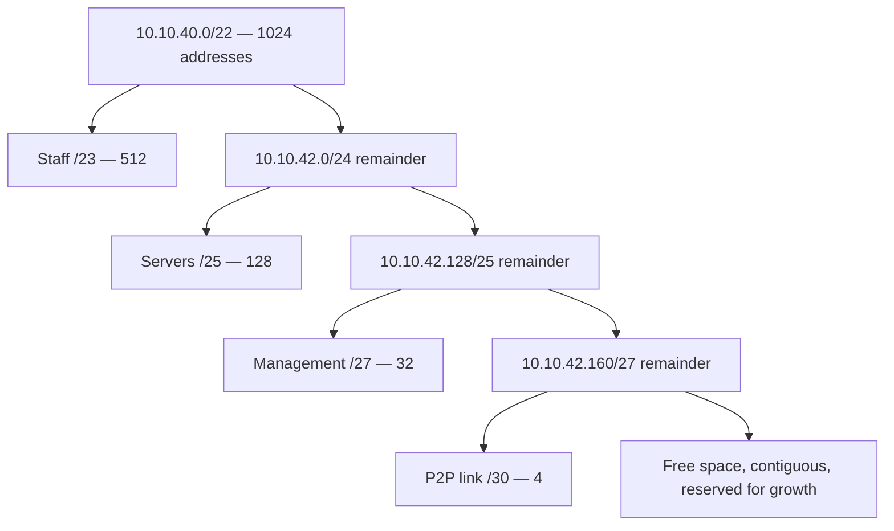

# 🪜 VLSM & Route Summarization

> [!abstract] Note of [[Addressing & Subnetting]]
> Fixed-size subnets waste address space and produce routing tables that grow without bound. This note covers the two techniques that fix that — dividing a block into unequal pieces, and collapsing many prefixes into one — and shows how longest-prefix match makes both safe, plus how summarization silently widens security policy if it is applied to rules rather than routes.

## Parent Learning Order
IPv4 Addressing -> Subnetting & CIDR -> VLSM & Route Summarization -> IPv6 Addressing -> Address Assignment & DHCP -> NAT & Address Translation

## One Size Does Not Fit

> *You have `10.10.40.0/22` and four segments needing 500, 100, 25 and 2 hosts. Why not cut it into four equal blocks?*
>
> Hold your answer — the section below is the response.

Meridian is opening a depot, and you are given `10.10.40.0/22` — the block §5c of the lab topology reserves for exactly this — to serve four networks:

| Segment | Hosts needed |
| --- | --- |
| Staff | 500 |
| Servers | 100 |
| Management | 25 |
| Router-to-router link | 2 |

Splitting the `/22` into four equal `/24` blocks fails immediately — Staff needs 500 addresses and a `/24` provides 254. Splitting into equal `/23` blocks gives only two subnets. Any fixed-size scheme either starves the largest segment or squanders hundreds of addresses on a link that needs two.

**VLSM (Variable-Length Subnet Masking)** removes the constraint: different subnets carved from the same parent may use different prefix lengths. It is not a new protocol, only the disciplined application of subnetting recursively.

The method has one rule that must not be broken: **allocate largest first**. Taking the small blocks first fragments the space and strands the large requirement with no contiguous room.

**Prerequisites:** CIDR notation and how to compute a subnet's range.

> [!tip] The analogy, and where it breaks
> Cutting a plank of wood: take the longest piece first and the offcuts still fit the smaller jobs, but cut the small pieces out of the middle first and you can never recover a long one. That is exactly why VLSM allocates largest-first. The analogy breaks for summarization, since you cannot glue planks back together in the physical world, whereas contiguous, aligned prefixes genuinely do collapse into one advertisement — provided the alignment rule holds.

## Worked Allocation

Start with `10.10.40.0/22`, which spans `10.10.40.0` through `10.10.43.255` — 1,024 addresses.

**Step 1 — Staff, 500 hosts.** Need 512 addresses → 9 host bits → `/23`.

```text
10.10.40.0/23    usable 10.10.40.1 - 10.10.41.254    broadcast 10.10.41.255
```

Remaining space begins at `10.10.42.0`.

**Step 2 — Servers, 100 hosts.** Need 128 → 7 host bits → `/25`.

```text
10.10.42.0/25   usable 10.10.42.1 - 10.10.42.126  broadcast 10.10.42.127
```

Remaining space begins at `10.10.42.128`.

**Step 3 — Management, 25 hosts.** Need 32 → 5 host bits → `/27`.

```text
10.10.42.128/27 usable 10.10.42.129 - 10.10.42.158 broadcast 10.10.42.159
```

Remaining space begins at `10.10.42.160`.

**Step 4 — Point-to-point link, 2 hosts.** A `/30` gives exactly two usable addresses.

```text
10.10.42.160/30 usable 10.10.42.161 - 10.10.42.162 broadcast 10.10.42.163
```

`10.10.42.164` through `10.10.43.255` remains free for growth — 348 addresses held in reserve, contiguous and therefore still summarizable.



Read the diagram as repeated halving. Each allocation consumes an aligned block and leaves an aligned remainder, which is what keeps the free space usable. Allocating out of order — taking the `/30` from the middle of the range first — would leave two smaller fragments where the `/23` needed to fit, and the design would fail with plenty of "free" addresses available.

Verify each block:

```bash
ipcalc 10.10.40.0/23
```

Expected excerpt:

```text
Network:   10.10.40.0/23
HostMin:   10.10.40.1
HostMax:   10.10.41.254
Broadcast: 10.10.41.255
Hosts/Net: 510
```

510 usable against a requirement of 500 confirms the choice; a `/24` would have failed and a `/22` would have wasted the rest of the parent.

## Summarization: The Opposite Operation

**Route summarization** (also called aggregation or supernetting) advertises many contiguous prefixes as one shorter prefix. Where VLSM divides, summarization collapses.

To summarize, find the longest run of leading bits common to every constituent prefix.

Given four networks:

```text
10.10.40.0/24   00001010.00001010.001010 00.00000000
10.10.41.0/24   00001010.00001010.001010 01.00000000
10.10.42.0/24   00001010.00001010.001010 10.00000000
10.10.43.0/24   00001010.00001010.001010 11.00000000
                └───── 22 identical bits ──┘
```

The first 22 bits match, so the summary is `10.10.40.0/22` — one advertisement replacing four.

Two conditions must hold, and violating either causes real outages. The blocks must be **contiguous**, and the summary must be **aligned** on a boundary that is a multiple of its own size. `10.10.40.0/22` is valid because 4 is a multiple of 4. Summarizing `10.10.41.0/24` through `10.10.44.0/24` as a `/22` would be wrong: the range is not aligned, and the resulting advertisement would cover `10.10.40.0` — an address block you may not own — while excluding `10.10.44.0`.

That failure mode has a name in operations: advertising address space you do not control. On an internal network it causes traffic blackholing; on the public Internet it is the mechanism behind route hijacking, whether accidental or deliberate.

```bash
ip route
```

Expected excerpt after summarization:

```text
10.10.40.0/22 via 10.10.250.2 dev eth1 proto ospf metric 20
```

versus before:

```text
10.10.40.0/24 via 10.10.250.2 dev eth1 proto ospf metric 20
10.10.41.0/24 via 10.10.250.2 dev eth1 proto ospf metric 20
10.10.42.0/24 via 10.10.250.2 dev eth1 proto ospf metric 20
10.10.43.0/24 via 10.10.250.2 dev eth1 proto ospf metric 20
```

The benefit is not only table size. Fewer entries mean faster lookups, less memory on constrained hardware, and — most importantly — **fault isolation**: if one of the four subnets flaps, the summary does not change, so the instability is not propagated to the rest of the network.

The cost is precision. The summarizing router now claims reachability for all 1,024 addresses even if one constituent `/24` is down. Traffic for the failed subnet is attracted and then discarded. Summarization trades granular failure signalling for stability, which is usually the right trade but must be a conscious one.

## Longest-Prefix Match Makes It Safe

Both techniques rely on one forwarding rule: when several routes match a destination, the router selects the one with the **longest prefix**, regardless of metric or source. Metric is only a tiebreaker between routes of equal prefix length.

Consider a table containing:

```text
0.0.0.0/0          via 10.10.250.1
10.10.0.0/16     via 10.10.250.2
10.10.40.0/22     via 10.10.250.3
10.10.41.0/24     via 10.10.250.4
10.10.41.77/32    via 10.10.250.5
```

Trace destinations:

```bash
ip route get 10.10.41.77
ip route get 10.10.41.20
ip route get 10.10.42.20
ip route get 10.10.30.1
```

Expected excerpt:

```text
10.10.41.77 via 10.10.250.5 dev eth1     # /32 — most specific wins
10.10.41.20 via 10.10.250.4 dev eth1     # /24
10.10.42.20 via 10.10.250.3 dev eth1     # /22
10.10.30.1 via 10.10.250.2 dev eth1     # /16
```

This is the property that lets a specific exception coexist with a broad summary. It is also the property that makes an accidental specific route so dangerous: a single injected `/32` overrides every broader route for that destination, and it will not appear anomalous in a table dominated by aggregates.

**The deliberate break:** summarisation reads as pure tidying — the same intent expressed in fewer lines, and therefore good practice anywhere a list of prefixes has grown long.

It is safe for routes and dangerous for policy, and the reason is a mechanism that exists on only one side. Longest-prefix match makes an aggregate route harmless: advertise a `/22` and a more specific `/24` still wins wherever it exists, so the summary is a fallback rather than an override. A firewall rule has no such tie-breaker. Collapsing four `/24` permits into one `/22` authorises everything in between, and if the four were not contiguous it authorises a great deal more. Identical notation, opposite consequence, because routing resolves by specificity while policy resolves by match.

**How you'd spot it:** expand every range to its literal address count during review and read that number rather than the prefix — a `/22` is 1,024 addresses whether or not you meant the four `/24`s inside it. On the routing side, monitor for unexpected *specific* prefixes rather than for reachability: a more-specific injection breaks nothing, users notice nothing, and traffic simply travels somewhere it should not, so a reachability check will report everything healthy throughout.

## Security Implications

The routing behaviour above transfers directly into two security problems.

**Specific routes override broad intent.** Because longest match always wins, an attacker or a misconfiguration that inserts a more specific prefix silently captures traffic for that destination. Nothing breaks, users notice nothing, and the traffic simply travels through somewhere it should not. Detection requires monitoring for unexpected specific prefixes and for changes in path, not merely for reachability — everything still "works" during such an event. On the public Internet the same mechanism is BGP hijacking, mitigated by origin validation such as RPKI; internally the equivalent control is authenticating routing protocol updates and filtering which prefixes a neighbour may announce.

**Summarization applied to policy is a silent privilege grant.** Aggregating *routes* is good engineering. Aggregating *firewall rules* the same way is not. A reviewer who replaces four `/24` permit rules with one `/22` for tidiness has authorized 1,024 addresses instead of 1,016 — and if the four subnets were non-contiguous, far more. Address ranges in rules must be expanded to their literal extent during review, because the notation hides the difference between what was intended and what was granted.

**Reserved space is not unused space.** The contiguous remainder left by good VLSM design is often absent from rules, monitoring, and asset inventories. When it is later allocated, hosts appear in a range no control anticipated. Reserved blocks should be explicitly denied and monitored until they are formally assigned.

Any route or rule inspection described here should be performed on infrastructure within an authorized scope; routing tables reveal internal topology and are themselves sensitive.

## Summary

You should now be able to:

- Explain why equal-size subnets waste space, and state the largest-first rule for VLSM allocation.
- Perform a full VLSM allocation for mixed requirements, compute a valid summary from a set of contiguous prefixes, and verify both with `ipcalc` and `ip route get`.
- Explain why an unaligned summary advertises space you may not own and what that causes internally and on the Internet; describe how longest-prefix match allows a single injected specific route to redirect traffic invisibly, and why summarizing firewall rules is a silent authorization change rather than a cosmetic one.

---
> 🔼 Up: [[Addressing & Subnetting]]
