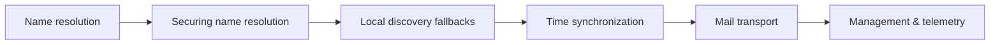

# 🛎️ Core Network Services

> [!abstract] Services branch
> The infrastructure protocols everything else silently depends on: turning names into addresses, agreeing what time it is, discovering neighbours, moving mail, and reporting state. Each was designed for a cooperative network, and each is now a control point worth attacking precisely because so much trusts it without checking.

## 🗺️ Zero-to-Mastery Learning Path

1. [[DNS Resolution & Records]] — follow a query through the resolver hierarchy; read every record type
2. [[DNS Security & Encrypted Transports]] — add DNSSEC, DoT, and DoH; defend the query channel
3. [[Local Name Resolution & Service Discovery]] — understand mDNS, NetBIOS, LLMNR and the spoofing surface each creates
4. [[Network Time Synchronization]] — explain NTP stratum, drift, and the authentication gap that enables attacks
5. [[Email Transport Protocols]] — trace SMTP, IMAP, and POP3; locate the forgery and interception surfaces
6. [[Network Management Protocols]] — audit SNMP, ICMP, and CDP/LLDP as both management and reconnaissance targets

---
> 🔼 Up: [[Networking]]
