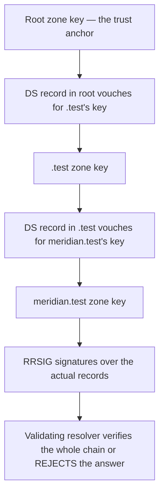

# 🔐 DNS Security & Encrypted Transports

> [!abstract] Note of [[Core Network Services]]
> DNS was designed with no authentication and no confidentiality, and the two gaps were closed by entirely separate technologies that people routinely confuse. This note separates them precisely — one proves an answer is genuine, the other hides the question — and covers the abuse cases that neither solves.

## Parent Learning Order
DNS Resolution & Records -> DNS Security & Encrypted Transports -> Local Name Resolution & Service Discovery -> Network Time Synchronization -> Email Transport Protocols -> Network Management Protocols

## Two Different Problems

> *Does DNSSEC encrypt your DNS queries?*
>
> Hold your answer — the section below is the response.

Classic DNS runs over UDP port 53 in cleartext with no signatures. That creates two independent weaknesses, and the single most common conceptual error in this topic is treating them as one.

| Problem | Question it raises | Technology that addresses it |
| --- | --- | --- |
| **No authenticity** | Is this answer genuine, or forged by someone on the path? | **DNSSEC** |
| **No confidentiality** | Can anyone observing the network see what I looked up? | **DoT / DoH** (encrypted transport) |

DNSSEC signs answers but transmits them in the clear — anyone watching still sees every name you resolve. DoH encrypts the conversation but proves nothing about whether the answer is truthful — a malicious resolver returns whatever it wants over a perfectly encrypted channel. **They are complementary, not alternatives**, and deploying one does not deliver the other's benefit.

**Prerequisites:** how DNS resolution and caching work.

> [!tip] The analogy, and where it breaks
> A sealed envelope and a notarised letter solve different problems: the seal stops anyone reading it in transit, the notary proves the contents are genuine. The analogy breaks mainly because people assume one implies the other. Encrypted transport seals the question; DNSSEC notarises the answer. A perfectly sealed envelope can still contain a forgery, which is why an encrypted lookup can still return an attacker's address.

**The deliberate break:** DNSSEC and DNS-over-HTTPS both have "secure DNS" attached to them, so they sound like two implementations of one idea. They solve opposite halves of the problem and neither does the other's job.

**DNSSEC authenticates the answer and encrypts nothing** — a signed record proves it came from the zone owner unmodified, while remaining fully readable to anyone on the path. **DoH/DoT encrypt the question and authenticate nothing about the answer** — the path cannot read your query, and the resolver can still hand you a forged record. Deploy DoH alone and an attacker who controls your resolver is unaffected. Deploy DNSSEC alone and every query is still in the clear.

**How you'd spot it:** the `ad` flag in a `dig` response means the resolver validated DNSSEC. The absence of `ad` on a signed zone is the tell that validation is not happening — a very common silent gap.

## DNSSEC: Proving the Answer Is Genuine

**DNSSEC (DNS Security Extensions)** adds cryptographic signatures to DNS records. A zone owner signs its records with a private key; a validating resolver verifies the signature with the corresponding public key. If the signature does not verify, the answer is rejected rather than returned.

The trust model is a **chain** that mirrors the delegation hierarchy. Each zone's signing key is vouched for by its parent, up to the root zone whose key is a well-known trust anchor.



The records involved: **DNSKEY** holds a zone's public keys, **RRSIG** holds signatures over record sets, **DS** sits in the *parent* zone and vouches for the child's key, and **NSEC/NSEC3** provide authenticated denial — proving a name genuinely does not exist rather than letting an attacker forge a "no such name" reply.

Verify validation is working:

```bash
dig @10.10.20.10 track.meridian.test A +dnssec +multiline | grep -E "flags:|RRSIG"
```

Expected excerpt when validation succeeded:

```text
;; flags: qr rd ra ad; QUERY: 1, ANSWER: 2
track.meridian.test. 300 IN RRSIG A 13 3 300 (...)
```

The **`ad` flag** — Authenticated Data — is the finding. It means the resolver cryptographically validated the chain.

> [!note] Why a lab zone will not produce that flag on its own
> A validating resolver trusts one key it was not told about by DNS: the IANA root anchor, shipped with the software. Every other key in the chain is vouched for by its parent. `meridian.test` sits under a lab root, so its chain terminates at a key no stock resolver has ever heard of, and validation fails at the top no matter how correctly the zone is signed — the answer comes back without `ad`, exactly as an unsigned zone would. Fixing it means configuring the lab root's key as an explicit trust anchor on the resolver. The general lesson outlives the lab: DNSSEC is not something a zone can grant itself, and a private hierarchy buys nothing until its anchor has been distributed to every validator by some channel other than DNS.

### Separating "unsigned" from "not validating"

Missing `ad` has two completely different causes and the same appearance, which is why the sentence "the absence of `ad` is the tell" is only half a method. One more query settles it — ask the zone's own server whether it has keys at all:

```bash
dig @10.10.20.10 track.meridian.test A +dnssec  | grep -E "flags:|RRSIG"
dig @ns1.meridian.test meridian.test DNSKEY +noall +answer
```

Expected excerpts:

```text
;; flags: qr rd ra; QUERY: 1, ANSWER: 1

meridian.test.  3600  IN  DNSKEY  257 3 13 (...)
meridian.test.  3600  IN  DNSKEY  256 3 13 (...)
```

No `ad` on the first, but `DNSKEY` records on the second. The zone *is* signed, so the gap is on the resolver's side: it is returning signed data without checking it, and every client behind it is unprotected while appearing to use a DNSSEC-enabled domain. Had the second query returned nothing, the conclusion would be the opposite — the resolver may be validating perfectly and simply has nothing to validate.

Two queries, two independent facts, and the pair of them is a real finding where either alone is a guess. This is the same shape as the route-versus-next-hop check in [[Static Routing & Default Gateways]]: when one signal has two possible causes, the method is to add a second signal that separates them, not to interpret the first one harder.

**What DNSSEC does not do**, stated plainly because it is widely overestimated: it does not encrypt anything, it does not authenticate the *user*, it does not protect the last hop between your device and your resolver unless that link is separately secured, and adoption remains partial so many zones are simply unsigned. It also introduces operational risk — a signing or key-rollover mistake makes a zone fail validation, which for validating resolvers means the domain becomes unreachable rather than merely unverified. That failure mode is a real deterrent to adoption and worth acknowledging honestly.

## Encrypted Transports: Hiding the Question

The second gap is that cleartext queries expose browsing behaviour to anyone on the path.

| Transport | Port | Characteristics |
| --- | --- | --- |
| **Do53** (classic) | UDP/TCP 53 | Cleartext; visible and blockable by port |
| **DoT** (DNS over TLS) | 853 | Encrypted; on a dedicated port, so it is visibly DNS and easy to permit or block deliberately |
| **DoH** (DNS over HTTPS) | 443 | Encrypted inside ordinary HTTPS; indistinguishable from web traffic |
| **DoQ** (DNS over QUIC) | 853 | Encrypted over QUIC; avoids TCP head-of-line blocking |

The distinction between DoT and DoH is organizational rather than cryptographic. Both encrypt equally well. But DoT uses a dedicated port, so a network operator can see that DNS is happening and apply policy to it. DoH hides inside HTTPS on port 443, so it is **indistinguishable from web browsing** — deliberately so, to resist censorship.

That design choice creates a genuine tension worth stating fairly. For a user on a hostile network, DoH protects privacy and resists surveillance and manipulation. For an enterprise defender, DoH used by a client that bypasses the organization's resolver removes DNS visibility — one of the highest-value telemetry sources — and can bypass DNS-based filtering entirely. Malware adopted DoH for exactly this reason: its lookups become invisible to network monitoring.

Neither position is simply correct. The practical enterprise posture is to **run an internal DoH/DoT resolver and require its use**, so clients get encrypted transport on the untrusted last hop while the organization retains logging at the resolver. Blocking DoH outright is increasingly impractical, since it is just HTTPS.

```bash
kdig -d @1.1.1.1 +tls track.meridian.test      # DoT
curl -sH 'accept: application/dns-json' \
  'https://cloudflare-dns.com/dns-query?name=track.meridian.test&type=A'   # DoH
```

Expected excerpt from the DoH query:

```text
{"Status":0,"TC":false,"RD":true,"RA":true,"AD":false,
 "Answer":[{"name":"track.meridian.test","type":1,"TTL":300,"data":"203.0.113.20"}]}
```

Note `"AD":false` — encrypted transport delivered the answer confidentially, and it is still not DNSSEC-validated. This single field demonstrates the note's central point better than any explanation.

## Abuse Cases Neither Technology Solves

**DNS tunnelling** encodes arbitrary data into query names and response records, using DNS as a covert channel for command-and-control or exfiltration. It works because DNS must generally be permitted outbound, and because resolvers will faithfully forward queries for any domain to that domain's authoritative server — which the attacker controls.

Detection is behavioural, and the indicators are distinctive:

- Abnormally long or high-entropy query names (encoded data, not words).
- Very high query volume to a single domain from one host.
- Unusual record types such as TXT or NULL in high volume.
- Regular timing intervals suggesting an automated beacon rather than human browsing.
- Consistently low TTLs to force repeated lookups.

```bash
sudo tcpdump -i eth0 -nn 'udp port 53' -A | grep -oE '[a-z0-9]{40,}'
```

A stream of long random-looking labels is the signature. Note that neither DNSSEC nor encryption helps here — the queries may be perfectly signed and perfectly encrypted, and are still exfiltration. This is why resolver-level logging and analytics remain necessary regardless of transport security.

**Subdomain takeover** exploits stale records. If `old-app.meridian.test` is a CNAME pointing at a cloud resource that was decommissioned, an attacker who claims that resource name at the provider now controls content served at your subdomain — inheriting your domain's reputation, cookies scoped to the parent domain, and any trust users place in it. The fix is record hygiene: remove DNS entries when the resource they point to is retired. This is a configuration-management failure that DNS security technologies do not address at all.

**Malicious resolvers** return whatever they choose. A resolver configured by a rogue DHCP lease or by malware answers with attacker-controlled addresses, over encryption if you like. DNSSEC validation at the *client* would catch forged answers for signed zones, which is precisely why validation location matters — validating only at a resolver you do not trust provides no protection.

## Security Implications

**Layer the two technologies deliberately.** Encrypted transport protects the last hop and user privacy; DNSSEC protects answer integrity end to end. An organization wanting both runs a validating resolver reachable over DoT/DoH and requires clients to use it.

**DNS telemetry is worth preserving.** Resolver logs record intent before encrypted traffic hides everything else — they surface newly registered domains, algorithmically generated names, tunnelling, and beaconing. Any architecture change that removes DNS visibility, including uncontrolled client DoH, should be a conscious decision with a compensating control, not an accident.

**Filtering at DNS is efficient but bypassable.** Blocking resolution of known-malicious domains is cheap and effective against commodity threats. It is not a boundary control: an attacker who uses direct IP addresses, an alternative resolver, or DoH to a third party is unaffected. Treat it as a broad filter, not a barrier.

**Availability is the underrated risk.** DNSSEC misconfiguration makes a domain unreachable to validating resolvers. Registrar or authoritative-server compromise redirects an entire domain regardless of any other control. Registrar account security, registry locks, and monitoring for unexpected NS or DS changes protect against the highest-impact DNS failures, which are administrative rather than protocol-level.

All testing described here must target domains and resolvers within an authorized scope. Tunnelling in particular must be confined to a lab with a domain you control.

## Summary

You should now be able to:

- State the two distinct DNS weaknesses and name the technology addressing each; explain why encrypting a query does not make its answer trustworthy.
- Verify DNSSEC validation via the `ad` flag, configure and confirm encrypted transport, and recognize DNS tunnelling by query length, entropy, volume, and timing.
- Explain the DNSSEC chain of trust from the root anchor down, and why validation location determines whether it protects you; argue the DoH privacy-versus-visibility tension fairly and describe the internal-resolver posture that resolves it; explain why subdomain takeover and registrar compromise are DNS risks that no protocol extension addresses.

---
> 🔼 Up: [[Core Network Services]]
