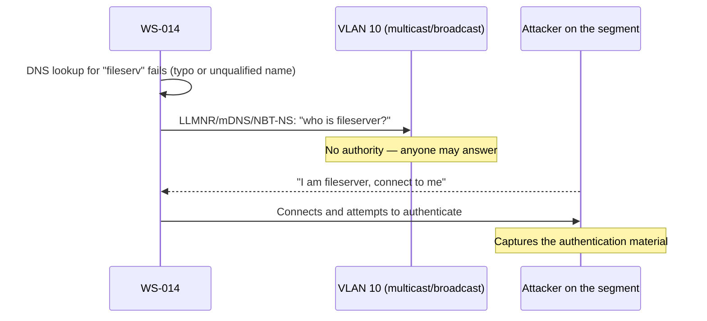

# 🏠 Local Name Resolution & Service Discovery

> [!abstract] Note of [[Core Network Services]]
> Before a host asks DNS, it consults a chain of local mechanisms — a static file, then broadcast-based protocols that let devices name themselves with no server at all. Those fallbacks make home networks work without configuration and make enterprise networks leak credentials, because a protocol that trusts any answer on the segment is a protocol an attacker answers first.

## Parent Learning Order
DNS Resolution & Records -> DNS Security & Encrypted Transports -> Local Name Resolution & Service Discovery -> Network Time Synchronization -> Email Transport Protocols -> Network Management Protocols

## Resolution Before DNS

> *A hostname resolved and you got an answer. Did DNS answer it?*
>
> Hold your answer — the section below is the response.

Name resolution is not a single lookup to DNS. The operating system consults sources in a configured order, and understanding that order is the key to both diagnosis and the security problems here.

On a typical Linux system the order is set by `nsswitch.conf`:

```bash
grep hosts /etc/nsswitch.conf
```

Expected output:

```text
hosts: files mdns4_minimal [NOTFOUND=return] dns
```

Read left to right: check local **files** first, then **mDNS** for `.local` names, then **DNS**. Windows has an analogous chain that historically includes the hosts file, DNS, and then broadcast fallbacks (LLMNR and NetBIOS).

The first source is always the **hosts file** — `/etc/hosts` on Unix-like systems, a similar file on Windows. It is a static, manually maintained mapping consulted before any network lookup:

```text
127.0.0.1     localhost
203.0.113.20  track.meridian.test
```

Because it wins over DNS, the hosts file is both a useful override (pin a name during testing) and a malware persistence technique (redirect a security-update domain to a dead address, or a bank to a phishing host). Checking the hosts file for unexpected entries is a basic compromise check precisely because it silently overrides everything below it.

**Prerequisites:** DNS resolution, and what a broadcast reaches.

> [!tip] The analogy, and where it breaks
> When the office directory fails, someone shouts 'who is the file server?' across the room and trusts whoever answers first. The analogy breaks badly: a real person would recognise a stranger's voice, and would not hand over their password to whoever replied. These protocols have no way to check the answer, and the connecting device offers its credentials automatically.

## The Zero-Configuration Fallbacks

The interesting mechanisms are the broadcast-based protocols that let devices resolve names and discover services with **no DNS server and no configuration at all**.

**mDNS (Multicast DNS)** resolves `.local` names by multicasting the query to the whole segment; the host that owns the name answers. It is how `printer.local` resolves on a home network with no infrastructure. Paired with **DNS-SD (DNS Service Discovery)**, it also advertises *services* — this is the technology behind automatic discovery of printers, media devices, and file shares.

**LLMNR (Link-Local Multicast Name Resolution)** is a Windows protocol that resolves names by multicast when DNS fails. **NetBIOS Name Service (NBT-NS)** is an older broadcast-based mechanism serving the same fallback role.

The unifying principle, and the vulnerability, is identical across all three: **when a name cannot be resolved normally, the host shouts the query to the entire local segment and trusts whichever device answers.** There is no authentication. There is no authority. The first plausible answer wins.



## Why This Leaks Credentials

The attack is not merely misdirection — it harvests authentication. On Windows networks, when a client connects to what it believes is a file server, it automatically attempts to authenticate, sending an NTLM authentication exchange. An attacker who answered the name query receives that exchange and captures the challenge-response material, which can then be cracked offline to recover a password or relayed to another service to authenticate as the user.

This is one of the most reliably productive techniques in internal network assessment, and its power comes from how *ordinary* the trigger is. A user mistyping a share name, an application referring to a host by an unqualified name that DNS cannot resolve, or a stale login script all generate the failed lookup that starts the sequence. The attacker does nothing but wait and answer.

The whole chain is visible in one capture, and the timestamps are the part to read:

```text
09:14:22.104  10.10.10.14.51204 > 10.10.20.10.53:    A? fileserv.meridian.test
09:14:22.106  10.10.20.10.53 > 10.10.10.14.51204:    NXDOMAIN
09:14:22.108  10.10.10.14.54882 > 224.0.0.252.5355:  LLMNR standard query A fileserv
09:14:22.111  10.10.10.66.5355 > 10.10.10.14.54882:  LLMNR response A 10.10.10.66
09:14:22.119  10.10.10.14.49733 > 10.10.10.66.445:   Negotiate Protocol Request
09:14:22.121  10.10.10.66.445 > 10.10.10.14.49733:   Negotiate Protocol Response
09:14:22.124  10.10.10.14.49733 > 10.10.10.66.445:   Session Setup Request, NTLMSSP_NEGOTIATE
09:14:22.126  10.10.10.66.445 > 10.10.10.14.49733:   Session Setup Response, NTLMSSP_CHALLENGE
09:14:22.131  10.10.10.14.49733 > 10.10.10.66.445:   Session Setup Request, NTLMSSP_AUTH
                                                      user: MERIDIAN\r.okonkwo
```

Twenty-seven milliseconds from a typo to a credential exchange with a stranger. Nothing in that sequence required a decision from the user, and nothing in it produced an error they would see — the last line is where the workstation hands its authentication material to `10.10.10.66`, a host it had never heard of forty milliseconds earlier and knows nothing about now. There is no dialogue, no warning, and no step where anything asks whether `10.10.10.66` is entitled to be `fileserv`.

Three lines deserve individual attention. Line 2 is the trigger: `NXDOMAIN` is DNS working correctly and answering honestly that the name does not exist. Line 4 is the entire vulnerability: an unsolicited claim of ownership, accepted because the protocol has no concept of a wrong answer. Line 9 is the loss, and it happens automatically because Windows offers single-sign-on credentials to SMB servers by default — which is a feature everywhere else and the payload here.

Note also who the attacker is not. `10.10.10.66` is on VLAN 10, not out on the Internet, because every protocol in this note is multicast or broadcast and reaches exactly one segment. That constraint is the good news in an otherwise bleak mechanism: this attack requires a foothold on the same wire as the victim, so segmentation genuinely limits its blast radius in a way it does not for most of the attacks in this domain.

```bash
sudo tcpdump -i eth0 -nn 'udp port 5355 or udp port 137 or udp port 5353'
```

Expected excerpt:

```text
IP 10.10.10.30.54211 > 224.0.0.252.5355: UDP, length 24   # LLMNR query
IP 10.10.10.30.137 > 10.10.10.255.137: UDP, length 50   # NetBIOS broadcast
IP 10.10.10.14.5353 > 224.0.0.251.5353: UDP, length 32    # mDNS query
```

Seeing LLMNR (5355) and NetBIOS (137) queries on an enterprise segment is itself a finding: these protocols are usually unnecessary where DNS is properly configured, and every query is an opportunity for an attacker to answer. Their presence indicates both an attack surface and, often, a DNS misconfiguration causing the failed lookups that trigger them.

## WPAD: The Fallback That Redirects All Traffic

A particularly dangerous case combines these protocols with proxy autoconfiguration. **WPAD (Web Proxy Auto-Discovery)** has clients look up the name `wpad` to find a proxy configuration file. If that lookup falls through to LLMNR or NetBIOS, an attacker answers, supplies a proxy configuration pointing at themselves, and thereby routes the victim's **web traffic** through an attacker-controlled proxy. A single answered name query becomes an on-path position for HTTP. Disabling WPAD where it is not needed removes this path.

**The deliberate break:** LLMNR, NBT-NS and mDNS present as protocols to switch off — the attack lives in the protocol, so removing the protocol removes the attack.

Every one of these attacks begins with **a name that DNS failed to resolve**. The fallback is the symptom and the failed lookup is the cause, so correct DNS hygiene — complete records, proper search suffixes, no reliance on unqualified names — means the fallback is never invoked and the attack never has a moment to happen in. Disabling the protocols is worth doing and it treats the last step; a network that still generates a steady stream of unresolvable names retains the underlying defect and will surface it through whatever fallback remains.

**How you'd spot it:** watch the failed lookups rather than the protocol. A host emitting LLMNR queries at all is telling you something asked for a name DNS did not answer, and capturing those names hands you the actual defect list — the typos, the decommissioned shares, the missing search suffix. The same misspelled hostname appearing across many workstations is a login script or a mapped drive nobody has corrected, and fixing that one entry removes more exposure than any amount of protocol tuning.

## Security Implications

**These protocols should be disabled in managed environments.** LLMNR, NBT-NS, and mDNS provide convenience that a correctly configured DNS infrastructure does not need. Disabling them — via group policy on Windows, by ensuring names resolve through DNS so the fallback never triggers — removes the credential-harvesting and traffic-redirection surface entirely. This is a standard hardening recommendation with broad consensus.

**Where they must remain, monitor and segment.** Some environments genuinely need mDNS for device discovery. There, the mitigations are network segmentation so discovery traffic stays within a trusted VLAN, monitoring for the query patterns above, and ensuring the segment does not also carry high-value authentication.

**The failed lookup is the real root cause.** Every attack here begins with a name that DNS could not resolve. Correct DNS configuration — proper search suffixes, complete records, no reliance on unqualified names — means the fallback protocols are never invoked, which defeats the attack without touching the protocols themselves. Fixing the DNS hygiene is often more durable than fighting the fallback.

**The hosts file is a persistence and redirection vector.** Because it overrides all network resolution, an attacker who can write to it redirects any name silently. It is small, rarely reviewed, and high-impact — a natural place for both malware and integrity monitoring to focus.

**Attribution is weak.** These protocols are unauthenticated and broadcast-based, so a captured query attributes a request to a source address that is itself unverified. Treat the evidence as indicative, not conclusive.

All interception described here must be confined to an isolated lab you own. Answering name queries on a network you do not control captures other users' authentication material and is unauthorized.

## Summary

You should now be able to:

- Describe the resolution order from hosts file through fallback protocols to DNS, and explain what mDNS, LLMNR, and NetBIOS have in common.
- Identify LLMNR/mDNS/NBT-NS queries in a capture, explain why their presence on an enterprise segment is a finding, and recognize the failed DNS lookup as the trigger.
- Explain how an unauthenticated name answer leads to NTLM credential capture and how WPAD extends it to web-traffic redirection; argue why disabling the fallbacks and fixing DNS hygiene are the durable controls, and why the hosts file is a distinct persistence vector overriding them all.

---
> 🔼 Up: [[Core Network Services]]
