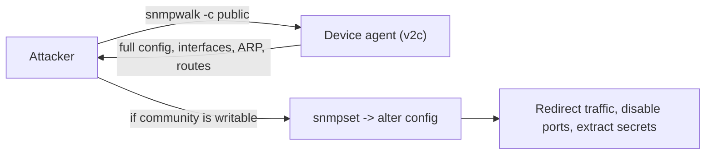

# 📊 Network Management Protocols

> [!abstract] Note of [[Core Network Services]]
> You cannot secure or troubleshoot what you cannot see, and these protocols are how a network reports its own state. This note covers polling device health, receiving event logs, and recording who talked to whom — and why each of these visibility tools is also a rich target, since the system that monitors everything knows everything.

## Parent Learning Order
DNS Resolution & Records -> DNS Security & Encrypted Transports -> Local Name Resolution & Service Discovery -> Network Time Synchronization -> Email Transport Protocols -> Network Management Protocols

## Three Kinds of Visibility

> *You need a switch's current error counters, what happened on it overnight, and who its top talkers were. One protocol, or three?*
>
> Hold your answer — the section below is the response.

Managing a network requires three distinct kinds of information, and a different protocol family provides each.

| Question | Mechanism | Protocol |
| --- | --- | --- |
| "What is this device's current state?" | **Polling** — ask on a schedule | SNMP |
| "What just happened on this device?" | **Event logging** — the device tells you | Syslog |
| "Who is talking to whom, and how much?" | **Flow records** — summarize conversations | NetFlow / IPFIX |

These are complementary. Polling gives you current metrics (interface utilization, CPU, errors). Logging gives you discrete events (a link went down, a login failed). Flow records give you the traffic matrix (this host sent this much to that host on that port). A mature monitoring practice uses all three, because each answers questions the others cannot.

**Prerequisites:** how devices are addressed, and why synchronized time matters.

> [!tip] The analogy, and where it breaks
> A building watched three ways: meter readings taken on a schedule (polling), incident reports phoned in as they happen (logging), and a visitor book listing who met whom and for how long (flow records). The analogy breaks usefully — the visitor book never records what was *said*, and that is exactly why it keeps working when every conversation is encrypted.

## SNMP: Polling Device State

**SNMP (Simple Network Management Protocol)** lets a management system query and configure network devices. A device runs an **agent** exposing a tree of values — the **MIB (Management Information Base)** — where each value has a numeric address called an **OID (Object Identifier)**. The manager polls OIDs for metrics, and devices can also push unsolicited **traps** when something notable occurs.

```bash
snmpwalk -v2c -c public 10.10.10.1 system
```

Expected excerpt:

```text
SNMPv2-MIB::sysDescr.0 = STRING: Router OS v12.4, 8-port
SNMPv2-MIB::sysUpTime.0 = Timeticks: (184023100) 21 days, 07:03:51.00
SNMPv2-MIB::sysContact.0 = STRING: netops@example.com
SNMPv2-MIB::sysName.0 = STRING: core-rtr-01
```

The security story is in the version and the `-c public`. SNMP versions 1 and 2c authenticate with a **community string** — a plaintext shared password transmitted in the clear. Worse, `public` (read) and `private` (write) are near-universal defaults that administrators routinely fail to change. A readable SNMP agent with a default community string discloses a device's configuration, interfaces, routing, and often far more; a writable one lets an attacker *reconfigure the device*.



**SNMPv3** fixed this with real authentication and encryption — user-based auth with a password hash, and optional payload encryption. The upgrade from v2c to v3 is one of the highest-value, lowest-glamour hardening steps on any network, because v2c on infrastructure is both an information disclosure and, if writable, a device-takeover path.

## Syslog: Receiving Events

**Syslog** is the standard for devices and systems to send event messages to a central collector. Each message carries a **facility** (which subsystem) and a **severity** (how urgent, from emergency down to debug), plus a timestamp and text.

```text
<134>1 2026-08-03T14:22:07Z core-rtr-01 sshd 4021 - user login failed for admin from 198.51.100.9
```

Centralizing syslog is a security necessity for one blunt reason: **logs on a compromised device cannot be trusted.** An attacker who controls a device edits or deletes its local logs. Forwarding events to a separate, hardened collector in real time means the evidence exists somewhere the attacker does not control by the time they think to erase it. The value of central logging is precisely that it removes the evidence from the attacker's reach.

Classic syslog runs over UDP 514 — unencrypted, unauthenticated, and unreliable, so messages can be lost, forged, or read in transit. Modern deployments use syslog over TLS for confidentiality and integrity, and reliable transport so events are not silently dropped under load. Because the timestamp is what makes correlation possible, syslog depends directly on synchronized time; skewed clocks make a central log a pile of unorderable events.

## NetFlow: The Traffic Matrix

**NetFlow** (and its standardized successor **IPFIX**) records metadata about conversations rather than their contents. For each flow, a device exports the five-tuple, byte and packet counts, timestamps, and flags — but not the payload.

```text
SrcIP           DstIP           Proto SrcPt DstPt  Packets Bytes  Flags
10.10.10.22     203.0.113.90    TCP   52418 443    1204    88213  ...S
10.10.10.22     198.51.100.7    UDP   51002 53     6       540    ...
10.10.10.99     198.51.100.9    TCP   49877 4444   88291   14M    ...
```

Flow data is uniquely valuable because it scales and it survives encryption. Recording the full payload of a busy network is impractical and, increasingly, impossible because the traffic is encrypted. But flow *metadata* — who connected to whom, when, how much — is compact enough to retain for long periods and remains visible even when the content does not. The third row above tells a story without any payload: a large sustained transfer to an unusual high port on an external host is the shape of exfiltration or command-and-control, detectable purely from the metadata.

This is why flow analysis is central to modern detection: it is the one network-wide visibility that encryption does not blind. Where deep inspection fails against TLS and QUIC, flow records still reveal the communication pattern.

**The deliberate break:** monitoring reads as passive and therefore low-risk — it watches, it changes nothing, and so it sits near the bottom of the hardening list behind the systems that do real work.

It is the most concentrated target on the network. SNMP holds device configuration, syslog holds the record of everything that happened, and flow data maps every conversation that occurred. An attacker who reaches the monitoring plane gains a complete map of the estate *and* the ability to remove their own traces from it — which is why the management network warrants stronger protection than the systems it observes, and why it so reliably receives weaker.

**How you'd spot it:** audit for unchanged defaults on precisely the systems that reveal the most: `public` and `private` community strings, syslog collectors accepting unauthenticated input, management interfaces still on shipped credentials. Then map coverage rather than configuration — write down which segments export flow and which devices forward logs, because the gaps in that list are where an attacker can work unobserved, and no monitoring system will ever alert you to its own blind spot.

## Security Implications

**The monitoring plane is a high-value target.** Every protocol here concentrates sensitive information: SNMP knows device configuration, syslog holds the record of everything that happened, and flow data maps all communication. Compromising the monitoring infrastructure gives an attacker both a map of the environment and the ability to erase their own traces. The management network deserves stronger protection than the systems it monitors, not weaker — yet it is frequently an afterthought reachable from ordinary segments.

**Default and weak credentials are the recurring failure.** SNMP `public`/`private`, unauthenticated syslog, and management interfaces on default passwords are among the most common findings in any assessment. These are not sophisticated vulnerabilities; they are unchanged defaults on the very systems that reveal the most. Auditing for them is high-yield.

**Visibility gaps are where attacks hide.** An attacker's goal is to operate where none of these three sees them: on a segment with no flow collection, on a device not forwarding syslog, in traffic between hosts that never crosses a monitored boundary. Mapping your own monitoring coverage — which segments export flow, which devices forward logs, what SNMP can see — reveals the blind spots before an adversary finds them. Comprehensive coverage is itself a control.

**Telemetry integrity underpins everything.** These systems feed detection and forensics, so their trustworthiness is foundational. Unauthenticated syslog can be flooded with forged events to bury a real one or to trigger false alarms. Unencrypted SNMP leaks the reconnaissance an attacker needs. Securing the telemetry — v3, TLS, authenticated collectors, a protected management network — is securing the ability to detect and investigate at all.

**Correlation across all three is the analytic goal.** A single source rarely tells the whole story. SNMP shows an interface saturating, flow data shows which conversation caused it, and syslog shows the event that started it. Feeding all three into a correlation system with synchronized timestamps is what turns raw telemetry into detection.

All enumeration described here must target only devices within an authorized scope. SNMP walking, log access, and flow inspection on infrastructure you do not own are unauthorized, and writable SNMP access in particular can alter device behaviour.

## Summary

You should now be able to:

- Explain the three kinds of visibility — polling, event logging, flow records — and which protocol provides each.
- Walk an SNMP agent and read the disclosure, configure central syslog and confirm forwarded events survive local deletion, and interpret a flow record to spot an anomalous conversation.
- Explain why SNMP v2c community strings and unauthenticated syslog are high-impact weaknesses on the very systems that reveal the most; argue why flow metadata is the visibility that survives encryption, and why the monitoring plane must be better protected than what it monitors.

---
> 🔼 Up: [[Core Network Services]]
