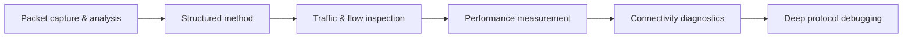

# 🔬 Network Analysis & Troubleshooting

> [!abstract] Analysis branch
> This is where every earlier branch is put to use. Troubleshooting is not guessing — it is a disciplined method of isolating a fault to a layer and proving the cause with evidence. This branch teaches capture, structured diagnosis, flow analysis, performance measurement, connectivity testing, and deep protocol debugging, so that "the network is slow" becomes a measurable, attributable conclusion.

## 🗺️ Zero-to-Mastery Learning Path

1. [[Packet Capture & Analysis]] — capture with tcpdump and Wireshark; read frame, IP, and transport headers
2. [[Structured Network Troubleshooting]] — apply the OSI divide-and-conquer methodology to any unexplained failure
3. [[Traffic Analysis & Flow Inspection]] — derive behaviour from NetFlow, sFlow, and aggregated statistics without deep inspection
4. [[Performance & Latency Analysis]] — measure RTT, jitter, retransmit rate, and queue depth to find bottlenecks
5. [[Connectivity Diagnostics]] — use ping, traceroute, and pathping to localise a break
6. [[Protocol Debugging & Deep Inspection]] — decode TLS, DNS, and application payloads to root-cause protocol misbehaviour

---
> 🔼 Up: [[Networking]]
