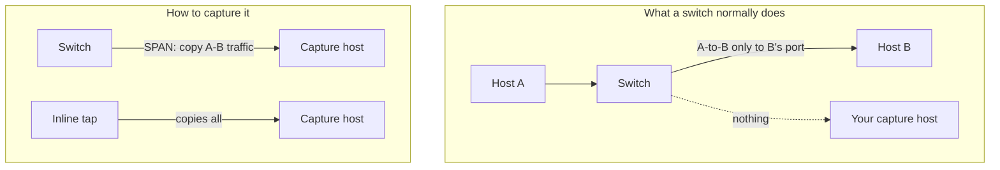

# 🎣 Packet Capture & Analysis

> [!abstract] Note of [[Network Analysis & Troubleshooting]]
> Packet capture is the ground truth of networking — when tools disagree and theories conflict, the packets settle it. This note covers how capture actually works, the two kinds of filter that are constantly confused, and how to get traffic to your capture tool in a switched network where, by design, you do not see other hosts' frames.

## Parent Learning Order
Packet Capture & Analysis -> Structured Network Troubleshooting -> Traffic Analysis & Flow Inspection -> Performance & Latency Analysis -> Connectivity Diagnostics -> Protocol Debugging & Deep Inspection

## Reading the Wire Directly

> *You put your NIC in promiscuous mode on the office switch. Whose traffic can you now see?*
>
> Hold your answer — the section below is the response.

Every diagnostic tool so far has *interpreted* the network — reported a state, a route, a connection. **Packet capture** shows the raw traffic itself: the actual bytes on the wire, header by header. It is the authoritative evidence, because it is not an interpretation — it is what actually happened. When a developer says "the request was sent" and the server says "nothing arrived," the capture ends the argument.

Capture works by putting the network interface into **promiscuous mode**, telling it to hand the operating system every frame it receives rather than only frames addressed to it. A capture library — **libpcap** on Unix-like systems — then delivers those frames to tools like `tcpdump` and Wireshark. The result can be saved as a **PCAP file**, a portable record that any analysis tool can open later.

```bash
sudo tcpdump -i eth0 -w capture.pcap -c 100 'tcp port 443'
```

This captures 100 TCP/443 packets to a file. The `-w` writes raw packets (openable in Wireshark), `-c` bounds the count, and the final expression is a **filter** — the single most important concept in capture, examined next.

**Prerequisites:** encapsulation, and how a switch forwards frames.

> [!tip] The analogy, and where it breaks
> A tape recorder on a phone line — the definitive record when two parties disagree about what was said. The analogy breaks because a modern switched network is not a party line: by default your recorder hears only your own calls, and you must arrange a deliberate tap or mirror to hear anyone else's. Capturing 'the network' is never automatic.

**The deliberate break:** you put the interface in promiscuous mode, start the capture, and expect to see the network. On a switched network you will see almost nothing but your own traffic and broadcasts.

Promiscuous mode tells your NIC to stop discarding frames not addressed to it. It does not tell the **switch** to send you any. A switch forwards unicast only to the port that owns the destination MAC, so the frames you want never reach your cable. This is the single most common reason a capture "isn't working," and no tcpdump flag fixes it — you need a SPAN/mirror port, a TAP, or to be in the path.

**How you'd spot it:** if every packet you see involves your own address, plus ARP and broadcast, you are on a switch port with no mirror. That is a topology problem, not a filter problem. It looks like this — a capture with no filter at all, taken while two other hosts on the VLAN are actively talking:

```text
10.10.10.14.52418 > 203.0.113.20.443: Flags [.], ack 1, win 502
203.0.113.20.443 > 10.10.10.14.52418: Flags [P.], seq 1:1449, length 1448
ARP, Request who-has 10.10.10.30 tell 10.10.10.1, length 28
ARP, Reply 10.10.10.30 is-at 00:00:5e:00:53:1e, length 28
10.10.10.14.52418 > 203.0.113.20.443: Flags [.], ack 1449, win 501
IP6 fe80::200:5eff:fe00:5330 > ff02::2: ICMP6, router solicitation
```

Every unicast line has `10.10.10.14` on one side of it — the capture host's own address. The `ARP` and IPv6 multicast lines are there because those are flooded to every port by design. `WS-030` and `DC01` exchanged several megabytes during this capture and not one byte of it appears, because the switch had no reason to send it here.

The mistake this causes is worse than an empty capture, because the capture is not empty. It is full of plausible traffic, and a responder who concludes "I captured the segment and the traffic you describe never happened" has stated something about their switch port and attributed it to the network.

## Two Filters, Constantly Confused

There are two entirely different kinds of filter, applied at different times, and mixing them up is the most common capture mistake.

A **capture filter (BPF)** decides which packets are *recorded at all*. It is applied in the kernel, before packets reach the tool, using **BPF (Berkeley Packet Filter)** syntax. Because it runs in the kernel, it is efficient and it discards non-matching traffic permanently — what a capture filter drops is gone.

A **display filter** decides which of the *already-captured* packets are *shown*. It is applied by the analysis tool after capture, and it hides rather than discards — you can change it freely to view different subsets of the same capture.

```text
Capture filter (BPF):   kernel-level, decides what is RECORDED (discarded if not matched)
Display filter:         tool-level, decides what is SHOWN (data still there, just hidden)
```

They are also **two different languages**, which is the mechanical reason the confusion persists — the same intent is written differently in each:

| Intent | Capture filter (BPF) | Display filter (Wireshark) |
|:--|:--|:--|
| one host | `host 10.10.10.14` | `ip.addr == 10.10.10.14` |
| a port | `tcp port 443` | `tcp.port == 443` |
| both | `host 10.10.10.14 and tcp port 443` | `ip.addr == 10.10.10.14 && tcp.port == 443` |
| SYN only | `tcp[tcpflags] & tcp-syn != 0` | `tcp.flags.syn == 1 && tcp.flags.ack == 0` |
| not this subnet | `not net 10.10.10.0/24` | `!(ip.addr == 10.10.10.0/24)` |

The two columns are close enough to look interchangeable and are not. Typing a display filter into `tcpdump` fails loudly, which is harmless. The reverse is the dangerous direction: `tcp port 443` typed into Wireshark's display-filter bar is accepted as a valid *expression* — `tcp`, `port` and `443` parse — and shows you a subset of packets that has nothing to do with what you asked for, with no error to warn you.

Only one of these two mistakes announces itself, which is worth knowing before an incident rather than during one.

The practical rule: **use a capture filter to control volume on a busy link** (you cannot record everything on a gigabit link, and recording irrelevant traffic buries the signal), and **use display filters to explore** what you captured. The danger of an overly narrow capture filter is that you discard the very packet that would have explained the problem — the retransmission, the reset, the error — so on anything but the busiest links, capture broadly and filter the display narrowly.

BPF capture-filter syntax is worth fluency because it appears everywhere — tcpdump, Wireshark, and many security tools share it:

```bash
sudo tcpdump -i eth0 'host 10.10.10.14 and tcp port 443'      # one host's HTTPS
sudo tcpdump -i eth0 'tcp[tcpflags] & tcp-syn != 0'          # SYN packets (find scans/handshakes)
sudo tcpdump -i eth0 'icmp or arp'                           # low-level troubleshooting
sudo tcpdump -i eth0 'net 10.10.10.0/24 and not port 22'    # a subnet, excluding SSH noise
```

## The Switched-Network Problem

Here is the obstacle that surprises beginners: **on a modern switched network, your capture tool sees very little.** A switch, by design, forwards frames only to the port leading to their destination (from the switching branch). Your host's interface therefore receives only frames addressed to it, plus broadcasts and multicasts — not the conversations between other hosts. Promiscuous mode makes your interface accept everything *it receives*, but the switch is not sending you other hosts' frames in the first place.

Getting the traffic you want to your capture point requires one of several techniques:

- **SPAN / mirror port** — configure the switch to copy traffic from one or more ports (or a whole VLAN) to the port where your capture host sits. This is the standard method and requires switch access.
- **Network tap** — a passive hardware device inserted into a link that copies all traffic to a monitor port, invisibly and without loss. Taps are the gold standard for reliability because they cannot drop traffic under load the way a busy SPAN port can.
- **Capture on an endpoint** — run the capture on one of the hosts in the conversation, where you naturally see its own traffic.
- **Capture at a chokepoint** — a router, firewall, or gateway sees all traffic crossing it, making it a natural capture location for anything that transits it.



This connects capture to sensor placement from the security-architecture branch: both are about getting the traffic you need to a point where you can observe it, and both are blind to traffic that never reaches that point.

## Security Implications

**Capture is the arbiter of truth, including for security.** When intrusion detection, application logs, and firewall logs disagree, the packet capture resolves what actually crossed the wire. It is the evidence of record for incident response, showing exactly what an attacker sent and received — subject, of course, to having captured at the right point.

**Capture exposes everything unencrypted, which is why encryption matters.** A capture reveals the full contents of any cleartext traffic — credentials, data, everything. This is the offensive value of a capture position and the defensive argument for encryption: the same capture that shows a plaintext password shows only ciphertext for a TLS session. Every "capture reveals cleartext" observation in this domain is an argument for encrypting the payload.

**Capturing requires privilege and is itself sensitive.** Promiscuous capture needs elevated privilege because it exposes other parties' traffic, and a capability to capture on a network is a capability to surveil it. Capture points, PCAP files, and mirror configurations are sensitive assets — a stored PCAP of production traffic may contain credentials and personal data and must be handled accordingly.

**Volume management is a real skill.** On a fast link, naive capture overwhelms storage and buries the relevant packets. Capture filters, ring buffers (rotating files), and snap length (capturing only headers when payloads are not needed) are the techniques that make capture practical at scale. A capture that fills the disk or that you cannot search is not evidence.

**The capture point defines what you can conclude.** A capture taken at the wrong location misses the traffic in question and can lead to false conclusions — "nothing was sent" may mean "nothing reached my capture point," which is a different statement. Stating where a capture was taken is part of stating what it proves, exactly as with sensor placement.

All capture described here must be performed only on networks and systems you own or are explicitly authorized to monitor. Capturing traffic exposes its contents, and doing so on networks you do not control is unlawful interception.

## Summary

You should now be able to:

- Explain what packet capture shows that other tools do not, what promiscuous mode does, and why a PCAP file is portable evidence.
- Distinguish a capture filter from a display filter and know when to use each; write BPF filters, and explain why a switched network requires a mirror, tap, or chokepoint to capture other hosts' traffic.
- Explain why capture is the arbiter of truth and simultaneously a sensitive surveillance capability; argue why the capture point defines what you can conclude, and why every "capture reveals cleartext" fact is an argument for encrypting the payload.

---
> 🔼 Up: [[Network Analysis & Troubleshooting]]
