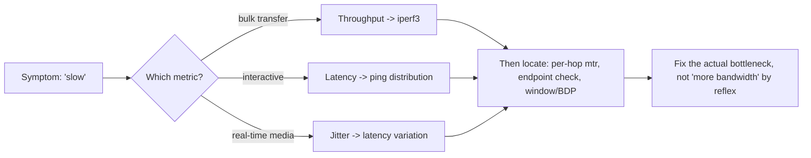

# ⚡ Performance & Latency Analysis

> [!abstract] Note of [[Network Analysis & Troubleshooting]]
> "The network is slow" is a symptom, not a diagnosis, and the single most common analytical error is confusing bandwidth with latency. This note separates the metrics that determine performance, shows how to measure each, and explains why adding bandwidth often does nothing — because the bottleneck was never bandwidth.

## Parent Learning Order
Packet Capture & Analysis -> Structured Network Troubleshooting -> Traffic Analysis & Flow Inspection -> Performance & Latency Analysis -> Connectivity Diagnostics -> Protocol Debugging & Deep Inspection

## Four Different Things Called "Slow"

> *A user reports that the network is slow. Which number are they describing?*
>
> Hold your answer — the section below is the response.

Users say "slow"; the analyst must translate that into a measurable quantity, because "slow" hides four distinct metrics that call for different fixes.

| Metric | What it measures | Analogy | Fixed by |
| --- | --- | --- | --- |
| **Bandwidth** | Maximum data rate (capacity) | Width of a pipe | Bigger link |
| **Throughput** | Actual achieved data rate | Water actually flowing | Depends on the true bottleneck |
| **Latency** | Time for data to travel one way / round trip | Length of the pipe | Shorter path, less queueing |
| **Jitter** | Variation in latency | Inconsistent flow | Stable path, queue management |

The relationship people get wrong: **bandwidth is capacity, latency is delay, and they are independent.** A satellite link can have huge bandwidth and terrible latency; a short fibre link can have modest bandwidth and superb latency. Adding bandwidth does nothing for a latency problem, and this single confusion wastes enormous money and effort — organizations "upgrade the internet" to fix slowness that was never a capacity issue.

**Which metric matters depends on the workload:**

- **Bulk transfer** (backups, downloads) is bandwidth- and throughput-sensitive — it wants a fat pipe.
- **Interactive work** (SSH, web browsing, gaming, voice) is latency-sensitive — it wants a short delay, and more bandwidth barely helps.
- **Real-time media** (voice, video calls) is jitter-sensitive — inconsistent latency, not average latency, is what breaks a call.

Diagnosing performance starts with identifying which metric the workload actually cares about, because optimizing the wrong one is effort wasted.

**Prerequisites:** throughput, round-trip time, and the bandwidth-delay product.

> [!tip] The analogy, and where it breaks
> A motorway: bandwidth is how many lanes it has, latency is how long the journey takes, and they are independent — adding lanes never shortens the distance. The analogy breaks for the case that confuses everyone: a long road with few vehicles allowed *in flight at once* stays slow no matter how wide it is, which is why a high-latency link needs a bigger window rather than more bandwidth.

## Measuring Each Metric

**Latency** is measured by round-trip time — ping is the most direct instrument — and read as a distribution, not a single number:

```bash
ping -c 20 192.0.2.10 | tail -3
```

Expected excerpt:

```text
20 packets transmitted, 20 received, 0% packet loss, time 19031ms
rtt min/avg/max/mdev = 11.204/14.882/48.201/7.113 ms
```

Read all four values. `avg` is the typical delay. `max` far above `avg`, and a large `mdev` (mean deviation), indicate **jitter** — inconsistent latency, the killer for real-time media even when the average looks fine. A steady 40 ms is fine for a call; an average of 15 ms that spikes to 48 ms is not.

**Throughput** is measured by an active test that actually moves data:

```bash
iperf3 -c 10.10.20.30 -t 10
```

Expected excerpt:

```text
[ ID] Interval           Transfer     Bitrate
[  5]   0.00-10.00  sec   1.09 GBytes   935 Mbits/sec   receiver
```

935 Mbits/sec on a gigabit link is healthy. If throughput is far below the link's bandwidth, the bottleneck is elsewhere — loss, latency (via the bandwidth-delay product from the transport branch), a slow endpoint, or a constrained device on the path.

**The bandwidth-delay product** ties latency and throughput together, and explains a frequent mystery: on a high-latency link, throughput is capped by how much data can be in flight (the window) divided by the round-trip time. A gigabit link with 100 ms latency and a too-small window delivers a fraction of its capacity — and the fix is tuning the window, not adding bandwidth. This is why "we have a fast link but transfers are slow" is so often a latency-and-windowing problem, not a capacity one.

## Finding Where the Slowness Is

Once you know *which* metric is bad, locate *where*. Per-hop analysis reveals whether latency accumulates gradually (distance) or jumps at a specific hop (a problem there):

```bash
mtr -n --report --report-cycles 30 192.0.2.10
```

Expected excerpt:

```text
HOST: workstation          Loss%   Snt   Last   Avg  Best  Wrst StDev
  1.|-- 10.10.10.1          0.0%    30    0.5   0.6   0.4   1.2   0.2
  2.|-- 10.10.250.1         0.0%    30    1.1   1.2   1.0   2.1   0.2
  3.|-- 203.0.113.1         0.0%    30    9.0   9.2   8.8  10.1   0.3
  4.|-- 192.0.2.23          2.1%    30   88.4  91.2  85.0 140.2  12.4
  5.|-- 192.0.2.10          2.0%    30   89.1  90.8  86.1 138.9  11.8
```

The story is at hop 4: latency jumps from 9 ms to 88 ms and loss and jitter appear, and both persist to the destination. That hop is where the problem enters. Critically — and this is the persistent misreading from the ICMP leaf — **only impairment that continues to the destination matters.** Loss at an intermediate hop that does *not* persist to later hops is a reporting artifact (that hop deprioritizing ICMP), not a real problem. Here it persists, so it is real.



**The deliberate break:** "the network is slow" invites adding bandwidth, because bandwidth is the number everyone in the conversation understands.

Four distinct metrics hide inside that word and only one of them is capacity, so the reflex fixes the problem roughly a quarter of the time. In a security context it does something worse than waste money: a saturated link is equally consistent with a backup job, an exfiltration transfer and a volumetric attack, and "we need more bandwidth" closes the investigation before anyone has established which. The upgrade then arrives, the symptom eases, and the cause is never named.

**How you'd spot it:** refuse to act on "slow" until it has resolved into one of the four numbers — bandwidth, throughput, latency or loss — because each points at a different fix. Then ask the ownership question: a link at capacity with no accountable owner for the traffic is the shape of both exfiltration and a flood, and what separates them is which flow, to which host, in what pattern. None of those questions are answerable from a megabits figure.

## Security Implications

**Performance problems and attacks look alike.** "Slow" is the symptom of both congestion and a denial-of-service attack; a link "saturated" could be a backup job or exfiltration; latency spikes could be a failing device or an attacker's traffic. Structured performance analysis is what distinguishes a mundane capacity issue from a security event — reaching a clear cause (this flow, this host, this pattern) is what tells you which it is. Jumping to "we need more bandwidth" can mask an ongoing attack.

**Baselines make performance anomalies meaningful.** As throughout the analysis branch, deviation is only detectable against a known-normal baseline. A latency or throughput change is a signal only if you know what the numbers usually are, so performance baselines are both an operational and a security asset — an unexplained performance shift can be the first sign of an incident.

**Denial-of-service is a performance attack.** Volumetric attacks work by consuming a performance resource — bandwidth, connection capacity, or a device's processing — until legitimate traffic cannot get through. Understanding which resource is the bottleneck is exactly what performance analysis provides, and it is what tells a defender whether they are facing a bandwidth flood (mitigate upstream), a connection exhaustion (per the transport leaf), or a resource attack on a specific device.

**Performance data can leak information.** Timing and throughput measurements can, in some contexts, reveal information about systems and even cryptographic operations (timing side channels). While mostly beyond network troubleshooting, it is why performance measurement of sensitive systems is not always benign, and why some environments treat detailed timing data as sensitive.

**The "add bandwidth" reflex wastes resources and hides causes.** Because bandwidth is the metric people understand, it is the reflexive fix — and when the real problem is latency, jitter, loss, an endpoint, or an attack, the upgrade changes nothing and the true cause persists undiagnosed. Analytical discipline that identifies the actual bottleneck is what prevents both wasted spend and missed incidents.

All performance testing described here should target systems you administer or are authorized to test; active throughput tests generate significant traffic and can themselves affect a shared link.

## Summary

You should now be able to:

- Define bandwidth, throughput, latency, and jitter, and explain why bandwidth and latency are independent.
- Identify which metric a workload cares about, measure each correctly, read a ping distribution and an `mtr` report, and distinguish real per-hop impairment from a reporting artifact.
- Explain the bandwidth-delay product and why a latency-limited transfer is fixed by window tuning rather than bandwidth; argue why performance analysis distinguishes a capacity problem from a denial-of-service attack, and why the "add bandwidth" reflex both wastes resources and can mask an incident.

---
> 🔼 Up: [[Network Analysis & Troubleshooting]]
