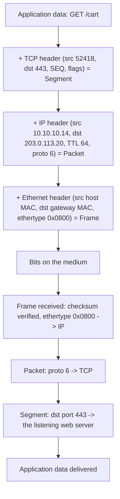

# 📦 Encapsulation & Protocol Data Units

> [!abstract] Note of [[Network Foundations]]
> Encapsulation is the mechanism that turns an abstract layer diagram into concrete bytes on a wire. This note traces a payload as headers are added and stripped, explains why the resulting size limits cause some of the most persistent failures in networking, and shows why header-stack depth is a security-relevant property rather than a curiosity.

## Parent Learning Order
Network Types & Topologies -> The OSI Model -> The TCP-IP Model -> Encapsulation & Protocol Data Units -> Network Devices & Traffic Paths -> Reachability Testing & ICMP

## Headers All the Way Down

When a program sends data, each layer beneath it prepends its own **header** — a fixed structure of fields that the peer layer on the receiving side knows how to read. The layer's data plus its header is called a **PDU (Protocol Data Unit)**, and each layer has its own name for it.

| Layer | PDU name | What the header carries |
| --- | --- | --- |
| Application | **Data** / message | Protocol-specific fields (method, record type, command) |
| Transport | **Segment** (TCP) / **Datagram** (UDP) | Source and destination ports, sequence, flags, checksum |
| Internet | **Packet** | Source and destination IP, TTL, protocol number, flags |
| Link | **Frame** | Source and destination hardware address, ethertype, trailer checksum |
| Physical | **Bits** | No header; encoding and timing on the medium |

**Encapsulation** is the process of adding these headers on the way down. **Decapsulation** is stripping them on the way up. The receiving layer removes exactly its own header and hands the remainder upward, using a field in the header it just read to decide *which* upper-layer protocol to hand it to.

That last point is the mechanism that makes the whole thing work, and it is usually skipped. Each header contains a **demultiplexing key**:

- The Ethernet header's **ethertype** (`0x0800` = IPv4, `0x86DD` = IPv6, `0x0806` = ARP) says what the frame contains.
- The IP header's **protocol number** (`6` = TCP, `17` = UDP, `1` = ICMP) says what the packet contains.
- The TCP or UDP **destination port** says which local program receives the payload.

Without these keys, a receiver would have a pile of bytes and no way to parse them.

> [!tip] The analogy, and where it breaks
> Nested envelopes is the standard image: the letter goes in an envelope, which goes in a courier bag, which goes in a container. It captures nesting and ordering well. It fails on two points — a real header is *read and acted upon* at each hop, not merely carried, and some headers are rewritten in transit while the payload is untouched.

## Tracing One Exchange



Two properties of this diagram matter more than the shape.

**Headers are added innermost-last and removed outermost-first.** The link header is added last and stripped first. This is why a capture tool displays the Ethernet header at the top of its output even though it is conceptually the outermost wrapper.

**Different headers have different lifetimes.** The Ethernet header is destroyed and rebuilt at *every hop*, because each hop is a different link with different hardware addresses. The IP header survives end-to-end, though its TTL is decremented and its checksum recomputed at each router. The TCP header and payload are untouched by routers entirely. Understanding which fields are stable and which are rewritten is what lets you reason about where an observed change was introduced.

## Seeing It Concretely

```bash
sudo tcpdump -i eth0 -nn -e -c 2 -v 'tcp port 443 and tcp[tcpflags] & tcp-syn != 0'
```

Expected excerpt:

```text
00:00:5e:00:53:0e > 00:00:5e:00:53:01, ethertype IPv4 (0x0800), length 74:
    (tos 0x0, ttl 64, id 41207, offset 0, flags [DF], proto TCP (6), length 60)
    10.10.10.14.52418 > 203.0.113.20.443: Flags [S], seq 2419087713,
    win 64240, options [mss 1460,sackOK,TS val 88213 ecr 0,nop,wscale 7], length 0
```

Every element of the header stack is visible in those four lines:

- `...:53:0e > ...:53:01` — link layer. The destination is the **gateway's** hardware address, not the server's, because the server is not on this link.
- `ethertype IPv4 (0x0800)` — the demultiplexing key telling the receiver an IP header follows.
- `ttl 64` — the initial hop budget. Common initial values are 64 (Linux, macOS), 128 (Windows), and 255 (many network devices), which is why an observed TTL hints at both the sender's platform and the hop count travelled.
- `flags [DF]` — Don't Fragment. This single bit is responsible for a large share of "works for small requests, hangs for large ones" incidents, explained below.
- `proto TCP (6)` — the next demultiplexing key.
- `length 60` versus frame `length 74` — the 14-byte Ethernet header accounts for the difference. Header overhead is real bandwidth.
- `mss 1460` — the largest payload this host wants in one segment, derived from a 1500-byte MTU minus 20 bytes of IP and 20 bytes of TCP header.

## MTU, Fragmentation, and the Classic Failure

**MTU (Maximum Transmission Unit)** is the largest payload a link can carry in one frame — 1500 bytes for standard Ethernet. Because encapsulation adds bytes, an oversized payload must be either fragmented or rejected.

IPv4 routers may fragment a packet that exceeds the next link's MTU, unless the **Don't Fragment** bit is set. When DF is set and the packet is too large, the router must discard it and return an ICMP "fragmentation needed" message. The sender uses that message to lower its estimate — this is **Path MTU Discovery**.

Here is where it breaks. If an administrator blocks all ICMP at a firewall "for security," those notifications never arrive. The sender keeps transmitting full-size segments, they keep being silently discarded, and the result is a connection that completes its handshake, transfers small responses successfully, and then hangs the moment a large response is sent. This is the **PMTU black hole**, and it is one of the most misdiagnosed conditions in networking precisely because every simple test passes.

Reproduce the diagnosis with a payload-size sweep:

```bash
ping -M do -s 1472 -c 2 10.10.20.10     # 1472 + 8 ICMP + 20 IP = exactly 1500
ping -M do -s 1473 -c 2 10.10.20.10     # one byte over
```

Expected excerpt:

```text
1480 bytes from 10.10.20.10: icmp_seq=1 ttl=63 time=1.42 ms

ping: local error: message too long, mtu=1500
```

The `-M do` flag sets DF, so the kernel refuses rather than fragments. If the first command succeeds and the second fails locally, your own MTU is 1500 and the path is fine. If a *smaller* size fails with no reply at all — silence rather than a local error — a device on the path is discarding oversized packets without signalling, and you have found the black hole. Tunnels are the usual culprit, because each layer of encapsulation subtracts from the usable payload.

```bash
tracepath 10.10.20.10
```

Expected excerpt:

```text
 1:  10.10.10.1       0.412ms
 2:  10.10.30.1       1.104ms  pmtu 1420
 3:  10.10.20.10      1.881ms  reached
     Resume: pmtu 1420 hops 3
```

`pmtu 1420` is the evidence: a tunnel on hop 2 costs 80 bytes of overhead. The fix is to correct MSS or MTU on the path, or to permit the ICMP type that carries the notification — not to disable DF globally.

## Security Implications

Encapsulation depth is a security property because **inspection stops where parsing stops**.

A control that examines the outer headers of a tunnelled flow sees only the tunnel. Traffic encapsulated inside DNS, ICMP, or HTTP still has a valid outer header and therefore passes any filter that only evaluates that header. Detecting protocol tunnelling means looking at behaviour — query volume, entropy, record-size distribution, timing regularity — rather than at the outer five-tuple.

Fragmentation has historically been an evasion technique in its own right. If a security device reassembles fragments differently from the destination host — different overlap resolution, different timeout, different resource limits — an attacker can construct a series of fragments that the inspector reads as benign and the target reassembles as malicious. Modern devices normalize fragments precisely to remove this ambiguity, and the general principle applies well beyond fragments: **wherever two implementations may parse the same bytes differently, that difference is an attack surface.**

Header fields also leak. Initial TTL narrows the sender's operating system. IP identification fields, TCP options ordering, and window sizes together form a fingerprint that can distinguish a genuine client stack from a scripted one. Defensively that is useful telemetry; offensively it is reconnaissance obtained passively.

Any capture described here must be performed only on networks and systems within an authorized scope, since packet capture exposes the contents of other parties' traffic.

## Summary

You should now be able to:

- Name the PDU at each layer, explain what a header is, and identify the three demultiplexing keys that let a receiver parse a frame.
- Read a verbose capture and attribute each field to its layer; diagnose an MTU problem with a DF-set payload sweep and explain why the connection succeeded for small responses.
- Explain why the link header is rebuilt every hop while the IP header survives end-to-end; describe how a PMTU black hole forms from a well-intentioned ICMP block, and why differing fragment-reassembly behaviour between an inspection device and a host constitutes an evasion surface.

---
> 🔼 Up: [[Network Foundations]]
