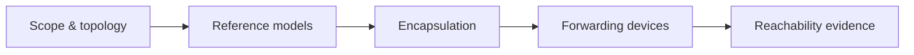

# 🧱 Network Foundations

> [!abstract] Foundations branch
> Everything else in this domain assumes the vocabulary built here: what a network is, the two reference models used to describe it, how a payload becomes a frame, which device makes which forwarding decision, and how to prove that two hosts can reach each other at all.

Read these in order. Each leaf assumes the terms defined by the ones before it.

## 🗺️ Zero-to-Mastery Learning Path

1. [[Network Types & Topologies]] — distinguish LAN, WAN, MAN, and PAN; compare physical and logical topologies
2. [[The OSI Model]] — map seven layers to concrete operations; know which layer owns a problem
3. [[The TCP-IP Model]] — reconcile OSI with the four-layer Internet model used in practice
4. [[Encapsulation & Protocol Data Units]] — trace a payload through header additions at each layer down to the wire
5. [[Network Devices & Traffic Paths]] — choose between hubs, switches, routers, and load balancers for a given path
6. [[Reachability Testing & ICMP]] — use ICMP echo and unreachable messages to prove or disprove a path

---
> 🔼 Up: [[Networking]]
