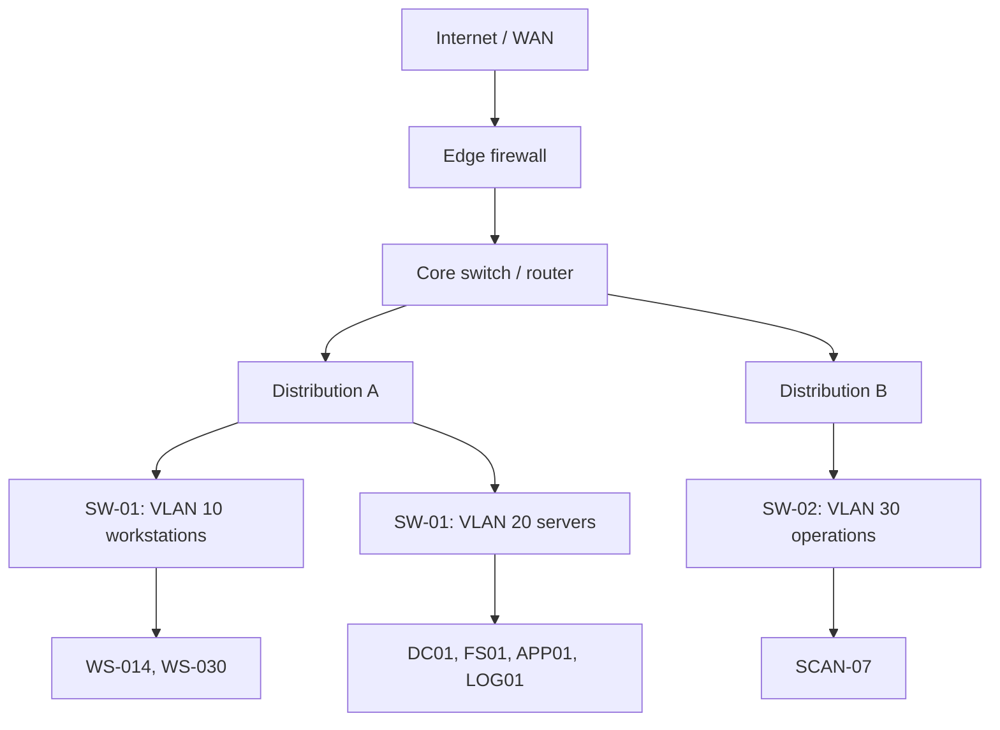

# 🕸️ Network Types & Topologies

> [!abstract] Note of [[Network Foundations]]
> A network is defined less by its cables than by its boundaries: who can reach whom without a router, who shares a broadcast, and where administrative trust changes hands. This note builds the vocabulary of scope and shape, then converts it into the two questions that matter operationally — what is my blast radius, and where does traffic become someone else's problem?

## Parent Learning Order
Network Types & Topologies -> The OSI Model -> The TCP-IP Model -> Encapsulation & Protocol Data Units -> Network Devices & Traffic Paths -> Reachability Testing & ICMP

## What a Network Actually Is

> *Every desk cables back to a single switch in a cupboard. What is the topology?*
>
> Hold your answer — the section below is the response.

A **network** is two or more devices that can exchange data using an agreed set of rules. That is the whole definition. Everything else — switches, routers, subnets, firewalls — exists to answer one repeated question: *given this destination, where do I send the data next?*

Before any of that, you need three terms.

A **node** (or **host**) is anything with a network interface that sends or receives data: a laptop, a printer, a virtual machine, a container, a phone. A **link** is the medium connecting nodes — copper, fibre, or radio. A **segment** is a set of nodes that can reach each other over links alone, with no routing decision in between.

The single most useful concept for a beginner is the **broadcast domain**: the set of devices that receive a frame addressed to "everyone on this segment." Two hosts in the same broadcast domain can discover and talk to each other directly. Two hosts in different broadcast domains cannot — they need a router, and a router is a place where policy can be applied. This is why segmentation is a security control and not merely a design preference.

> [!tip] The analogy, and where it breaks
> A broadcast domain is like a room where shouting reaches everyone. A router is the door between rooms. The analogy breaks down in two places: a switch quietly delivers most traffic point-to-point rather than shouting it, and modern virtual networks put "rooms" inside a single physical box, so physical proximity tells you nothing about logical adjacency.

## Classifying by Scope

Networks are conventionally named by geographic and administrative reach. The names are loose, but they communicate who owns the infrastructure and therefore who can change it.

| Term | Scope | Typical owner | Example |
| --- | --- | --- | --- |
| **PAN** | A person, metres | The individual | Bluetooth headset, wearable |
| **LAN** | One site or building | The organization | Office floor, home network |
| **VLAN** | A logical slice of a LAN | The organization | Meridian's `servers` separated from `workstations` |
| **CAN** | Several adjacent buildings | The organization | University campus |
| **MAN** | A metropolitan area | Carrier or municipality | City-wide fibre ring |
| **WAN** | Regions, countries | Multiple carriers | Corporate inter-site links, the Internet |
| **Overlay / VPN** | Logical, spans anything | The organization | Encrypted tunnel joining two sites |

The security consequence of this table is trust asymmetry. Devices on the same LAN historically trusted each other far more than they trusted anything outside — file shares, printer discovery, credential caching, and management protocols were all designed for a "friendly" local segment. That assumption is why a single foothold inside a LAN is disproportionately valuable, and why modern architecture pushes toward treating the local segment as hostile.

An **overlay** deserves special attention because it breaks the geography intuition entirely. A VPN or software-defined overlay makes two hosts on different continents behave as if they share a segment. Everything you conclude about trust from a physical diagram must therefore be re-checked against the logical topology.

**The deliberate break:** look at any modern office and you will see a star — every desk cabled back to a switch. So the reasonable conclusion is that the topology is a star.

Physically, yes. Logically, it depends entirely on what the switch does, and that is the distinction that matters for security. A hub wired in exactly the same star is a logical **bus**: every frame reaches every port. A switch with one VLAN is a single **broadcast domain**, which is why ARP spoofing works across the whole floor. The cabling diagram tells you where to send an engineer; it tells you almost nothing about who can hear whom.

**How you'd spot it:** ping a broadcast address, or watch a capture with no filter. If you see traffic between two hosts that are not you, you are in a shared segment, not an isolated one — regardless of what the cable map says.

## Topology: Physical Shape versus Logical Behaviour

**Topology** describes how nodes are interconnected. Crucially, the *physical* topology (where the cables run) and the *logical* topology (how traffic actually flows) can differ.

| Topology | Structure | Failure behaviour | Status |
| --- | --- | --- | --- |
| **Star** | Every node to a central switch | One link fails, one node drops; the switch is a single point of failure | Dominant today |
| **Bus** | All nodes share one backbone | One break kills the segment | Legacy |
| **Ring** | Each node connects to two neighbours | Break splits the ring unless dual-ring | Legacy, some carrier use |
| **Mesh** | Many nodes interconnect directly | Highly resilient, expensive | Core/backbone, wireless mesh |
| **Tree / hierarchical** | Stars uplinked into a core | Localized failure, predictable growth | Standard enterprise design |

Real enterprise networks are a **tree of stars**: access switches serving endpoints, uplinked to distribution switches, uplinked to a core, with routers and firewalls at the edge. This is drawn as three tiers because each tier has a different job — access enforces port-level policy, distribution aggregates and routes between VLANs, core moves traffic fast without policy.



Read the diagram as a policy map, not a cable map. Every downward edge is a place where a forwarding decision is made, and every horizontal boundary between VLANs is a place where a rule can allow or deny. If two branches meet only at the core, then the core is the only place a control can be applied between them — and if that control is absent, the two branches are effectively one flat network regardless of how the drawing looks.

## The Flat Network Problem

A **flat network** is one large broadcast domain with no internal segmentation. It is easy to run and catastrophic to defend, because every host is one link-layer hop from every other host. In a flat network, an attacker with any foothold can enumerate neighbours, impersonate the gateway, answer name-resolution requests, and reach management interfaces that were never meant to be exposed to endpoints.

Segmentation fixes this by making lateral movement cross a controlled boundary. The practical design questions are:

- Which systems must talk to each other, and on which ports? Everything else is denied.
- Where do management interfaces live, and can an ordinary endpoint reach them?
- Is a guest or IoT device in its own domain with no path to corporate resources?
- Does the segmentation survive an attacker who already has valid credentials?

That last question is the one that separates real segmentation from decorative segmentation. A VLAN with a permissive inter-VLAN rule set is a drawing, not a control.

## Mapping a Network You Are Authorized to Examine

Start with what your own host already knows. These commands read local state and do not touch other systems.

```bash
ip addr show                 # interfaces, addresses, prefix lengths
ip route                     # local subnets and the default gateway
ip neigh                     # neighbours already resolved on this segment
```

Expected excerpt:

```text
2: eth0: <BROADCAST,MULTICAST,UP,LOWER_UP> mtu 1500 state UP
    inet 10.10.10.14/24 brd 10.10.10.255 scope global eth0

default via 10.10.10.1 dev eth0 proto dhcp metric 100
10.10.10.0/24 dev eth0 proto kernel scope link src 10.10.10.14

10.10.10.1 dev eth0 lladdr 00:00:5e:00:53:01 REACHABLE
```

Three facts fall out of that output, and each one answers a scope question:

- `10.10.10.14/24` means this host's own segment holds 254 usable addresses. That is the set of hosts reachable without any routing decision.
- `default via 10.10.10.1` identifies the gateway — the only exit from this broadcast domain, and therefore the natural place for policy.
- The neighbour entry proves the gateway answered at the link layer, which is a stronger statement than "an address is configured."

### Watching the boundary appear

The definition at the top of this note claims something specific and testable: hosts in one broadcast domain reach each other directly, and hosts in different ones cannot. Two pings from `WS-014` make the boundary visible, and the evidence is not in the pings at all — it is in what they leave behind in the neighbour table.

```bash
ping -c 1 10.10.10.30 >/dev/null    # WS-030, same VLAN
ping -c 1 10.10.20.10 >/dev/null    # DC01, VLAN 20
ip neigh
```

Expected output:

```text
10.10.10.30 dev eth0 lladdr 00:00:5e:00:53:1e REACHABLE
10.10.10.1 dev eth0 lladdr 00:00:5e:00:53:01 REACHABLE
```

Both pings succeeded. Only one of the two destinations is in the table.

`WS-030` is there because it is on this segment: `WS-014` resolved its hardware address by asking the segment directly, and now holds a link-layer route to it. `DC01` is not there and never will be, because it is not on this segment — there is no address to resolve. Its packets went to `10.10.10.1`, and the only new neighbour entry is the gateway's.

That difference is the broadcast domain, and it is worth holding onto because most of Layer 2 security follows from it. Every attack in the switching branch — ARP spoofing, MAC flooding, VLAN hopping — works by living inside that first line. An attacker on VLAN 10 can offer `WS-014` a false answer for `10.10.10.30` because the question was asked out loud on a shared segment. They cannot do the same for `10.10.20.10`, because `WS-014` never asks about it; it asks the router, and the router is where a control can sit. Segmentation is a security boundary for exactly this mechanical reason, not as a matter of policy hygiene.

To enumerate live hosts within a block you are explicitly authorized to test, use a host-discovery sweep:

```bash
nmap -sn 10.10.10.0/24
```

Expected excerpt:

```text
Nmap scan report for 10.10.10.1
Host is up (0.00089s latency).
Nmap scan report for 10.10.10.14
Host is up (0.000058s latency).
Nmap done: 256 IP addresses (2 hosts up) scanned in 2.41 seconds
```

### The misleading result you must expect

"2 hosts up" does not mean two hosts exist. Host discovery infers liveness from replies, and replies can be suppressed. A host firewall that drops ICMP and unsolicited probes will appear dead. Conversely, a security appliance that answers on behalf of absent addresses can make an empty range look fully populated.

The troubleshooting workflow is to change the evidence type rather than repeat the same probe:

```bash
nmap -sn -PR 10.10.10.0/24        # ARP-based discovery, local segment only
```

ARP discovery is far harder to suppress on a local segment because a host that ignores ARP cannot receive traffic at all. If ARP finds hosts that ICMP missed, the correct conclusion is "ICMP is filtered," not "the network changed."

## Security Implications

Scope and shape determine three things that matter to both attackers and defenders.

**Blast radius.** The size of a broadcast domain sets how many systems a single compromised host can reach without crossing a control. An oversized flat range multiplies the consequences of one weak endpoint.

**Observability.** Traffic that never crosses a routed boundary may never pass a sensor. If all inspection sits at the edge firewall, intra-segment lateral movement is invisible. Sensor placement must follow the topology, not the org chart.

**Trust inheritance.** Overlays, VPNs, and virtual switches can silently join segments that the physical diagram shows as separate. Any assessment of exposure must be validated against live routing and neighbour state rather than documentation.

All enumeration described here is limited to systems within an authorized scope. Host discovery generates traffic that is logged, and sweeping ranges outside an agreed boundary is both detectable and out of bounds.

## Summary

You should now be able to:

- Define node, link, segment, and broadcast domain; name the common topologies and explain why star-of-stars dominates.
- Read `ip addr`, `ip route`, and `ip neigh` to state your own segment, gateway, and reachable scope; run an authorized sweep and explain why ARP and ICMP discovery can disagree.
- Given a topology diagram, identify every enforcement point and every place where an overlay could bypass one; design a segmentation scheme that still constrains an attacker holding valid credentials, and specify where sensors must sit to observe intra-segment movement.

---
> 🔼 Up: [[Network Foundations]]
