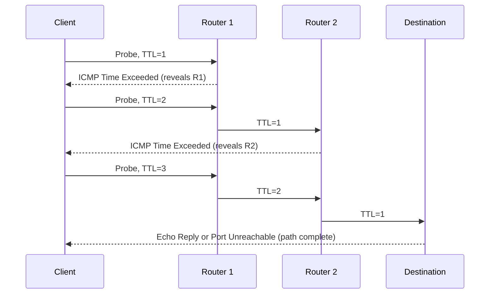

# 📡 Reachability Testing & ICMP

> [!abstract] Note of [[Network Foundations]]
> "Can I reach it?" is the first question in every network investigation and the one most often answered wrongly. This note explains what ICMP actually is, what ping and traceroute genuinely prove, why silence is ambiguous rather than negative, and how to build a reachability conclusion that survives scrutiny.

## Parent Learning Order
Network Types & Topologies -> The OSI Model -> The TCP-IP Model -> Encapsulation & Protocol Data Units -> Network Devices & Traffic Paths -> Reachability Testing & ICMP

## ICMP Is Not a Ping Tool

> *Which port does `ping` use?*
>
> Hold your answer — the section below is the response.

**ICMP (Internet Control Message Protocol)** is the diagnostic and error-reporting protocol of the Internet layer. It rides directly inside IP with protocol number 1 — it is not carried over TCP or UDP and has no ports. Its job is to let routers and hosts report conditions that IP itself cannot express, because IP is a fire-and-forget delivery mechanism with no feedback channel of its own.

Ping is merely the best-known *use* of ICMP. The messages that keep the Internet functioning are the error types.

| Type | Name | Meaning | Why it matters |
| --- | --- | --- | --- |
| 8 / 0 | Echo Request / Echo Reply | "Are you there?" / "Yes" | The ping pair |
| 3 | Destination Unreachable | Delivery failed, with a code explaining why | Codes distinguish network, host, port, and policy failures |
| 3 code 4 | Fragmentation Needed | Packet too large and DF was set | Path MTU Discovery depends entirely on this |
| 3 code 3 | Port Unreachable | Nothing is listening on that UDP port | How UDP scanning and traceroute detect arrival |
| 3 code 13 | Administratively Prohibited | A policy rejected it | Distinguishes a firewall from a dead host |
| 11 | Time Exceeded | TTL reached zero in transit | The entire mechanism behind traceroute |
| 5 | Redirect | "Use a better gateway" | Historically abusable for traffic redirection |

The reason this table matters more than the ping command is that **blocking ICMP wholesale breaks things that are not diagnostics**. Type 3 code 4 is a load-bearing part of TCP over paths with varying MTU; suppress it and you get connections that establish and then hang on large transfers. The reflexive "block ICMP for security" posture trades a small reconnaissance benefit for a class of failures that are very hard to diagnose.

> [!tip] The analogy, and where it breaks
> ICMP is the postal service's paperwork rather than its post: the *return to sender*, *no such address*, *too large for this route* slips a carrier generates **about** mail it could not deliver. That captures the error types well, and it captures why they are load-bearing — a sender who never receives the "too large for this route" slip keeps posting parcels that keep vanishing. The analogy breaks in three places, and each one is a section of this note. First, echo is not an error: nothing about ping is a failure report, and reading a missing reply as one is the misreading this note exists to prevent. Second, a postal service always issues the slip, whereas dropping ICMP silently is the *normal* configuration on the modern Internet — the default outcome here is no paperwork at all. Third, no postal system lets you hide a letter inside a return-to-sender slip, which is exactly what ICMP tunnelling does.

## What Ping Proves, and What It Does Not

```bash
ping -c 4 10.10.20.10
```

Expected output:

```text
PING 10.10.20.10 (10.10.20.10) 56(84) bytes of data.
64 bytes from 10.10.20.10: icmp_seq=1 ttl=63 time=1.42 ms
64 bytes from 10.10.20.10: icmp_seq=2 ttl=63 time=1.38 ms
64 bytes from 10.10.20.10: icmp_seq=3 ttl=63 time=1.51 ms
64 bytes from 10.10.20.10: icmp_seq=4 ttl=63 time=1.44 ms

--- 10.10.20.10 ping statistics ---
4 packets transmitted, 4 received, 0% packet loss, time 3005ms
rtt min/avg/max/mdev = 1.380/1.437/1.510/0.048 ms
```

Read three things from this, not one.

**`ttl=63`** is the TTL remaining when the reply arrived. Since common initial values are 64, 128, and 255, a received 63 implies an initial 64 and exactly one routing hop. This is a useful, if soft, indicator: it hints at both the responder's platform family and the path length. It is soft because initial TTL is configurable and because middleboxes can rewrite it.

**`time=1.42 ms`** is round-trip time, not one-way latency, and it includes the responder's processing delay. Many devices deprioritize ICMP generation, so a high ping time to a router does not necessarily mean traffic *through* that router is slow. Judging path performance by pinging an intermediate hop is a persistent analytical error.

**`0% packet loss`** proves that the Internet layer works in both directions. It proves nothing above Layer 3. A host can answer ping perfectly while every service on it is down, and a host can be fully healthy while never answering ping at all.

### The ambiguity of silence

```text
4 packets transmitted, 0 received, 100% packet loss, time 3067ms
```

This single result has at least five distinct causes:

- The host does not exist at that address.
- The host exists but its firewall drops ICMP echo.
- A network device between you and it drops ICMP by policy.
- The request arrived but the reply was dropped on the return path.
- The address is routed nowhere and the discard is silent.

Silence is not evidence of absence. It is evidence that *this particular probe* produced no response. The professional habit is to change the probe type rather than repeat the same one, and to state conclusions with their basis attached: "no ICMP response" rather than "host is down."

Compare against an explicit rejection:

```bash
ping -c 2 10.10.30.7
```

```text
From 10.10.10.1 icmp_seq=1 Destination Host Unreachable
From 10.10.10.1 icmp_seq=2 Destination Host Unreachable
```

Here the gateway told you something concrete. `SCAN-07` is on VLAN 30, so `10.10.10.1` routed the packet to its own interface on that VLAN, asked the segment for `10.10.30.7`'s hardware address, and got no answer — which is a fact about VLAN 30, discovered by a host that has never been on it. Note who is speaking: the message came from `10.10.10.1`, the *router*, not from the target. Compare that with the silence above. Both are failures; only one of them tells you where the delivery got as far as, and which device made the last decision.

## Traceroute: Weaponizing TTL for Good

Traceroute discovers the path by exploiting the TTL rule. It sends probes with TTL 1, then 2, then 3. Each router that decrements TTL to zero discards the packet and returns an ICMP Time Exceeded message revealing its own address. The destination itself replies differently — with an Echo Reply, or a Port Unreachable if UDP probes were used — which is how traceroute knows to stop.



The diagram makes the key limitation visible: traceroute only ever learns about devices that *choose to respond*. A silent router is invisible, and a device operating transparently at the link layer — a bridging firewall, an inline inspection appliance — never decrements TTL and therefore cannot appear at all. Traceroute maps the routed hops that answer, which is a subset of the devices actually touching your traffic.

```bash
traceroute -n -T -p 443 203.0.113.10
```

Expected excerpt:

```text
 1  10.10.10.1      0.498 ms  0.472 ms  0.510 ms
 2  10.10.250.1     2.104 ms  2.081 ms  2.190 ms
 3  * * *
 4  10.10.250.9     2.410 ms  2.377 ms  2.502 ms
 5  203.0.113.10    3.011 ms  2.958 ms  3.033 ms
```

The `-T -p 443` flags send TCP SYN probes to port 443 instead of the default UDP or ICMP. This matters enormously in filtered environments: many networks drop ICMP and high-numbered UDP but must permit HTTPS, so a TCP traceroute frequently completes where the default fails. Choosing a probe protocol the path is expected to allow is the difference between mapping a path and concluding, incorrectly, that it is broken.

For sustained analysis, combine the path walk with continuous measurement:

```bash
mtr -n --report --report-cycles 20 203.0.113.10
```

Expected excerpt:

```text
HOST: workstation           Loss%   Snt   Last   Avg  Best  Wrst StDev
  1.|-- 10.10.10.1          0.0%    20    0.5   0.5   0.4   0.7   0.1
  2.|-- 10.10.250.1         0.0%    20    2.1   2.2   2.0   3.1   0.3
  3.|-- ???               100.0%    20    0.0   0.0   0.0   0.0   0.0
  4.|-- 10.10.250.9         0.0%    20    2.4   2.5   2.3   3.9   0.4
  5.|-- 203.0.113.10        5.0%    20    3.0   3.1   2.9   5.2   0.6
```

This output contains the single most misread pattern in network diagnostics. Hop 3 shows 100% loss, yet hops 4 and 5 are fine — so traffic obviously passes through hop 3 without difficulty. That hop simply does not generate Time Exceeded messages, usually by policy or ICMP rate limiting. **Loss at an intermediate hop that does not persist to subsequent hops is a reporting artefact, not a fault.** Only loss that continues to the final destination — the 5% at hop 5 here — describes the actual path quality.

**The deliberate break:** ICMP looks optional. It is the diagnostics protocol, attackers use it for sweeps and tunnels, and blocking it therefore reads as a free hardening win with only a lost convenience as the cost.

Parts of it are load-bearing. **Fragmentation Needed** is how path MTU discovery works and **Time Exceeded** is how traceroute works, so dropping them does not harden anything — it creates black holes where small transfers succeed, large ones hang, and nothing in the logs explains why. Meanwhile the covert-channel argument does not survive contact: the same tunnelling works over DNS and HTTPS, so blocking echo relocates the problem rather than solving it. Blanket ICMP denial trades a genuine operational dependency for a reconnaissance benefit that mostly is not there; rate limiting and selective type filtering are the instruments that actually fit.

**How you'd spot it:** the black hole has a distinctive shape — a connection that establishes cleanly and then hangs the moment a large payload moves, with `ping` and small requests working perfectly throughout. Confirm it with a size sweep using the do-not-fragment bit (`ping -M do -s`), and look for the point where replies stop. For the tunnel, the pattern is sustained bidirectional echo between exactly one internal host and one external address, with payloads far larger than any diagnostic needs and intervals far too regular for a human.

## Security Implications

ICMP sits in an awkward position: it is genuinely useful to attackers and genuinely necessary for correct operation.

**As reconnaissance**, echo sweeps enumerate live hosts cheaply, TTL values fingerprint operating systems, and the distinction between a silent drop and an administratively-prohibited reply maps firewall policy. This is why perimeter ICMP is often restricted.

**As a covert channel**, ICMP echo carries an arbitrary payload that most networks neither inspect nor log. Data can be tunnelled inside echo requests and replies, producing command-and-control or exfiltration traffic that passes any control examining only the outer header. Detection is behavioural: unusually large payloads, sustained bidirectional echo volume, high payload entropy, or regular timing between a single internal host and a single external address. Blocking echo does not solve the general problem, since the same technique works over DNS or HTTPS.

**As a defensive dependency**, the error types must survive. Permit Fragmentation Needed and Time Exceeded even where echo is restricted; suppressing them creates PMTU black holes and blinds legitimate path diagnosis. Rate-limiting is a better instrument than blanket denial.

**As an availability risk**, ICMP has been used for amplification and for redirect-based traffic manipulation. Modern hosts ignore ICMP redirects by default and should be configured to continue doing so.

All sweeping, tracing, and probing described here applies only to systems inside an authorized scope. Host discovery is logged by any competent monitoring stack, and enumeration of ranges outside an agreed boundary is out of scope regardless of how benign the payload is.

## Summary

You should now be able to:

- Explain what ICMP is, why it has no ports, and what a successful ping does and does not prove about a host.
- Interpret TTL and RTT correctly, choose a probe protocol suited to a filtered path, and explain why intermediate-hop loss in an `mtr` report that does not persist to the destination is an artefact.
- Justify an ICMP policy that permits Fragmentation Needed and Time Exceeded while rate-limiting echo; describe how ICMP tunnelling evades header-based controls and what behavioural telemetry would detect it; and state a reachability conclusion with the evidence and its limits attached.

---
> 🔼 Up: [[Network Foundations]]
