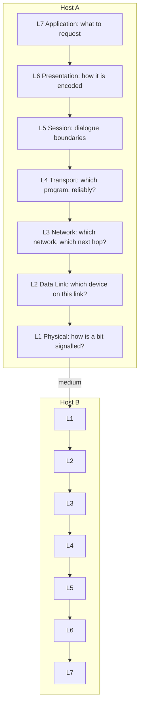

# 📚 The OSI Model

> [!abstract] Note of [[Network Foundations]]
> No production system implements OSI exactly, and yet every network engineer and every incident responder speaks in its layers. This note explains what each layer genuinely does, why the model survived despite not being implemented, and how to use it as a disciplined fault-isolation procedure rather than a memorized list.

## Parent Learning Order
Network Types & Topologies -> The OSI Model -> The TCP-IP Model -> Encapsulation & Protocol Data Units -> Network Devices & Traffic Paths -> Reachability Testing & ICMP

## Why Layer a Network at All

> *How many layers does the stack your packets actually traverse have?*
>
> Hold your answer — the section below is the response.

Sending data between two programs on different machines is a large problem: signals must be encoded onto a medium, addressed to a machine on the local link, routed across unfamiliar networks, delivered to the correct program, and finally interpreted as meaningful content. Solving all of that as one monolithic system would make every change catastrophic — swapping copper for fibre would require rewriting the email client.

**Layering** solves this by defining independent responsibilities with fixed interfaces between them. Each layer offers a service to the layer above and consumes the service of the layer below, and neither needs to know how the other works internally. Replace Ethernet with Wi-Fi and the layers above notice nothing.

The **OSI (Open Systems Interconnection) Model** is the ISO reference framework that names seven such layers. It is a *reference* model: it describes functions that must exist somewhere, not code that must exist as written.

> [!tip] The analogy, and where it breaks
> Layering is often compared to posting a letter: you write content, put it in an envelope, the postal service routes it, a courier carries it. The analogy is good for encapsulation and bad for everything else — real layers negotiate, retransmit, and give feedback to each other, whereas an envelope never asks the letter to be rewritten. Do not let the analogy suggest that layers are strictly independent in practice.

**The deliberate break:** OSI is taught as though it describes how networks work. It does not. It is a *reference model* from a competing protocol suite that lost — and the stack your packets actually traverse is TCP/IP, which has four layers, not seven.

Layers 5 and 6 have almost no independent existence in real implementations: TLS is routinely called "Layer 6" and is nothing of the kind, and no running system has a "session layer" you can point at. Keep OSI for what it is genuinely good at — a shared vocabulary for *where a problem lives* — and stop expecting to find its seven layers in a packet.

## The Seven Layers

| # | Layer | PDU | Core responsibility | Concrete examples |
| --- | --- | --- | --- | --- |
| 7 | **Application** | Data | Network services exposed to software | HTTP, DNS, SMTP, SSH |
| 6 | **Presentation** | Data | Syntax: encoding, serialization, encryption | TLS, UTF-8, JPEG, ASN.1 |
| 5 | **Session** | Data | Establishing, managing, and ending dialogues | RPC, NetBIOS, SMB sessions |
| 4 | **Transport** | Segment / Datagram | End-to-end delivery to a specific program | TCP, UDP, QUIC |
| 3 | **Network** | Packet | Logical addressing and routing between networks | IP, ICMP, IPsec |
| 2 | **Data Link** | Frame | Local delivery on one link; framing and error detection | Ethernet, 802.11, ARP |
| 1 | **Physical** | Bit | Signals, timing, connectors, media | Copper, fibre, radio |

A mnemonic for the bottom-up order: **P**lease **D**o **N**ot **T**hrow **S**ausage **P**izza **A**way.

The layers most often misunderstood are 5 and 6, precisely because no widely deployed stack implements them as separate entities. Their functions are real; their separation is not. Session management lives inside application protocols, and TLS — the canonical "Layer 6" example — actually spans the boundary between transport and application, running as a record protocol above TCP while presenting a byte-stream API to applications. Being able to say *why* TLS resists clean placement is a better signal of understanding than reciting that it is Layer 6.

### Two protocols that will not sit in a row

TLS is the gentle case. It is called Layer 6 because it encodes and encrypts, which is a presentation-layer job description; it behaves like Layer 5 because it negotiates and resumes sessions; and it depends on TCP having already delivered bytes in order, which makes it unambiguously *above* Layer 4. Three layers, one protocol, and the answer people memorize picks one of them.

QUIC is the case that ends the argument. Walk it down the table and it appears in four places at once:

| It does this | Which is the job of | 
|:--|:--|
| runs inside UDP datagrams | above Layer 4 |
| provides reliability, ordering, flow control and congestion control | Layer 4 |
| performs the TLS 1.3 handshake as part of its own connection setup | Layer 5/6 |
| multiplexes independent streams and carries HTTP/3 | Layer 7 |

The honest answer to "what layer is QUIC" is that the question assumes something untrue. QUIC took the functions OSI assigns to layers 4 through 6, implemented them together in one userspace library, and shipped the result on top of the one transport protocol that gets out of the way.

There is a security consequence, and it is not a footnote. Because QUIC encrypts its own transport headers, a middlebox cannot read sequence numbers, cannot see a connection being established or torn down, and cannot inspect or modify the transport state it has spent thirty years reading. Everything a firewall used to know about a TCP connection by looking at it — is this a new flow, is this a retransmission, is this a reset — is inside the ciphertext. Layer 4 visibility, which most network security tooling quietly assumes, is a property of TCP rather than of networking.

So the model survives as a vocabulary and fails as an architecture, and the useful skill is knowing which of those you are using it for. Saying "the problem is at Layer 3" to a colleague is precise and helpful. Asking "which layer is QUIC" is asking a filing question about something that was not filed.

## What Each Layer Genuinely Decides

The productive way to hold the model is by the decision each layer makes.

**Layer 1** decides how a bit is represented on the medium — voltage, wavelength, modulation, timing. It has no concept of a destination.

**Layer 2** decides which device on *this link* receives the frame. It uses a hardware address that is meaningful only on the local segment, and it detects corrupted frames with a checksum. It does not know that other networks exist.

**Layer 3** decides which network the data belongs to and which next hop moves it closer. This is the first layer with an end-to-end address, and the first that can traverse unrelated networks. It offers no delivery guarantee.

**Layer 4** decides which program on the destination host receives the data, using port numbers, and whether delivery is reliable and ordered. This is where the notion of a *connection* first appears.

**Layer 5** decides how a longer dialogue is bounded: when it starts, how it recovers, when it ends.

**Layer 6** decides how data is represented on the wire versus in memory — character encoding, structure, and cryptographic protection.

**Layer 7** decides what the exchange *means*: fetch this resource, resolve this name, deliver this message.



Read the diagram vertically as *responsibility* and horizontally as *peer relationship*. Layer 4 on Host A is logically talking to Layer 4 on Host B even though every byte physically travels down to Layer 1 and back up. That peer relationship is what makes fault isolation possible: if Layer 4 on both sides agrees the connection is established, every layer beneath it is working.

## Layer Isolation as a Procedure

The model's real value is diagnostic. When something "doesn't work," resolve the layer before theorizing about causes. Work upward, because a lower-layer failure makes every higher-layer test meaningless.

```bash
ip link show eth0                      # L1/L2: is the interface up, is carrier present?
ip neigh show 10.10.10.1             # L2: did the gateway answer at the link layer?
ping -c 2 10.10.10.1                 # L3: is the local gateway reachable?
ping -c 2 192.0.2.10                   # L3: does routing off-segment work?
getent hosts example.com               # L7: does name resolution work?
curl -sS -o /dev/null -w '%{http_code}\n' https://example.com   # L4-L7
```

Expected excerpt:

```text
2: eth0: <BROADCAST,MULTICAST,UP,LOWER_UP> mtu 1500 qdisc fq_codel state UP
10.10.10.1 dev eth0 lladdr 00:00:5e:00:53:01 REACHABLE
2 packets transmitted, 2 received, 0% packet loss
2 packets transmitted, 2 received, 0% packet loss
200
```

Each line answers exactly one question, and the order is not arbitrary. `state UP` with `LOWER_UP` proves the physical link carries a signal; without it, no ping result means anything. A `REACHABLE` neighbour entry proves the gateway responded to address resolution on the local link. Successful ping to an off-segment address proves routing and return-path routing both work.

### The failure mode that teaches the most

Consider this outcome:

```text
2 packets transmitted, 2 received, 0% packet loss     # ping 192.0.2.10 works
;; connection timed out; no servers could be reached  # name resolution fails
```

Routing is healthy and the Internet is reachable, yet a browser reports "no Internet." The fault is at Layer 7 — the configured resolver is unreachable or wrong — and no amount of cable-checking will fix it. Users report symptoms at Layer 7 because that is the only layer they can see; the responder's job is to translate the symptom into the layer that actually failed.

The reverse error is equally common: concluding "the network is fine" because ping succeeds. Ping exercises Layers 1 through 3 only. An application failure over an established TCP connection is above transport by definition, and the network team cannot fix it.

**How you'd spot the layer:** work upward and stop at the first failure. No link light is L1. Link but no ARP entry for the gateway is L2. ARP resolves but ping fails is L3. Ping works but the port refuses is L4. The port answers but the application errors is L7. Each answer eliminates everything below it, which is the entire practical value of the model.

## Security Implications by Layer

Because attacks target mechanisms, and mechanisms live at layers, the model is also a threat taxonomy.

| Layer | Representative attack | Why it works | Primary control |
| --- | --- | --- | --- |
| 1 Physical | Tapping, rogue device on a live port | Signal is accessible to anyone with media access | Physical security, port disablement, 802.1X |
| 2 Data Link | ARP spoofing, MAC flooding, VLAN hopping | Link-layer protocols were designed without authentication | Dynamic ARP Inspection, port security, DHCP snooping |
| 3 Network | Source-address spoofing, ICMP tunnelling, route injection | IP has no built-in origin authentication | Ingress filtering, ACLs, authenticated routing, RPKI |
| 4 Transport | SYN flooding, port scanning, RST injection | Connection state can be created or forged cheaply | SYN cookies, stateful filtering, rate limits |
| 5–6 Session/Presentation | Session fixation, TLS downgrade, parser abuse | Negotiation and decoding accept attacker-controlled input | Session regeneration, HSTS, strict parsers |
| 7 Application | Injection, broken access control, logic abuse | The application trusts input it should validate | Input validation, authorization checks, output encoding |

Two structural lessons follow. First, a control at one layer does not protect another: encrypting traffic at Layer 6 does nothing about a Layer 2 attacker who can still redirect and drop it. Second, most modern breaches occur at Layer 7, because the lower layers now work reliably and the application is where business logic — and therefore ambiguity — lives.

## Summary

You should now be able to:

- Name the seven layers in order, state the PDU at each, and explain in plain language what decision each layer makes.
- Run a bottom-up isolation procedure, read the output of each step, and state which layer failed and which tests the failure invalidated.
- Explain why TLS and QUIC resist clean layer placement, why a control at one layer cannot compensate for a weakness at another, and how you would design telemetry so that a reported Layer 7 symptom can be attributed to the correct layer without guesswork.

---
> 🔼 Up: [[Network Foundations]]
