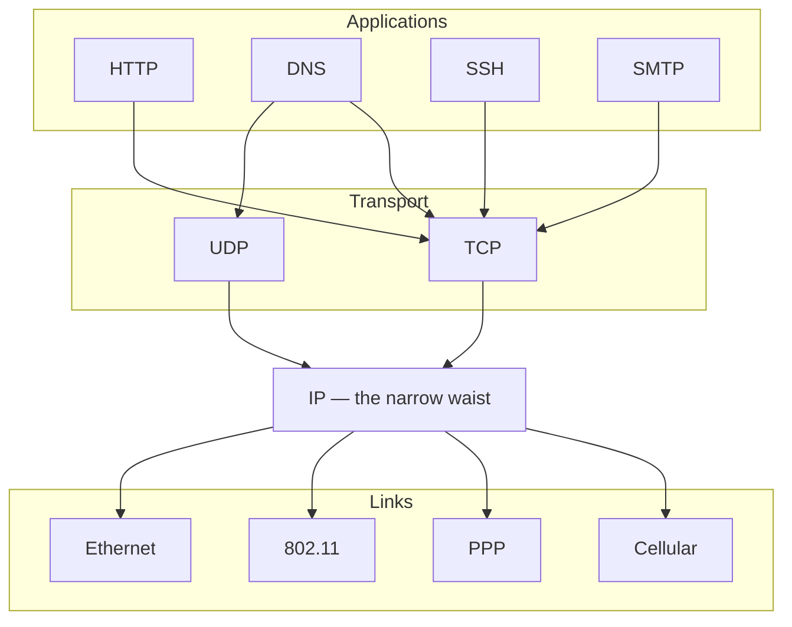

# 🧩 The TCP-IP Model

> [!abstract] Note of [[Network Foundations]]
> OSI is the vocabulary; TCP/IP is the implementation every device actually runs. This note explains the four-layer suite as specified in RFC 1122, why it collapsed OSI's top three layers, where the two models genuinely disagree, and how the hourglass shape of the suite explains both the Internet's success and its security weaknesses.

## Parent Learning Order
Network Types & Topologies -> The OSI Model -> The TCP-IP Model -> Encapsulation & Protocol Data Units -> Network Devices & Traffic Paths -> Reachability Testing & ICMP

## The Model That Shipped

> *You were taught seven OSI layers. How many does the stack on your machine implement?*
>
> Hold your answer — the section below is the response.

OSI was designed by committee as a complete reference architecture. TCP/IP was built by implementers who needed working code, and it won because the code worked. The suite is formally described in RFC 1122 and RFC 1123 as four layers.

| TCP/IP layer | OSI equivalent | Job | Protocols |
| --- | --- | --- | --- |
| **Application** | 7 + 6 + 5 | Everything the program cares about | HTTP, DNS, SSH, SMTP, TLS |
| **Transport** | 4 | Deliver to the right program, with or without reliability | TCP, UDP |
| **Internet** | 3 | Address and route between networks | IP, ICMP, IPsec |
| **Link** | 2 + 1 | Move a frame across one physical link | Ethernet, 802.11, ARP, PPP |

The collapse at the top is not an oversimplification — it reflects reality. In practice a program manages its own dialogue state and its own encoding, so separating "session" and "presentation" from "application" creates boundaries nobody implements. The collapse at the bottom reflects the same pragmatism: to the IP layer, a link is simply something that can carry a datagram to a next hop, and whether that link is copper, fibre, or radio is the link technology's business.

> [!tip] Which model should you use?
> Use OSI when you need to *talk about a failure* — "this is a Layer 2 problem" is universally understood. Use TCP/IP when you need to *reason about a real packet* — because that is what the header stack actually contains. They are not competitors; they are a vocabulary and an implementation.

**Prerequisites:** the OSI layers and what decision each one makes.

> [!tip] The analogy, and where it breaks
> Think of a postal system that standardised only one thing — the envelope format — and let every country invent its own trucks and every writer invent their own letter style. That single fixed layer in the middle is why the system scaled worldwide. The analogy breaks because a real envelope is passive cargo, whereas the IP header is *read and rewritten* at every hop, and because no postal service lets you nest an entire second postal system inside one envelope the way tunnelling does.

## The Hourglass: Why IP Is the Waist

The single most important structural property of the suite is that it is narrow in the middle and wide at both ends. Many link technologies exist below; many applications exist above; and between them there is essentially one network protocol.



The waist is why the Internet scaled. A new application does not need permission from link technologies, and a new link technology does not need to know about applications; both only have to speak IP. Anything that must be changed *at the waist* — the move to IPv6 is the canonical example — is extraordinarily slow precisely because everything depends on it.

The waist is also the root of a security property. Because IP carries no notion of identity or integrity, and because it must remain simple enough for every device to implement, security was pushed outward: to the link layer (802.1X, WPA), to transport and above (TLS, SSH), or bolted onto the waist as an option (IPsec). There is no layer at which "the network authenticates the sender" by default, and that single fact explains source spoofing, on-path attacks, and the entire industry built to compensate.

## Following One Request Through the Suite

Consider a browser on `WS-014` fetching `https://track.meridian.test/cart`. Watch the layers do their work in order.

**Application** decides the intent: an HTTP `GET` for `/cart`, with a `Host` header and cookies. But before any of that, a *different* application-layer protocol runs — DNS must turn the name into an address.

**Transport** opens a TCP connection to port 443, choosing an ephemeral source port so the reply can be matched back to this browser tab. TLS then negotiates keys over that connection; because TLS sits above TCP but below HTTP, it is the clearest example of the model's imperfect boundaries.

**Internet** wraps each segment in an IP header carrying the source and destination addresses, consults the routing table for a next hop, and decrements TTL at every router along the way.

**Link** wraps the packet in a frame addressed to the next hop's hardware address — the gateway's, not the server's — and hands it to the physical medium.

The critical subtlety is that the addresses at different layers change at different rates. The IP addresses stay constant end-to-end. The link-layer addresses are rewritten at *every hop*, because each hop is a new link. Beginners who conflate the two cannot explain why a captured frame shows the gateway's hardware address rather than the server's.

```bash
ss -tnp state established '( dport = :443 )'
```

Expected excerpt:

```text
Recv-Q Send-Q      Local Address:Port      Peer Address:Port  Process
     0      0     10.10.10.14:52418        203.0.113.20:443  users:(("firefox",pid=4412,fd=91))
```

Read this as the transport layer made visible. `10.10.10.14:52418` is the local half of the socket — the ephemeral port is how the kernel demultiplexes this reply to Firefox rather than to some other process. The four values plus the protocol form the five-tuple that uniquely identifies the connection. Nothing here says anything about HTTP; that is one layer up and invisible to `ss`.

## Where the Models Genuinely Disagree

Memorizing a mapping table hides three real disagreements worth understanding.

**ARP has no clean home.** Address Resolution Protocol maps an IP address to a hardware address. It is used *by* the Internet layer but travels *inside* link-layer frames and is not carried in IP. OSI purists call it Layer 2.5; RFC 1122 places it in the Link layer. The honest answer is that it is a layer-crossing helper, and its lack of authentication is a direct consequence of being designed as plumbing rather than a protocol with peers to verify.

**TLS spans a boundary.** It runs over a reliable transport, provides Layer 6 services, and is configured by applications; [[The OSI Model]] works through why it and QUIC refuse to sit in a single row. The point that belongs here is what that costs the four-layer picture: QUIC merges the Transport and Application layers of *this* model, not just OSI's middle three, which means the clean statement "transport is TCP or UDP, and the application sits on top" describes a stack that a large share of web traffic no longer uses.

**Tunnelling breaks the ordering entirely.** A VPN carries IP inside IP, or IP inside UDP. The layer stack becomes recursive rather than linear, and the "layer" of a given header depends on which encapsulation you are currently inside. Any analysis tool must track depth, not just position.

These are not trivia. Each one is a place where a control that assumes strict layering can be bypassed — a firewall that inspects the outer header only, an IDS that cannot parse the inner protocol, a policy that assumes TCP.

**The deliberate break:** the layers read as an organising convenience — a filing system that makes protocols easier to teach, with no consequence once you have memorised which one goes where.

The stack encodes a **trust chain that runs downward and is verified nowhere**. An application trusts that the transport delivered data from the peer it believes it is talking to; the transport trusts that IP delivered from the stated source; IP trusts that the link delivered from the stated device. None of those trusts is checked by default. Break the chain low enough and every layer above inherits the lie without noticing, which is the entire mechanism behind on-path attacks and the reason authentication has to be end-to-end and cryptographic rather than derived from position in the path.

**How you'd spot it:** resolve tool disagreements by layer rather than by preference — a capture decodes all four layers at once and outranks any tool reading one of them. And read every result as a statement about its own layer only: an open port means a listener completed a handshake, not that the service behind it is healthy, and certainly not that the host answering is the one you intended to reach.

## Security Implications

Offensive and defensive tooling is organized around this suite, and knowing which layer a tool operates at tells you what its results can and cannot prove.

A port scanner manipulates transport-layer state — it constructs TCP segments and interprets the responses. Its results describe reachability and listener state, not application health. A packet-crafting tool operates at the Internet and Transport layers and can therefore forge fields that higher-layer tools take on trust. A capture tool decodes all four layers at once, which is why it is the arbiter when tools at different layers disagree.

The second consequence is about who can lie where, because the layers are not equally reachable. Each one demands a different position from an attacker, and that requirement — not the protocol's design — is what usually decides your exposure:

| To forge at this layer | An attacker must | So the threat comes from |
|:--|:--|:--|
| Link | be on the segment, physically or through a compromised host on it | an insider, a rogue device, one foothold on the VLAN |
| Internet | be able to emit a packet with a chosen source address | anywhere on a network that permits it — see [[Routing Security & Path Validation]] on why ingress filtering is the control and why it is under-deployed |
| Transport | usually be on-path, or guess connection state | an on-path position, or a protocol that made state cheap to guess |
| Application | be able to connect | anyone on the Internet |

Read that column upward and the industry's shape follows from it. Application-layer attacks dominate the breach statistics because the entry requirement is nothing at all, while link-layer attacks are rarer and far more serious when they happen, because getting into position was already most of the work. A control chosen without asking which row an adversary can actually occupy is defending a layer they were never going to reach.

All traffic generation described here belongs on systems within an authorized scope. Crafted packets and scans are recorded by network telemetry, and probing outside an agreed boundary is out of scope regardless of intent.

## Summary

You should now be able to:

- Name the four layers, map them to OSI, and explain why the top three OSI layers were collapsed into one.
- Use `ss` to identify the five-tuple of a live connection, explain what the ephemeral port is for, and state which layers its output does and does not describe. ([[Encapsulation & Protocol Data Units]] takes the same connection apart header by header.)
- Explain the hourglass model and its consequences for both innovation and security; describe why ARP and TLS resist clean placement, how tunnelling turns the layer stack into a recursive structure that layer-assuming controls fail to inspect, and what position an attacker needs to forge at each layer.

---
> 🔼 Up: [[Network Foundations]]
