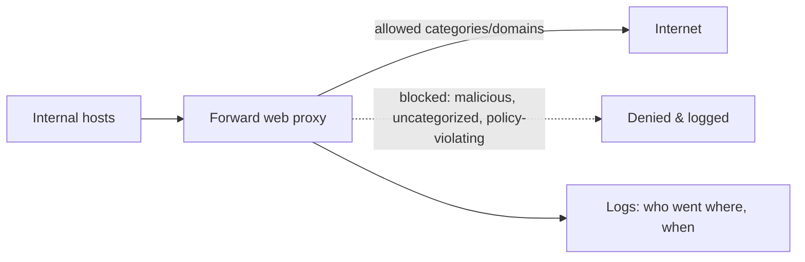

# 🚪 Egress Control & Web Proxies

> [!abstract] Note of [[Network Security Architecture]]
> Most networks guard the front door and leave the back door wide open — outbound traffic is trusted by default. But every breach that matters ends in data leaving or an attacker's server being contacted, and both are outbound. This note argues egress control as a first-class defense and covers the web proxy that enforces it.

## Parent Learning Order
Firewall Architecture & Policy -> Network Segmentation & Zero Trust -> VPNs & Encrypted Tunnels -> Intrusion Detection & Network Monitoring -> Egress Control & Web Proxies -> Network Access Control

## The Neglected Direction

> *Your firewall blocks everything inbound. Which attacks does that stop?*
>
> Hold your answer — the section below is the response.

Firewall attention overwhelmingly goes to **ingress** — keeping bad traffic out. Outbound traffic, **egress**, is usually permitted by default: internal hosts may connect anywhere on the Internet. This asymmetry feels natural and is a serious gap.

Consider what depends on outbound connectivity from inside the network:

| Attack phase | Direction | What it needs |
|:--|:--|:--|
| Initial compromise | inbound, or the user fetches it | many possible routes |
| **Tool download** | **outbound** | reach an attacker-controlled host |
| **Command and control** | **outbound** | a channel the implant opens itself |
| **Beaconing** | **outbound** | the same channel, on a schedule |
| **Data exfiltration** | **outbound** | enough bandwidth, to anywhere |

Only the first row has alternatives. Malware rarely accepts inbound connections, precisely because outbound is the direction nobody filters — the implant calls its operator, not the other way round.

The pattern is unmistakable: **the damaging phases of an attack are outbound.** An attacker can often get in through many routes, but everything they do afterward — receiving commands, downloading tools, stealing data — requires talking to the outside. Controlling egress attacks the attacker at the step they cannot avoid.

**Egress filtering** applies the default-deny principle to outbound traffic: permit only the outbound connections the business actually needs, and deny the rest. A network that only allows outbound to the specific services it uses gives malware nowhere to call and data no way out.

**Prerequisites:** firewall default-deny, DNS, and TLS.

> [!tip] The analogy, and where it breaks
> A building that has always screened visitors coming in, and finally starts asking what is being carried *out* and who staff are phoning. The analogy breaks in an encouraging direction: a thief must eventually leave with the goods, and a burglar's accomplice must eventually be called — so watching the exit catches the phase of an intrusion that cannot be skipped, however the entry happened.

## Why Default-Allow Egress Persists

If egress control is so valuable, why is it rare? The honest answer is that it is operationally hard. Modern applications, updates, cloud services, and SaaS make an enormous and shifting set of outbound connections, and cataloguing all legitimate destinations is difficult and never finished. A too-strict egress policy breaks things constantly and generates support load, so organizations default to allow-all for outbound and accept the risk — usually without having decided to.

The practical path is incremental: start by blocking the outbound protocols and destinations known to be unnecessary and abused (direct outbound on unusual ports, connections to known-bad destinations, protocols that should only go through a proxy), then tighten toward allowlisting as you learn the legitimate traffic. Even partial egress control — forcing web traffic through a proxy, blocking direct outbound DNS except from the resolver, denying outbound on ports with no business use — removes the easiest exfiltration and C2 paths.

## The Web Proxy as Enforcement Point

Because most legitimate outbound traffic is web traffic, a **forward web proxy** is the natural place to enforce and observe egress. All outbound web requests are directed through it, and it becomes a control and visibility chokepoint.



A web proxy provides several controls at once:

- **URL and category filtering** — block known-malicious domains, newly registered domains, and policy-violating categories.
- **Logging** — a record of every outbound web request: who connected to what, when. This is high-value telemetry, capturing intent even for connections that were allowed.
- **Malware scanning** — inspecting downloaded content before it reaches the endpoint.
- **Authentication** — tying outbound requests to a user identity, so logs attribute activity to a person, not just an address.

The proxy is where the earlier NAT-gateway concept meets security: rather than merely translating outbound addresses, it decides and records what may leave.

```bash
grep 'TCP_DENIED' /var/log/squid/access.log | tail -1
```

Expected excerpt:

```text
1690984922.431 512 10.10.10.14 TCP_DENIED/403 3821 CONNECT known-bad.example:443 r.okonkwo DENIED-CATEGORY-MALWARE
```

That single line is egress control working: an internal host's outbound connection to a known-bad destination was denied, logged, and attributed to a user — the exact event that, unlogged and unblocked, would be an exfiltration channel.

### The lines that were allowed

A denial is the satisfying log entry and the less useful one. Ask the harder question instead — everything `WS-014` contacted, whether or not it was permitted:

```bash
awk '$3=="10.10.10.14"' /var/log/squid/access.log | tail -8
```

```text
1690983122.104  241 10.10.10.14 TCP_TUNNEL/200  1420 CONNECT cdn.meridian-freight.test:443 r.okonkwo ALLOWED
1690983422.118  238 10.10.10.14 TCP_TUNNEL/200  1436 CONNECT cdn.meridian-freight.test:443 r.okonkwo ALLOWED
1690983722.096  244 10.10.10.14 TCP_TUNNEL/200  1418 CONNECT cdn.meridian-freight.test:443 r.okonkwo ALLOWED
1690984022.131  239 10.10.10.14 TCP_TUNNEL/200  1441 CONNECT cdn.meridian-freight.test:443 r.okonkwo ALLOWED
1690984322.107  242 10.10.10.14 TCP_TUNNEL/200  1427 CONNECT cdn.meridian-freight.test:443 r.okonkwo ALLOWED
1690984622.115  240 10.10.10.14 TCP_TUNNEL/200 84219 CONNECT cdn.meridian-freight.test:443 r.okonkwo ALLOWED
1690984922.431  512 10.10.10.14 TCP_DENIED/403  3821 CONNECT known-bad.example:443 r.okonkwo DENIED-CATEGORY-MALWARE
1690985222.109  238 10.10.10.14 TCP_TUNNEL/200  1433 CONNECT cdn.meridian-freight.test:443 r.okonkwo ALLOWED
```

Every `ALLOWED` line is the incident. Subtract the timestamps: 300.01, 299.98, 300.04, 299.98, 300.01 — a five-minute interval holding to a fraction of a second across the whole window. That is a thing software does and people do not. The transfer sizes cluster around 1,430 bytes because a check-in has a fixed shape, and the one line at 84 KB is the moment the implant was given something to send. The destination was permitted throughout, since `cdn.meridian-freight.test` was categorised as a content-delivery domain and nothing about it was known-bad at the time.

Now compare the two views. The `DENIED` line proves the malware category list contained one domain this implant tried once — useful, and it identifies nothing. The `ALLOWED` lines identify the channel, the interval, the moment of exfiltration, and the domain to block and search for across every other host. The control that produced the second view was, for this entire episode, permitting the traffic.

That is the case for logging egress even where you cannot yet filter it, and it is why monitor-only is a defensible first deployment rather than a half-measure.

## The Encryption and Tunnelling Challenge

Egress control faces the same encryption problem as detection. A proxy can filter by destination domain (visible via SNI or the CONNECT request) even when it does not decrypt, which catches connections to known-bad domains. But it cannot see *inside* an encrypted tunnel to an allowed destination, so an attacker who exfiltrates over HTTPS to an allowed cloud service, or tunnels data inside DNS or another permitted protocol, evades content inspection.

This is why egress control layers with the other controls rather than standing alone:

- **Domain and category filtering** catches connections to known-bad or uncategorized destinations regardless of encryption.
- **Behavioural analysis** catches the *shape* of exfiltration — unusual volume, timing, or destination — even when content is opaque, exactly as network detection does.
- **DNS filtering** (from the DNS-security material) catches tunnelling and blocks resolution of malicious domains before a connection is even attempted.
- **Data Loss Prevention (DLP)** inspects content, where visible, for sensitive data patterns leaving the network.

No single layer is sufficient; together they make exfiltration and C2 meaningfully harder.

**The deliberate break:** egress control gets judged by what it blocks. Deploy it, look at the denial count, and measure the control by how much it stopped.

The **logs are most of the value, and they accrue on the traffic you allowed**. When a compromise surfaces, the question is "what did this host contact, and when" — and the proxy log answers it in seconds, usually naming the command-and-control domain and bounding the incident. That payoff exists whether or not a single connection was ever denied, which inverts the usual deployment calculus: a control running in monitor-only mode with good logging has captured most of the benefit, while one blocking aggressively without logging has captured surprisingly little.

**How you'd spot it:** ask what your egress logs would tell you about a host you learned was compromised an hour ago. A destination list with timestamps means the control is doing its job regardless of its block rate. If the only thing recorded is what was denied, then the allowed traffic — which is where the command-and-control channel actually lived — left no trace at all, and the investigation starts from nothing.

## Security Implications

**Egress control is the highest-value neglected control.** Because every serious attack has an outbound phase, filtering egress disrupts attacks at a step they cannot skip. It will not prevent initial compromise, but it can prevent that compromise from becoming a breach — the C2 never connects, the data never leaves. For the effort, few controls offer as much containment, which is why it appears repeatedly as a recommendation and rarely as a deployed reality.

**It contains, aligning with assume-breach.** Egress control accepts that attackers will get in and focuses on stopping what they do next. This is the same containment logic as segmentation and zero trust, applied to the network's outbound edge, and it composes with them — a segmented network with egress control confines an attacker both laterally and outward.

**The proxy is a chokepoint of both control and risk.** Routing all outbound web traffic through one point centralizes enforcement and visibility, and centralizes trust — the proxy sees every destination and, if decrypting, all content. It is a high-value target and a potential bottleneck, and it must be protected and made resilient accordingly.

**Logs are the payoff even for allowed traffic.** Egress logs record intent. When an incident is discovered, the proxy log answers "what did this host contact and when" — often the fastest way to scope a compromise and find the C2 domain. This investigative value exists even when the traffic was permitted, which is why logging egress is worthwhile independent of blocking.

**Attackers adapt to egress control, which is the point.** They tunnel over allowed protocols, use allowed cloud services as C2, and blend with normal traffic — but each adaptation costs them effort and increases their detectable footprint. Forcing an attacker to exfiltrate slowly over an allowed channel to avoid volume alarms is a win; it buys detection time and shrinks what they can take.

All egress configuration and testing described here must target only networks within an authorized scope. Deploying egress controls affects every outbound connection, and testing exfiltration paths must be confined to an authorized lab.

## Summary

You should now be able to:

- Explain why the damaging phases of an attack are outbound and what egress filtering is; describe what a forward web proxy controls and records.
- Configure a proxy to filter and log outbound web traffic, explain why destination filtering works on encrypted traffic while content inspection does not, and read a proxy log to attribute a denied connection.
- Argue egress control as a high-value containment aligned with assume-breach; explain why it must layer with behavioural analysis, DNS filtering, and DLP to counter tunnelling over allowed channels, and why egress logs are investigative gold even for permitted traffic.

---
> 🔼 Up: [[Network Security Architecture]]
