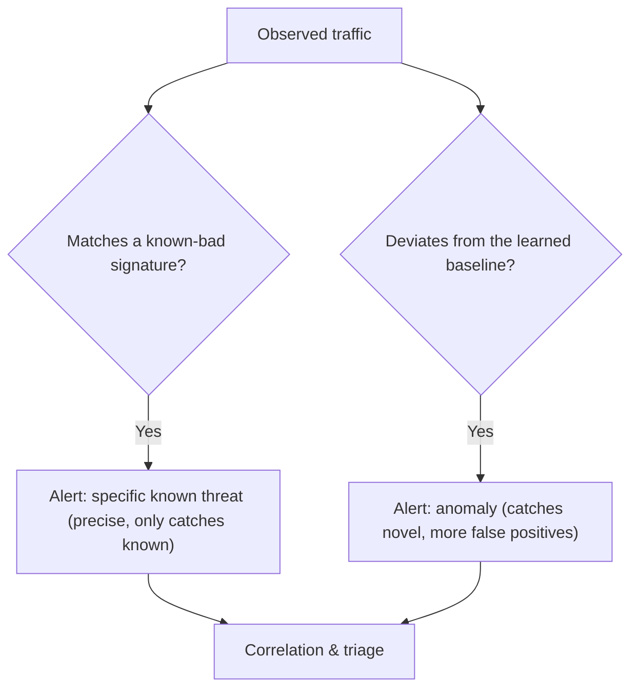

# 👁️ Intrusion Detection & Network Monitoring

> [!abstract] Note of [[Network Security Architecture]]
> Firewalls decide what may pass; detection systems watch what actually did. This note covers the two ways to recognize an attack — matching known-bad patterns and spotting deviation from normal — where sensors must sit to see anything, and why pervasive encryption forced network detection to shift from reading content to reading behaviour and metadata.

## Parent Learning Order
Firewall Architecture & Policy -> Network Segmentation & Zero Trust -> VPNs & Encrypted Tunnels -> Intrusion Detection & Network Monitoring -> Egress Control & Web Proxies -> Network Access Control

## Detect Versus Prevent

> *The firewall permitted the traffic. Was it therefore safe?*
>
> Hold your answer — the section below is the response.

A firewall enforces policy at a boundary. A **detection system** watches traffic to recognize malicious activity that policy alone did not stop — because the traffic was permitted, or because the attack hid inside allowed protocols.

Two roles exist, and the difference is consequential:

- An **IDS (Intrusion Detection System)** observes and alerts. It sits out of the traffic path (or on a copy of it) and raises an alarm when it sees something suspicious. It cannot block; it can only tell you.
- An **IPS (Intrusion Prevention System)** sits inline in the traffic path and can drop malicious traffic in real time. It prevents, not just detects.

The trade-off is direct. An IPS stops attacks but, being inline, is a potential bottleneck and a single point of failure — and a false positive means it blocks legitimate traffic, causing an outage. An IDS never breaks legitimate traffic but only tells you after the fact. Many deployments run detection broadly and enable prevention selectively for high-confidence signatures, accepting alerts elsewhere.

**Prerequisites:** firewalls, packet capture, and what encryption hides.

> [!tip] The analogy, and where it breaks
> A security guard watching camera feeds: one who recognises known faces from a wanted list, and one who notices that someone is behaving oddly for this building at this hour. The analogy breaks with encryption — it is as if everyone now wears a mask, so the wanted list becomes useless and only the behaviour, timing, and movement patterns remain readable. That is why detection shifted to metadata.

## Two Detection Philosophies

How does a system decide traffic is malicious? Two fundamentally different approaches, with complementary strengths.

**Signature-based detection** matches traffic against a database of known-bad patterns — a specific byte sequence, a known exploit, a malware communication pattern. It is precise and produces few false positives *for known threats*, and its alerts are specific and actionable ("this is exploit X"). Its fatal limitation: it can only catch what someone has already written a signature for. A novel attack, or a known one altered enough to miss the pattern, sails through. Signatures are necessary and permanently one step behind.

**Anomaly-based detection** builds a model of normal behaviour and flags deviation. It can catch *novel* attacks that no signature describes — a workstation suddenly transferring gigabytes at 3 a.m., a server connecting to a country it never talks to, a login from an impossible location. Its weakness is the mirror image of signatures': it produces false positives, because "unusual" is not the same as "malicious," and legitimate rare events trigger it. It also requires a good baseline, and if the baseline is built while an attacker is already present, their activity becomes "normal."



The two are complementary, not competing: signatures catch the known with precision, anomaly detection catches the unknown with noise, and a mature program runs both and correlates their output.

## Sensor Placement: You Only See What Reaches the Sensor

The most important operational fact about network detection is that **a sensor sees only the traffic that passes it.** Detection is blind to everything else, which makes placement a first-order design decision.

- A sensor at the **perimeter** sees traffic crossing the boundary — inbound attacks, outbound exfiltration — but nothing between internal hosts.
- A sensor sees **east-west** (internal, host-to-host) traffic only if that traffic is routed past it or mirrored to it. In a flat segment, lateral movement never crosses the perimeter sensor and is invisible.

This is why sensor placement must follow the topology and the segmentation, not the org chart. An attacker moving laterally within a segment that has no internal sensor is undetected by the network entirely. Comprehensive coverage means placing sensors — or collecting flow data — at the boundaries where you need visibility, and knowing precisely which segments are covered and which are blind. Mapping your own blind spots before an attacker finds them is itself a control.

Traffic reaches a sensor by a **SPAN/mirror port** (the switch copies traffic to the sensor), a **network tap** (a passive hardware device on the link), or **flow export** (the device sends metadata rather than full packets).

## The Encryption Problem

Signature detection historically read packet contents. Pervasive TLS and QUIC broke that: **the payload is encrypted, so content-matching sensors see ciphertext.** A signature for a malicious HTTP request cannot match when the HTTP is inside TLS. This is the defining challenge for modern network detection, and there are three responses, each with a cost.

**Inspect by decrypting.** Terminate TLS at a proxy, inspect the plaintext, re-encrypt. This restores content visibility but concentrates all plaintext at one point, breaks certificate pinning, and is the deliberate reduction of TLS's guarantee discussed in the web branch. It scales poorly and raises privacy and trust concerns.

**Detect by metadata and behaviour.** Even encrypted traffic reveals its shape: who connects to whom, when, how much, how often, with what timing, to what destination, with what certificate characteristics and TLS fingerprint. Beaconing to a command-and-control server has a distinctive rhythm even when its content is opaque; exfiltration has a distinctive volume and direction. This is why flow data, from the management-protocols material, became central — it is the visibility encryption does not remove. **Network Detection and Response (NDR)** is largely built on this: behavioural analysis of metadata rather than content inspection.

**Move detection to the endpoints.** Where the traffic terminates, it is plaintext. Endpoint detection sees what network sensors cannot, which is why detection strategy has shifted partly off the network and onto the hosts.

The honest state: content-based network detection is in decline as encryption becomes universal, and the future of network detection is behavioural and metadata-driven, complemented by endpoint visibility.

## Worked Example: What a Sensor Sees, Misses, and Infers

Three captures against one Suricata sensor show the whole argument of this note:
a signature is precise but narrow, a small change defeats it, and encryption
moves the evidence from content to metadata.

> [!note] Representative output
> Reconstructed from a lab of this shape rather than copied from one capture. Field layouts and flag names match the named tool; addresses and identifiers are synthetic.

**A known pattern, matched.** A request carrying an obvious SQL injection
string crosses the sensor, and the signature engine names it exactly:

```shell-session
analyst@sensor:~$ tail -n 1 /var/log/suricata/fast.log
04/12/2026-14:22:07.118431  [**] [1:2013028:7] ET WEB_SERVER Possible SQL
Injection Attempt SELECT FROM [**] [Classification: Web Application Attack]
[Priority: 1] {TCP} 198.51.100.24:51422 -> 192.0.2.10:80
```

Every field here is actionable: `1:2013028:7` identifies the exact rule that
fired, the classification tells an analyst what kind of problem this is, and the
five-tuple says who did it to whom. This is the strength of signature detection —
when it fires, it fires with an explanation.

**The same attack, URL-encoded.** The request means the same thing to the web
server, but no longer matches the literal bytes the rule looks for:

```shell-session
analyst@sensor:~$ tail -n 1 /var/log/suricata/fast.log
04/12/2026-14:19:44.902017  [**] [1:2013028:7] ET WEB_SERVER Possible SQL
Injection Attempt SELECT FROM [**] ... {TCP} 198.51.100.24:51188 -> 192.0.2.10:80
analyst@sensor:~$ # after re-sending the request as %53%45%4c%45%43%54 ...
analyst@sensor:~$ tail -n 1 /var/log/suricata/fast.log
04/12/2026-14:19:44.902017  [**] [1:2013028:7] ET WEB_SERVER Possible SQL
Injection Attempt SELECT FROM [**] ... {TCP} 198.51.100.24:51188 -> 192.0.2.10:80
```

**The timestamp did not change** — that is the finding. The last line is still
the *previous* alert, because the encoded request produced no new one. A rule
matching raw bytes sees different bytes; whether the target decodes them back to
the same query is not the rule's concern. This is the known-only limitation made
concrete, and it is why normalization before matching is a core IDS design
problem rather than a detail.

**Encrypted traffic, inferred.** Once the same session runs inside TLS the
sensor cannot read the payload at all — but it can still describe the
conversation:

```shell-session
analyst@sensor:~$ jq -c 'select(.event_type=="tls")' /var/log/suricata/eve.json | tail -1
{"timestamp":"2026-04-12T14:31:55.402113+0000","flow_id":1885274419203371,
"src_ip":"192.0.2.10","dest_ip":"203.0.113.77","dest_port":443,
"tls":{"sni":"cdn-updates.example.net","version":"TLS 1.3",
"ja3":{"hash":"e7d705a3286e19ea42f587b344ee6865"}}}
```

No payload appears, and none can. What remains is still substantial: the
requested name in `sni`, the negotiated `version`, and `ja3` — a hash of how the
client proposed the handshake, which fingerprints the *client software* rather
than the content. A JA3 hash that matches no browser in the environment, talking
to a name registered last week, is a detection built entirely from metadata. That
is the shift this note describes, visible in one log line.

## Security Implications

**Detection assumes prevention will fail.** The entire premise is that some attacks get past the firewall, so you watch for them. This aligns with assume-breach: detection is how you find the attacker who is already inside, and its value is measured in how fast you detect and how much you can then contain.

**Alerts without triage are noise.** A detection system generating thousands of unreviewed alerts provides no security — it provides a false sense of it. The scarce resource is human attention, so tuning to reduce false positives, correlating related alerts into incidents, and prioritizing by confidence and impact are what turn detection into response. A quieter, well-tuned system beats a louder, ignored one.

**Attackers target the blind spots and the sensors.** Knowing that detection sees only what reaches it, attackers operate in unmonitored segments, use encryption to defeat content inspection, and move slowly to stay under anomaly thresholds. They also attack the detection infrastructure itself — flooding it with alerts to bury a real one, or disabling logging. The monitoring plane, per the earlier argument, must be protected accordingly.

**Evasion mirrors the lower-layer ambiguities.** Just as fragment reassembly and HTTP parsing differences enable evasion, an IDS that reassembles or normalizes traffic differently from the destination host can be fed traffic it reads as benign and the target reads as malicious. Sensors must normalize traffic the way the endpoint will, or the gap becomes an evasion.

**Time and correlation underpin everything.** Detection output is only useful if events across sensors can be ordered and correlated, which requires the synchronized time from the services branch and a central collection point. An alert without reliable time and context is hard to act on.

All monitoring described here must be deployed on networks within an authorized scope. Capturing traffic exposes its contents and metadata, and monitoring networks you do not own is unauthorized.

## Summary

You should now be able to:

- Explain the difference between an IDS and an IPS and between signature and anomaly detection, including what each detection method catches and misses.
- Explain why a sensor sees only traffic that reaches it and how placement determines coverage; demonstrate signature evasion and the false-positive cost of anomaly detection and inline blocking.
- Explain why pervasive encryption pushed network detection from content to metadata and behaviour, and what each response (decryption, NDR, endpoint) costs; describe how attackers exploit blind spots, evasion via parsing differences, and alert flooding, and why triage and correlation are what make detection actionable.

---
> 🔼 Up: [[Network Security Architecture]]
