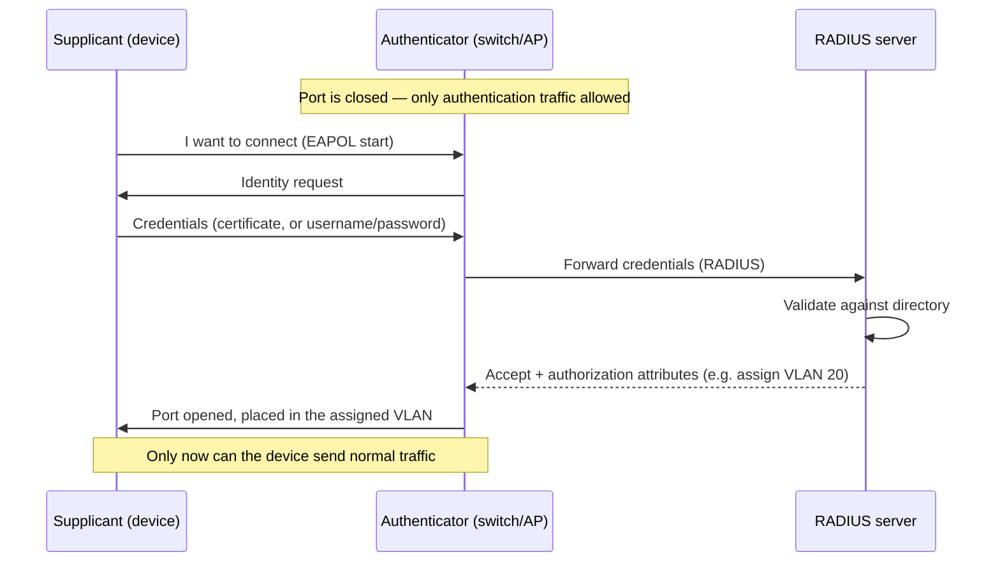

# 🎟️ Network Access Control

> [!abstract] Note of [[Network Security Architecture]]
> Every control in this branch assumes a device is on the network before deciding what it may do. Network Access Control asks the prior question: should this device be admitted at all? This note covers authenticating devices at the point of connection, checking their health before granting access, and why the port a cable plugs into is the earliest place to enforce trust.

## Parent Learning Order
Firewall Architecture & Policy -> Network Segmentation & Zero Trust -> VPNs & Encrypted Tunnels -> Intrusion Detection & Network Monitoring -> Egress Control & Web Proxies -> Network Access Control

## Who Gets On the Network?

> *An unmanaged laptop is plugged into a conference-room jack. Which of your firewall rules applies to it?*
>
> Hold your answer — the section below is the response.

Firewalls, segmentation, and detection all operate on traffic from devices that are *already connected*. But an unmanaged laptop plugged into a conference-room jack, or an attacker's device connected to an exposed port, is on the network before any of those controls apply. **NAC (Network Access Control)** closes that gap by deciding, at the moment of connection, whether a device may join at all — and if so, with what access.

NAC answers three questions before a device gets meaningful network access:

1. **Authentication** — who or what is this device? Prove it.
2. **Posture** — is this device healthy and compliant? Check it.
3. **Authorization** — given who it is and its state, what may it access? Assign it.

This is the network's admission control, and it is the earliest possible enforcement point — earlier than the firewall, because it acts before the device can send traffic anywhere.

**Prerequisites:** switch ports, VLANs, and the link-layer attacks that need segment access.

> [!tip] The analogy, and where it breaks
> A turnstile that checks your pass before you reach any office door, and routes you to the floor your pass allows. The analogy breaks at the exceptions: the delivery hatch propped open for equipment that cannot carry a pass. Those accommodations — devices admitted by hardware address alone — are exactly where attackers aim, because the strong control has a documented hole beside it.

## 802.1X: Authenticating at the Port

The standard mechanism for wired and wireless authentication is **802.1X**, which enforces authentication at the switch port or wireless association *before* the port carries any normal traffic.

Three roles participate:

- The **supplicant** — the device requesting access, running client software that provides credentials.
- The **authenticator** — the switch or wireless access point controlling the port. It relays credentials but does not decide.
- The **authentication server** — typically a **RADIUS** server, which validates the credentials and tells the authenticator the verdict.



The critical property is in the first note: **the port passes only authentication traffic until the device authenticates.** An unauthenticated device connected to an 802.1X port cannot reach anything — it cannot flood, spoof, scan, or inject, because the port will not carry its traffic. This is why 802.1X was described in the link-layer branch as the strongest link-layer control: it prevents the unauthorized device from participating at all, making most link-layer attacks impossible from that port.

The RADIUS server can return **authorization attributes**, not just accept/reject — most powerfully, a **VLAN assignment**. This means the network can place a device into the correct segment *based on its identity*: a finance laptop into the finance VLAN, an unrecognized device into a quarantine VLAN, a contractor into a restricted one. Access control and segmentation combine at the moment of connection.

## Posture Assessment: Healthy Enough to Join?

Authentication proves identity; it says nothing about the device's *state*. A properly authenticated laptop can still be missing security patches, running no antivirus, or already compromised. **Posture assessment** checks the device's health before granting full access:

- Is the operating system patched?
- Is endpoint protection running and current?
- Is disk encryption enabled?
- Does it meet configuration policy?

A device that fails posture can be **quarantined** — placed in a restricted VLAN with access only to remediation resources (patch servers, update services) until it becomes compliant, then re-evaluated. This turns admission into a health gate: the network refuses to fully admit a device that would be a risk, and helps it become admissible rather than simply rejecting it.

## Handling the Devices That Cannot Authenticate

A real network is full of devices that cannot run 802.1X supplicant software — printers, IP cameras, badge readers, sensors, medical and industrial equipment. NAC must handle them, and how it does is a recurring weak point.

**MAC Authentication Bypass (MAB)** admits such a device based on its hardware address being on an approved list. The weakness is immediate: MAC addresses are forgeable, so an attacker who learns an approved printer's MAC can spoof it and inherit the printer's access. MAB is a necessary accommodation and a weak authenticator, so devices admitted by MAB should be placed in tightly restricted segments where a spoofed identity gains little.

This ties directly to segmentation and zero trust: because MAB and unmanaged devices are weakly authenticated, they belong in constrained segments, and their access should be minimized — a device that can only be weakly identified should be able to reach very little.

## Worked Example: A Port Deciding Whether to Let You In

802.1X is easiest to understand from the supplicant's side, where the whole
exchange is narrated line by line.

> [!note] Representative output
> Reconstructed from a lab of this shape rather than copied from one capture. Field layouts and flag names match the named tool; addresses and identifiers are synthetic.

**A successful authentication.** The client starts EAP on a wired interface and
the switch port transitions from unauthorized to forwarding:

```shell-session
analyst@ws-4471:~$ sudo wpa_supplicant -i enp3s0 -D wired -c /etc/wpa_supplicant/8021x.conf
enp3s0: CTRL-EVENT-EAP-STARTED EAP authentication started
enp3s0: CTRL-EVENT-EAP-METHOD EAP vendor 0 method 13 (TLS) selected
enp3s0: CTRL-EVENT-EAP-PEER-CERT depth=1 subject='/CN=Example Issuing CA'
enp3s0: CTRL-EVENT-EAP-SUCCESS EAP authentication completed successfully
enp3s0: CTRL-EVENT-CONNECTED - Connection to 01:80:c2:00:00:03 completed
```

`method 13` is EAP-TLS — certificate-based, with no password anywhere in the
exchange. The address the client "connects to" is `01:80:c2:00:00:03`, the
reserved multicast address for 802.1X itself; the supplicant is talking to the
port, not to a host, which is the point of authenticating at Layer 2.

**What the server decided, and what it attached.** On the RADIUS side the accept
carries more than a yes:

```shell-session
admin@radius:~$ sudo journalctl -u freeradius -n 6 --no-pager
Sending Access-Accept ID 214 from 10.20.0.5:1812 to 10.20.0.9:41003
  User-Name = "host/ws-4471.corp.example.com"
  Tunnel-Type = VLAN
  Tunnel-Medium-Type = IEEE-802
  Tunnel-Private-Group-Id = "310"
```

Those three tunnel attributes are the mechanism behind dynamic VLAN assignment.
The switch does not decide where this device belongs — the identity decision and
the placement decision are made together, centrally, and the port is configured
from the answer. A finance laptop and a visitor's laptop can share a physical
port and still land in different segments.

**A failure, and what the port does about it.** With an expired client
certificate the same exchange ends differently:

```shell-session
enp3s0: CTRL-EVENT-EAP-STATUS status='remote certificate verification'
        parameter='certificate has expired'
enp3s0: CTRL-EVENT-EAP-FAILURE EAP authentication failed
enp3s0: CTRL-EVENT-DISCONNECTED bssid=01:80:c2:00:00:03 reason=23
```

```shell-session
admin@radius:~$ sudo journalctl -u freeradius -n 2 --no-pager
Login incorrect (TLS Alert write:fatal:certificate expired):
  [host/ws-4471] (from client sw-access-01 port 14 cli 00:00:5e:00:53:0e)
```

The port never reaches the forwarding state, so the device has link but no
network — no IP, no DHCP, nothing. This is the failure mode that generates help
desk tickets reading "the cable is plugged in but the internet is broken", and
recognising it as an authentication result rather than a cabling fault is most of
the diagnosis. Note also `port 14` and the client MAC in the server log: the
switch tells RADIUS exactly which physical port asked, which is what makes the
decision enforceable at the edge.

**The deliberate break:** NAC reads as a binary gate. Once 802.1X is deployed, an unauthorised device cannot get onto the network, and the port is closed.

Real deployments are **defined by their exceptions**. Printers and cameras that cannot do 802.1X get MAC Authentication Bypass; some ports are never enforced; guest networks exist; equipment gets exempted under deadline and stays exempted. Each of those is a documented, deliberate hole, and an attacker goes straight to them rather than attacking the authentication — the unmanaged printer's port is easier than the protocol will ever be. The control is exactly as strong as its exception list, which is the part of the deployment nobody revisits.

**How you'd spot it:** audit the exceptions, not the policy. Enumerate every port not enforcing 802.1X and every MAB entry, and ask of each what it is for and whether that thing still exists. The concrete test follows directly: unplug a MAB-authorised device and connect through its port presenting its MAC address — if that succeeds, the exception is not an exception, it is the access path.

## Security Implications

**NAC is the earliest enforcement point, which makes it uniquely valuable and uniquely bypassable.** Enforcing at the port stops an unauthorized device before it does anything, which is the strongest position. But NAC deployments are riddled with exceptions — MAB devices, ports where 802.1X is not enforced, guest networks, exempted equipment — and each exception is a bypass. Attackers specifically look for the unmanaged printer's port or the conference room jack without enforcement, because those are where NAC's strong guarantee has a hole. The control is only as good as its exception handling.

**802.1X converts network access from location to identity.** Without it, plugging into a port grants network access — location equals trust, the model zero trust rejects. With it, access requires proving identity, and the identity determines the segment. This is a concrete step toward zero trust at the network layer: being physically connected grants nothing until you authenticate.

**RADIUS is critical infrastructure.** Every authentication decision flows through it, so its availability and integrity are foundational — if RADIUS is down, either no one can connect (fail closed, secure but disruptive) or everyone connects unauthenticated (fail open, available but insecure), and which behaviour is configured is a significant security decision. RADIUS itself must be protected and redundant.

**Posture assessment is a point-in-time check that can go stale.** A device compliant at connection can become non-compliant minutes later — disable its antivirus, or be compromised. Posture at admission is necessary but not sufficient; continuous posture evaluation, re-checking during the session, is the stronger model and aligns with zero trust's continuous verification rather than a one-time gate.

**Physical access still matters.** NAC raises the bar for connecting a rogue device, but an attacker who can reach a port that an authorized device uses — unplugging a authenticated printer and connecting through its MAB exception, or using a device already authenticated — can still gain access. NAC is a strong control, not an absolute one, and it pairs with physical security and constrained segmentation for weakly authenticated devices.

All NAC configuration and testing described here must target only networks within an authorized scope. Bypassing NAC, spoofing MAB identities, or connecting unauthorized devices requires explicit authorization and belongs in a controlled lab.

## Summary

You should now be able to:

- Explain the question NAC answers that other controls assume, and the three roles in 802.1X; state why an unauthenticated 802.1X port grants no access.
- Configure 802.1X with RADIUS and dynamic VLAN assignment, explain posture-based quarantine, and describe why MAB is a necessary but weak accommodation.
- Explain why NAC is the earliest enforcement point and simultaneously bypassable through its exceptions; argue how 802.1X converts access from location to identity as a step toward zero trust, and why point-in-time posture and fail-open/closed RADIUS behaviour are consequential design decisions.

---
> 🔼 Up: [[Network Security Architecture]]
