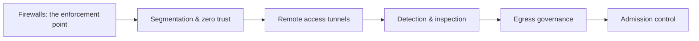

# 🏛️ Network Security Architecture

> [!abstract] Architecture branch
> Where the individual controls from earlier branches combine into a deliberate design. This is the strategic layer: where boundaries are drawn, how trust is granted, how remote access is secured, how traffic is inspected, how egress is governed, and how devices are admitted to the network at all.

## 🗺️ Zero-to-Mastery Learning Path

1. [[Firewall Architecture & Policy]] — design stateful inspection policy, zone pairs, and rule-base reasoning
2. [[Network Segmentation & Zero Trust]] — apply VLANs, micro-segmentation, and the deny-by-default principle
3. [[VPNs & Encrypted Tunnels]] — compare IPsec, WireGuard, and TLS tunnels; assess each for data-in-transit risk
4. [[Intrusion Detection & Network Monitoring]] — position IDS/IPS sensors and correlate alerts with traffic evidence
5. [[Egress Control & Web Proxies]] — enforce content inspection, URL filtering, and TLS break-and-inspect at the boundary
6. [[Network Access Control]] — gate port or wireless access with 802.1X, NAC, and posture assessment

---
> 🔼 Up: [[Networking]]
