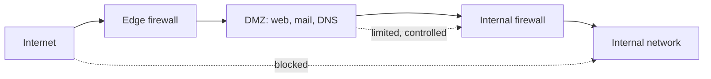

# 🧭 Network Segmentation & Zero Trust

> [!abstract] Note of [[Network Security Architecture]]
> The old model trusted anything inside the perimeter, and attackers learned to get inside once and roam freely. This note traces the shift from perimeter trust to segmentation to zero trust — a progression driven entirely by the goal of containing an attacker who is already in, since assuming breach is now the only realistic posture.

## Parent Learning Order
Firewall Architecture & Policy -> Network Segmentation & Zero Trust -> VPNs & Encrypted Tunnels -> Intrusion Detection & Network Monitoring -> Egress Control & Web Proxies -> Network Access Control

## Why the Castle Fell

> *Your perimeter firewall is immaculately configured. How much of your internal traffic does it see?*
>
> Hold your answer — the section below is the response.

The traditional model was a **hard perimeter with a soft interior** — a firewall at the edge, and inside it a large trusted network where systems reached each other freely. The metaphor was a castle with a moat: strong walls, and once inside, free movement.

This model has a fatal flaw that defined a generation of breaches. Once an attacker gets inside — through a phished credential, a vulnerable public service, a malicious email, a rogue device — the flat trusted interior lets them move freely from the initial foothold to the actual target. This is **lateral movement**, and it is the phase where a minor intrusion becomes a major breach. The perimeter did nothing to stop it, because inside the perimeter everything was trusted.

The entire evolution of network security architecture is a response to this single problem: **how do you contain an attacker who is already inside?**

Four answers were given in succession, and each one narrows what "trusted" means:

| Model | What earns trust | What a compromised host reaches |
|:--|:--|:--|
| **Perimeter** | being inside the network | everything inside |
| **Segmentation** | being inside your zone | everything in that zone |
| **Microsegmentation** | being a workload with an explicit permitted flow | only that workload's permitted flows |
| **Zero trust** | nothing, by location — every access is verified by identity | only what that identity is authorised for, per request |

Read the middle column downward and the whole progression is one idea applied repeatedly: each step removes a category of thing that used to be trusted for free. The rest of this note is those four rows in detail, and the last of them is a direction of travel rather than a place most organisations have arrived at.

**Prerequisites:** VLANs, routing, and firewall policy.

> [!tip] The analogy, and where it breaks
> A castle with a moat versus a modern building where every internal door needs your badge. In the castle, one person over the wall roams freely; in the building, entering the lobby grants nothing. The analogy breaks because the badge system must also survive a *stolen* badge — which is why zero trust adds per-resource checks rather than trusting anyone already inside, something no physical door does well.

**The deliberate break:** "we have a firewall, so the network is segmented." Those are different claims, and the gap between them is where most breaches spread.

A perimeter firewall filters traffic **crossing** the boundary — north-south. It sees nothing of the traffic between two workstations on the same VLAN, which is east-west, and that is the traffic an attacker uses after the first foothold. A flat internal network behind a strong perimeter is one compromised laptop away from being fully reachable, and the firewall logs will show nothing at all, because nothing crossed it.

**How you'd spot it:** from one internal host, try to reach another host's SMB or RDP port. If it answers, those two machines are in the same trust zone, whatever the network diagram claims.

### Blast radius, as a number

That test is worth running properly, because "blast radius" is used throughout this note as the metric and it is genuinely countable. Take `WS-014` as the compromised host and ask what it can reach:

```bash
sudo nmap -Pn -n --open -p- 10.10.10.0/24 10.10.20.0/24 10.10.30.0/24 \
  -oG - | awk '/Ports:/ {print $2, $0}'
```

Before segmentation, with the three VLANs routed to each other and no policy between them:

```text
10.10.10.30   WS-030    135, 139, 445, 3389
10.10.20.10   DC01      53, 88, 135, 139, 389, 445, 636, 3268, 3389
10.10.20.20   FS01      135, 139, 445, 3389
10.10.20.30   APP01     22, 80, 443, 3306
10.10.20.40   LOG01     22, 443, 9200
10.10.30.7    SCAN-07   23, 80

6 hosts, 26 open ports reachable from one workstation
```

Now with inter-VLAN policy permitting only what a workstation actually needs, and host isolation on the access VLAN:

```text
10.10.20.10   DC01      53, 88, 389, 445
10.10.20.20   FS01      445
10.10.20.30   APP01     443

3 hosts, 6 open ports reachable from one workstation
```

Twenty-six services down to six. That ratio is the blast radius, and the note's later claims about containment mean exactly this and nothing more mystical.

Three of the removals matter more than the count suggests. `WS-030` vanishing is the lateral-movement path closing — the IT admin's workstation was one SMB hop from the finance analyst's, which is the single most valuable hop an attacker on VLAN 10 has. `SCAN-07` vanishing removes a device running telnet on ancient firmware from a compromised laptop's reach entirely. And `LOG01` vanishing matters in the other direction: the SIEM collects *from* hosts and has no reason to accept connections from them, so its reachability was pure exposure with no function behind it.

Note what did *not* change. `DC01` still answers on 445, because a domain member genuinely needs it, and that is the honest limit of segmentation: it removes the flows nobody needed and leaves the ones the business runs on. An attacker with a valid credential still has Kerberos, LDAP and SMB to a domain controller — which is precisely the gap the rest of this note exists to close, and why segmentation alone is a step rather than an answer.
## Step One: Segmentation

**Segmentation** divides the flat interior into zones separated by controls, so that compromising one zone does not grant access to the others. Instead of one trusted network, there are many smaller ones with firewalls, ACLs, or VLANs between them, and traffic crossing a zone boundary is subject to policy.

The classic pattern is the **DMZ (demilitarized zone)** — a segment for public-facing servers, positioned so that neither the Internet nor those servers can reach the internal network directly.



The logic: a public web server *must* be reachable from the Internet, so it is exposed — but it lives in the DMZ, and even if compromised, the internal firewall stops it from reaching internal systems. The DMZ absorbs the risk of exposure and contains it.

Beyond the DMZ, segments separate by function and sensitivity: user workstations, servers, management interfaces, guest and IoT devices, and regulated data each in their own zone. The key questions are always the same — which systems must communicate, on which ports, and everything else is denied at the boundary. Segmentation converts lateral movement from a free Layer 2 hop into a routed event that a firewall can deny and a sensor can observe.

## Step Two: Microsegmentation

Segmentation with a handful of zones still leaves large trusted areas — a compromised server can still reach every other server in its zone. **Microsegmentation** pushes the boundaries down to individual workloads: each server, or even each application, has its own policy governing exactly what it may talk to.

The shift is from "which network zone are you in?" to "which specific workload are you, and what is that workload allowed to do?" A database accepts connections only from its specific application servers, on its specific port, and nothing else — not even other databases in the same zone. This is enforced by host-based firewalls, hypervisor policy, or software-defined networking rather than by physical topology, so it follows workloads even as they move.

Microsegmentation dramatically shrinks the blast radius: a compromised workload can reach only what its policy explicitly permits, which for a well-defined workload is very little.

## Step Three: Zero Trust

**Zero trust** completes the progression by discarding network location as a basis for trust entirely. Its principle is stated as **"never trust, always verify"** — and more precisely, *assume the network is already compromised.* No connection is trusted because of where it originates; every access is authenticated, authorized, and encrypted regardless of whether it comes from the "internal" network or the Internet.

The consequences are structural:

- **Identity replaces location.** Access decisions are based on verified identity of the user and device, not on being on a trusted subnet. Being inside the network grants nothing.
- **Every request is verified.** Authentication and authorization happen per-access, continuously, not once at a perimeter.
- **Least privilege is enforced per resource.** A verified identity gets access only to the specific resources it needs, not to a network segment.
- **Encryption is assumed everywhere**, because the network — internal included — is treated as hostile. This is the architectural reason the internal path is no longer trusted, and why re-encryption to backends became standard.

Zero trust is a direction of travel, not a product. It is implemented incrementally — strong identity, device posture checking, per-application access instead of network-level VPN access, pervasive encryption, and continuous verification — and most organizations are somewhere along the path rather than at its end.

## Security Implications

**Assume breach is the honest premise.** Every step of this evolution accepts that prevention will sometimes fail and an attacker will get in. The design goal shifts from keeping attackers out to **limiting what they can do once in**. This is realistic in a way perimeter trust was not, and it reframes success as containment and detection rather than an unbreachable wall.

**Containment is measured by blast radius.** The value of segmentation, microsegmentation, and zero trust is directly the reduction in how far one compromised element reaches. A flat network has a blast radius of everything; a microsegmented one confines a compromise to a single workload's permitted flows. This is the concrete metric by which an architecture's containment is judged.

**Segmentation must survive valid credentials.** An attacker who phishes a credential is, from the network's view, a legitimate user. Segmentation that only stops unauthenticated traffic does nothing against them. This is exactly why zero trust adds per-resource authorization and least privilege — so that a stolen credential grants access only to what that identity legitimately needs, not to a whole segment.

**The controls compose with everything below.** Segmentation is enforced by the firewalls, VLANs, and routing from earlier branches; zero trust adds identity and encryption on top. A zero-trust architecture does not replace network controls — it layers identity-based verification over them, and a failure at any layer (a flat VLAN, a permissive inter-zone rule, weak identity) undermines the whole.

**Complexity and operations are the real cost.** Fine-grained policy means more policy to define, maintain, and troubleshoot. Microsegmentation and zero trust demand accurate knowledge of what should talk to what — which many organizations lack — and a wrong policy blocks legitimate work. The migration is as much an operational and discovery effort as a technical one, and rushing it produces outages that discredit the approach.

All architecture testing described here must be confined to systems within an authorized scope. Probing segment boundaries and attempting lateral movement are intrusive and require explicit authorization.

## Summary

You should now be able to:

- Explain the perimeter model's flaw, what lateral movement is, and why segmentation contains it; describe the purpose of a DMZ.
- Configure segmentation to contain a compromise, measure the resulting blast radius, and explain how microsegmentation shrinks it to individual workloads.
- Explain the progression from perimeter to zero trust as successive answers to "contain an attacker already inside"; argue why segmentation must survive valid credentials and how zero trust's identity-based, least-privilege, encrypt-everything model achieves that, and why it composes with rather than replaces network controls.

---
> 🔼 Up: [[Network Security Architecture]]
